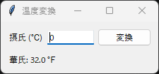

11. クラスによる設計
====================

11.1 関数による実装の問題点
---------------------------

ここまでのサンプルコードは、``main`` 関数の中でウィジェットを作成し、入れ子の関数をコールバック関数として使っていました。小さなプログラムではこの書き方で十分ですが、アプリケーションが大きくなると、次のような問題が生じます。

* ``main`` 関数が長くなり、どこで何をしているのかが分かりにくくなります。
* コールバック関数から値を書き換えるたびに ``nonlocal`` 宣言が必要になります。
* 画面の一部を別の画面で再利用することが困難です。
* 計算処理が画面の処理と混ざり、画面を表示せずに動作を確認（テスト）できません。

これらの問題は、画面をクラスとして実装し、計算処理を画面から分けることで解決できます。

11.2 Frame を継承したクラス
---------------------------

tkinter でよく使われるのは、``ttk.Frame`` を継承したクラスで画面を実装する方法です。ウィジェットや変数クラスはインスタンスの属性として保持し、コールバック関数はメソッドとして定義します。

.. code-block:: python

   class ConverterApp(ttk.Frame):
       def __init__(self, master: tk.Misc) -> None:
           super().__init__(master, padding=10)
           self.celsius = tk.StringVar(value="0")  # 属性として保持
           ...

       def convert(self) -> None:  # コールバック関数はメソッドにする
           ...

作成したクラスは Frame の一種なので、ほかのウィジェットと同じように ``pack`` や ``grid`` で配置できます。1 つのウィンドウに複数の画面を並べたり、Notebook のタブとして追加したりすることも容易です。

次のサンプルコードは、摂氏温度 :math:`C` を華氏温度 :math:`F` に変換するアプリケーションです。変換には次の式を使います。

.. math::

   F = \frac{9}{5} C + 32

.. literalinclude:: ../examples/ch11_class_app.py
   :language: python
   :caption: ch11_class_app.py
   :linenos:

:download:`ch11_class_app.py をダウンロード <../examples/ch11_class_app.py>`

   実行結果

Frame を継承する代わりに、メインウィンドウをクラスの属性として保持する方法もあります。:doc:`第 12 章 <12_practice_memo_app>`\ の簡易メモ帳はこの方法で実装しています。画面を部品として再利用したい場合は Frame の継承が、メニューバーなどウィンドウ全体を扱う場合はメインウィンドウの保持が向いています。

11.3 画面と処理の分離
---------------------

サンプルコードでは、温度を変換する計算を ``celsius_to_fahrenheit`` 関数として、画面のクラスの外に定義しています。この関数は tkinter に依存しないため、画面を表示せずにテストできます。たとえば、pytest を使うと次のようにテストを書けます。

.. code-block:: python

   from ch11_class_app import celsius_to_fahrenheit

   def test_celsius_to_fahrenheit() -> None:
       assert celsius_to_fahrenheit(0) == 32
       assert celsius_to_fahrenheit(100) == 212

画面のクラスは、入力値の取得、計算処理の呼び出し、結果の表示だけを担当します。計算処理が複雑になっても画面のクラスは変わらないため、コードを読みやすく保てます。
