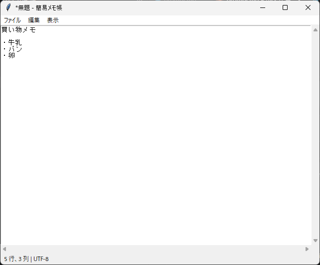

12. 実践: 簡易メモ帳アプリ
==========================

この章では、これまでに学んだ内容を組み合わせて、テキストファイルを編集できる簡易メモ帳アプリケーションを作成します。

12.1 完成イメージと機能一覧
---------------------------

   簡易メモ帳の画面

簡易メモ帳の機能と、関連する章を次に示します。

.. list-table::
   :header-rows: 1
   :widths: 25 50 25

   * - 分類
     - 機能
     - 関連する章
   * - ファイル
     - 新規作成、開く、上書き保存、名前を付けて保存（文字コードは UTF-8）
     - :doc:`第 7 章 <07_menu_dialog>`
   * - 編集
     - 元に戻す、やり直し、切り取り、コピー、貼り付け、すべて選択
     - :doc:`第 3 章 <03_basic_widgets>`
   * - 表示
     - 右端で折り返すかどうかの切り替え
     - :doc:`第 7 章 <07_menu_dialog>`
   * - 操作
     - メニューとキーボードショートカット
     - :doc:`第 6 章 <06_events>`、:doc:`第 7 章 <07_menu_dialog>`
   * - 状態の表示
     - タイトルバーにファイル名と未保存の印（``*``）、ステータスバーにカーソルの位置を表示
     - :doc:`第 4 章 <04_layout>`、:doc:`第 5 章 <05_variables>`
   * - 安全対策
     - 未保存の変更がある状態で、新規作成、開く、終了を行う場合の確認
     - :doc:`第 7 章 <07_menu_dialog>`

12.2 全体の構成
---------------

アプリケーションは、``MemoApp`` クラスと、それを起動する ``main`` 関数で構成します。:doc:`第 11 章 <11_class_design>`\ で説明したように、``MemoApp`` はメインウィンドウを属性 ``root`` として保持します。主なメソッドを次に示します。

.. list-table::
   :header-rows: 1
   :widths: 35 65

   * - メソッド
     - 役割
   * - ``_create_widgets``
     - テキスト領域、スクロールバー、ステータスバーを作成します。
   * - ``_create_menu``
     - メニューバーを作成します。
   * - ``_bind_shortcuts``
     - キーボードショートカットを登録します。
   * - ``new_file``、``open_file``
     - 新規作成と、ファイルの読み込みを行います。
   * - ``save_file``、``save_file_as``
     - 上書き保存と、名前を付けて保存を行います。
   * - ``quit``
     - 未保存の変更を確認してから終了します。
   * - ``_confirm_discard``
     - 未保存の変更がある場合に、保存するかどうかを確認します。
   * - ``_update_title``、``_update_status``
     - タイトルバーとステータスバーの表示を更新します。

名前が ``_`` で始まるメソッドは、クラスの内部だけで使うメソッドです。以降の節では、主なメソッドを抜粋して説明します。抜粋の行番号は、:ref:`memo-full-code`\ の行番号と対応しています。

12.3 画面の構成
---------------

.. literalinclude:: ../examples/ch12_memo_app.py
   :language: python
   :pyobject: MemoApp._create_widgets
   :lineno-match:

画面は、下端のステータスバーと、残りの領域を占める編集領域に分かれます。ステータスバーを編集領域より先に ``pack`` しているのは、ウィンドウを縮めたときにステータスバーが隠れないようにするためです。``pack`` は配置した順に領域を割り当てるので（:doc:`第 4 章 <04_layout>`\ 参照）、先に配置したウィジェットの領域が優先して確保されます。

編集領域では、Text と縦横の Scrollbar を ``grid`` で配置し、Text のセルにだけ ``weight`` を設定しています。Text の ``undo=True`` は「元に戻す」と「やり直し」を有効にするオプションです。

最後の 3 行では、Text のイベントを ``bind`` しています。``<<Modified>>`` は、Text の変更フラグ（内容が変更されたかどうかを表すフラグ）が切り替わったときに発生する仮想イベントです。

12.4 メニューの実装
-------------------

.. literalinclude:: ../examples/ch12_memo_app.py
   :language: python
   :pyobject: MemoApp._create_menu
   :lineno-match:

「編集」メニューの各項目は、Text に仮想イベント（``<<Undo>>``、``<<Copy>>`` など）を発生させるだけです。Text には、これらの仮想イベントに対応する標準の動作が ``bind`` されているため、自分で切り取りやコピーの処理を書く必要はありません。仮想イベントは ``event_generate`` メソッドで発生させます。``_event`` メソッドは、``event_generate`` を呼び出す関数を作って返すメソッドで、メニューの ``command`` に指定するために使っています。

.. literalinclude:: ../examples/ch12_memo_app.py
   :language: python
   :pyobject: MemoApp._event
   :lineno-match:

「表示」メニューの「右端で折り返す」は ``add_checkbutton`` で作成し、``BooleanVar`` の値に応じて Text の ``wrap`` オプションを切り替えています。日本語の文章には単語の区切りの空白がないため、文字単位で折り返す ``"char"`` を指定しています。

12.5 キーボードショートカット
-----------------------------

.. literalinclude:: ../examples/ch12_memo_app.py
   :language: python
   :pyobject: MemoApp._bind_shortcuts
   :lineno-match:

.. literalinclude:: ../examples/ch12_memo_app.py
   :language: python
   :pyobject: MemoApp._on_shortcut
   :lineno-match:

メニューの ``accelerator`` は表記を表示するだけなので、ショートカットキーは ``bind`` で登録します。Text には Ctrl + O で改行を挿入するなどの標準の動作が ``bind`` されているため、ショートカットは Text 自体に ``bind`` し、``_on_shortcut`` で ``"break"`` を返して標準の動作を止めています（:ref:`bindtags` 参照）。

``partial(self._on_shortcut, command)`` は、最初の引数 ``command`` を固定した関数を作ります。イベントが発生すると、この関数に ``tk.Event`` オブジェクトが 2 番目の引数 ``event`` として渡されます。

元に戻す（Ctrl + Z）、切り取り（Ctrl + X）、コピー（Ctrl + C）、貼り付け（Ctrl + V）は、Text の標準の動作をそのまま使うため、登録していません。なお、Windows 版の Tk では、やり直しに Ctrl + Y が割り当てられていますが、Linux 版では Ctrl + Shift + Z です。メニューに表示している ``accelerator`` の表記は Windows を想定しています。また、:ref:`6.3 <event-sequence>` で説明したとおり、``<Control-s>`` などは Caps Lock が有効なときには発生しません。

12.6 ファイルの読み込みと保存
-----------------------------

.. literalinclude:: ../examples/ch12_memo_app.py
   :language: python
   :pyobject: MemoApp.open_file
   :lineno-match:

.. literalinclude:: ../examples/ch12_memo_app.py
   :language: python
   :pyobject: MemoApp._write
   :lineno-match:

ファイルの読み書きには、``pathlib.Path`` の ``read_text`` と ``write_text`` を使い、文字コードは UTF-8 に固定しています。読み書きに失敗した場合は、``messagebox.showerror`` でエラーの内容を表示します。

* ``OSError`` は、ファイルが存在しない場合や、書き込む権限がない場合などに発生します。
* ``UnicodeDecodeError`` は、Shift_JIS で保存されたファイルなど、UTF-8 として読めないファイルを開いた場合に発生します。

保存するときは、Text が末尾に自動で付ける改行を含めないように、``"end-1c"`` までの文字列を取得しています（:doc:`第 3 章 <03_basic_widgets>`\ 参照）。保存に成功したら、``edit_modified(False)`` で変更フラグを消去します。

``save_file`` は、ファイル名が決まっていない場合は ``save_file_as`` を呼び出し、決まっている場合は上書き保存します。どちらのメソッドも、保存できたかどうかを ``bool`` で返します。この戻り値は、次節の確認処理で使います。

12.7 変更の管理と終了時の確認
-----------------------------

.. literalinclude:: ../examples/ch12_memo_app.py
   :language: python
   :pyobject: MemoApp._confirm_discard
   :lineno-match:

Text の ``edit_modified()`` は、最後に変更フラグを消去してから内容が変更されたかどうかを返します。変更されている場合は、``askyesnocancel`` で保存するかどうかを確認します。

.. list-table::
   :header-rows: 1
   :widths: 25 75

   * - 選択
     - 動作
   * - はい
     - 保存します。保存がキャンセルされたり失敗したりした場合は、処理を中止します。
   * - いいえ
     - 保存せずに処理を続けます。
   * - キャンセル
     - 処理を中止します。

``new_file``、``open_file``、``quit`` の各メソッドは、最初に ``_confirm_discard`` を呼び出し、``False`` が返された場合は何もせずに戻ります。また、``__init__`` で ``root.protocol("WM_DELETE_WINDOW", self.quit)`` を設定しているため、タイトルバーの閉じるボタンでも同じ確認が行われます。

タイトルバーの ``*`` は、``_update_title`` が変更フラグに応じて付け外ししています。``_update_title`` は、``<<Modified>>`` イベントで呼び出される ``_on_modified`` から呼び出されます。

12.8 ステータスバー
-------------------

.. literalinclude:: ../examples/ch12_memo_app.py
   :language: python
   :pyobject: MemoApp._update_status
   :lineno-match:

``index("insert")`` は、入力カーソルの位置を ``"行.列"`` の形式で返します。列は 0 から数えるため、1 を足して表示しています。このメソッドは、キーが離されたとき（``<KeyRelease>``）とマウスのボタンが離されたとき（``<ButtonRelease-1>``）に呼び出されます。メニューから貼り付けなどを実行した場合もカーソルが動くため、``_event`` メソッドが作る関数の中でも呼び出しています。

.. _memo-full-code:

12.9 全体のコード
-----------------

.. literalinclude:: ../examples/ch12_memo_app.py
   :language: python
   :caption: ch12_memo_app.py
   :linenos:

:download:`ch12_memo_app.py をダウンロード <../examples/ch12_memo_app.py>`

12.10 発展課題
--------------

簡易メモ帳に、次のような機能を追加してみましょう。

* 文字列の検索と置換（Toplevel で入力画面を作り、Text の ``search`` メソッドとタグで検索結果を強調表示します）
* フォントの種類と大きさの変更（:doc:`第 9 章 <09_style>`\ の名前付きフォントを使います）
* 最近使ったファイルの一覧（「ファイル」メニューにサブメニューを追加します）
* Shift_JIS など、UTF-8 以外の文字コードでの読み書き
* 行番号の表示（Text の左側に Canvas を配置し、行番号を描画します）
