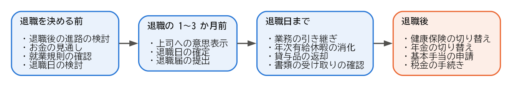
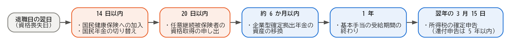

退職の全体像
============

この章では、退職の種類と、退職を考え始めてから退職後の手続きを終えるまでの流れを示します。個々の活動や手続きの詳しい説明は、次の章以降で行います。

退職の種類
----------

退職は、誰の意思で、どのような理由で雇用関係が終わるかによって、いくつかの種類に分けられます。退職の種類は、雇用保険の基本手当を受け取れるまでの期間や日数に影響します（:doc:`09_employment_insurance`\ を参照）。

.. list-table:: 退職の主な種類
   :header-rows: 1
   :widths: 25 45 30

   * - 種類
     - 内容
     - 雇用保険上の主な扱い
   * - 自己都合退職
     - 転職や家庭の事情など、労働者自身の都合で退職することです。
     - 一般の離職者
   * - 会社都合退職
     - 解雇、倒産、事業所の廃止、退職勧奨に応じた退職など、会社の都合で退職することです。
     - 特定受給資格者
   * - 定年退職
     - 就業規則で定めた定年の年齢に達したことによって退職することです。
     - 一般の離職者
   * - 契約期間の満了
     - 期間を定めた雇用契約が終わり、更新されずに退職することです。
     - 更新の希望の有無などによって異なります。

自己都合退職であっても、病気、家族の介護、通勤が困難になる転居など、やむを得ない理由がある場合は、**特定理由離職者**\ として会社都合退職に近い扱いを受けられることがあります。どの扱いになるかは、会社が離職票に記載した離職理由をもとに、最終的にハローワークが判断します。

退職の流れ
----------

退職の流れは、大きく次の 4 つの時期に分けられます。

   退職の流れ

各時期の活動と、詳しく説明している章は次のとおりです。

.. list-table:: 退職の流れと詳しい説明
   :header-rows: 1
   :widths: 22 48 30

   * - 時期
     - 主な活動と手続き
     - 詳しい説明
   * - 退職を決める前
     - 退職後の進路の検討、お金の見通しの確認、就業規則の確認、退職日の検討
     - :doc:`03_before_decision`
   * - 退職の 1〜3 か月前
     - 上司への退職の意思表示、退職届の提出、退職日の確定
     - :doc:`04_resignation`
   * - 退職日まで
     - 業務の引き継ぎ、年次有給休暇の消化、貸与品の返却、書類の受け取りの確認
     - :doc:`05_handover`、:doc:`06_documents`
   * - 退職後
     - 健康保険と年金の切り替え、雇用保険の基本手当の申請、税金の手続き
     - :doc:`07_health_insurance`、:doc:`08_pension`、:doc:`09_employment_insurance`、:doc:`10_tax`

退職後の手続きの期限
--------------------

退職後の手続きには、期限が決まっているものがあります。次の表は、退職日の翌日から数えた主な期限です。転職先が退職日の翌日から決まっている場合は、多くの手続きを転職先が行うため、自分で行う手続きは少なくなります（:doc:`11_career_paths`\ を参照）。

.. list-table:: 退職後の主な手続きの期限
   :name: table-deadlines
   :header-rows: 1
   :widths: 30 40 30

   * - 期限
     - 手続き
     - 窓口
   * - 14 日以内
     - 国民健康保険への加入
     - 市区町村
   * - 14 日以内
     - 国民年金の第 1 号被保険者への種別変更
     - 市区町村
   * - 20 日以内
     - 健康保険の任意継続被保険者の資格取得の申し出
     - 協会けんぽの支部、または健康保険組合
   * - 原則として 1 年以内（受給期間）
     - 雇用保険の基本手当の受給
     - ハローワーク
   * - 原則として 6 か月以内
     - 企業型確定拠出年金の資産の移換
     - iDeCo などの運営管理機関
   * - 翌年の 3 月 15 日まで（還付申告は 5 年以内）
     - 所得税の確定申告
     - 税務署

これらの期限を、期限が早い順に並べると次のようになります。箱の間隔は、実際の日数に比例していません。

   退職後の主な手続きの期限

健康保険と国民年金の手続きは、どちらか一方だけで済むわけではありません。転職先に入社しない場合は、両方の手続きが必要です。

雇用保険の基本手当は、受給期間が原則として退職日の翌日から 1 年間です。この期間を過ぎると、所定給付日数が残っていても受け取れなくなります。基本手当を受け取る予定がある場合は、退職後できるだけ早く手続きしてください。

「資格喪失日」という考え方
--------------------------

健康保険、厚生年金保険、雇用保険の資格は、退職日の翌日に失われます。この日を\ **資格喪失日**\ と呼びます。例えば、3 月 31 日に退職した場合、資格喪失日は 4 月 1 日です。

健康保険と厚生年金保険の保険料は、資格喪失日が属する月の前月の分まで、月単位でかかります。このため、退職日によって、退職する月の保険料を会社の保険で納めるか、国民健康保険と国民年金で納めるかが変わります。詳しくは\ :doc:`03_before_decision`\ で説明します。

まとめ
------

* 退職には、自己都合退職、会社都合退職、定年退職、契約期間の満了などの種類があり、雇用保険の扱いに影響します。
* 退職の流れは、退職を決める前、退職の 1〜3 か月前、退職日まで、退職後の 4 つの時期に分けられます。
* 退職後の手続きには、14 日以内、20 日以内などの期限があります。
* 社会保険の資格は、退職日の翌日（資格喪失日）に失われます。
