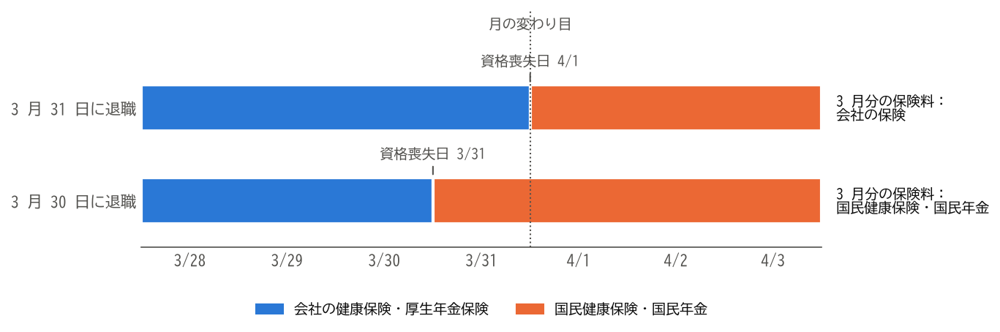

退職を決める前に
================

退職は、一度会社に伝えると取り消すのが難しい決断です。この章では、退職を会社に伝える前に、確認し、準備しておくべきことを説明します。

退職の理由と進路を整理する
--------------------------

まず、なぜ退職したいのか、退職して何をしたいのかを書き出してみましょう。理由が職場の人間関係や仕事の内容である場合は、異動や休職など、退職以外の方法で解決できることもあります。

退職後の進路は、主に次の 4 つに分けられます。進路によって、必要な手続きが大きく異なります（:doc:`11_career_paths`\ を参照）。

* 別の会社に転職する。
* 個人事業主として独立する、または会社を設立する。
* しばらく仕事をせずに、求職活動、学び直し、療養、育児、介護などに専念する。
* 定年退職し、継続雇用や再就職を選ぶか、引退する。

転職する場合は、できるだけ在職中に転職活動を行い、転職先が決まってから退職を伝えることをお勧めします。在職中であれば収入が途切れず、社会保険の手続きも転職先に任せられます。また、退職後に転職活動が長引くと、収入のない期間が長くなり、焦って転職先を選んでしまうおそれがあります。

お金の見通しを立てる
--------------------

退職後に収入がない期間が生じる場合は、その間の生活費を準備しておく必要があります。退職後は、在職中には給与から天引きされていた次のような支出を、自分で納めることになります。

.. list-table:: 退職後に自分で納めることになる主な支出
   :header-rows: 1
   :widths: 30 70

   * - 支出
     - 内容
   * - 健康保険料
     - 任意継続被保険者になる場合は、在職中に会社が負担していた分も含めて全額を自分で納めます。国民健康保険に加入する場合は、前年の所得などをもとに計算した保険料を納めます（:doc:`07_health_insurance`\ を参照）。
   * - 国民年金保険料
     - 第 1 号被保険者になると、定額の保険料を納めます。失業による免除の制度があります（:doc:`08_pension`\ を参照）。
   * - 住民税
     - 前年の所得にかかる税金を、退職した年も納めます。収入がなくなっても、すぐには安くなりません（:doc:`10_tax`\ を参照）。

雇用保険の基本手当を受け取れる場合でも、自己都合退職では、受け取りが始まるまでに 1 か月以上かかります（:doc:`09_employment_insurance`\ を参照）。収入のない期間の生活費と上の支出を見積もり、少なくとも数か月分の生活費を準備しておくと安心です。

また、住宅ローンやクレジットカードの審査、賃貸住宅の契約では、勤務先と収入が確認されます。これらの予定がある場合は、在職中に済ませておくのが無難です。

就業規則と社内の規程を確認する
------------------------------

退職を伝える前に、就業規則や退職金規程を読み、次の点を確認しておきましょう。

.. list-table:: 就業規則などで確認しておくこと
   :header-rows: 1
   :widths: 30 70

   * - 項目
     - 確認する内容
   * - 退職の申し出の時期
     - 退職日の何日前までに申し出るよう定めているか（:doc:`04_resignation`\ を参照）。
   * - 退職の手続き
     - 退職届の書式、提出先、承認の流れ。
   * - 退職金
     - 退職金制度の有無、支給の条件（勤続年数の下限など）、自己都合退職と会社都合退職での支給率の違い、支払いの時期。
   * - 賞与
     - 支給日に在籍していることを支給の条件としているか。
   * - 年次有給休暇
     - 残りの日数と、退職時の扱い（:doc:`05_handover`\ を参照）。
   * - 秘密保持と競業避止
     - 退職後の秘密保持の義務や、同業他社への転職を制限する定めがあるか（:doc:`13_troubles`\ を参照）。
   * - 企業年金
     - 確定給付企業年金や企業型確定拠出年金の有無と、退職時の扱い（:doc:`08_pension`\ を参照）。

退職日を決める
--------------

退職日は、会社と話し合って決めます。次の点を考えて、自分にとって不利にならない日を選びましょう。

* **賞与**：賞与の支給日の前に退職すると、支給されないことがあります。
* **退職金**：勤続年数が 1 年増えるだけで、退職金の額や、退職金にかかる税金が変わることがあります（:doc:`10_tax`\ を参照）。
* **年次有給休暇**：残りの有給休暇をすべて消化できる日程にします。
* **転職先の入社日**：退職日と入社日の間を空けないようにすると、健康保険と年金の切り替えの手続きが不要になります。
* **月末かどうか**：社会保険料の扱いが変わります（次の節を参照）。

月末に退職する場合と月の途中で退職する場合
------------------------------------------

:doc:`02_overview`\ で述べたように、健康保険と厚生年金保険の保険料は、資格喪失日が属する月の前月の分までかかります。このため、月末に退職するか、月末の前日までに退職するかで、退職する月の保険料の扱いが変わります。

.. list-table:: 3 月に退職する場合の例
   :header-rows: 1
   :widths: 20 20 60

   * - 退職日
     - 資格喪失日
     - 3 月分の保険料
   * - 3 月 31 日
     - 4 月 1 日
     - 会社の健康保険と厚生年金保険の保険料がかかります。会社が半分を負担します。
   * - 3 月 30 日
     - 3 月 31 日
     - 会社の保険料はかかりません。翌日から転職先に入社しない場合は、3 月分の国民健康保険料と国民年金保険料を納めます。

この違いを図にすると、次のようになります（退職後に転職先に入社しない場合）。3 月 31 日に退職すると、月の変わり目まで会社の保険に加入しているため、3 月分の保険料は会社の保険で納めます。3 月 30 日に退職すると、3 月の末日には国民健康保険と国民年金に加入しているため、3 月分の保険料はこれらの保険で納めます。

   退職日と、3 月分の保険料を納める保険

月の途中で退職すると、最後の給与から差し引かれる保険料は少なくなります。しかし、その月の国民健康保険料と国民年金保険料を全額自分で納めることになり、厚生年金保険の加入期間も 1 か月短くなります。転職先に入社するまでの間が空く場合は、一般的には月末に退職するほうが有利です。

なお、多くの会社では、ある月の社会保険料を翌月の給与から差し引きます。このため、月末に退職すると、最後の給与から 2 か月分の保険料が差し引かれることがあります。これは誤りではありません。

まとめ
------

* 退職の理由と退職後の進路を整理し、転職する場合はできるだけ在職中に転職先を決めます。
* 退職後は、健康保険料、国民年金保険料、住民税を自分で納めることになります。数か月分の生活費を準備しておきましょう。
* 就業規則と退職金規程を読み、退職の申し出の時期、退職金、賞与、有給休暇の扱いを確認します。
* 退職日は、賞与、退職金、有給休暇、転職先の入社日、社会保険料の扱いを考えて決めます。
