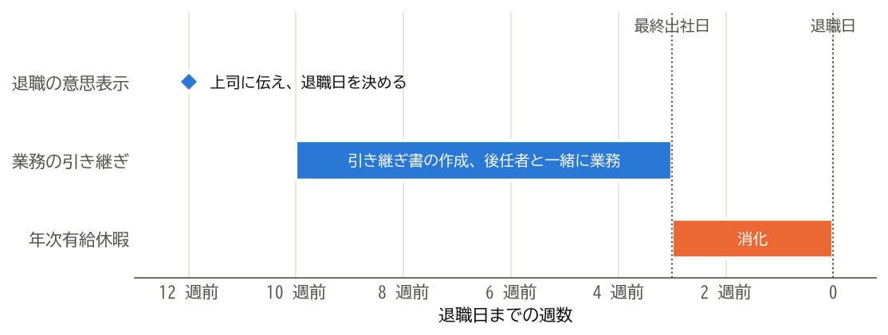

引き継ぎと年次有給休暇
======================

退職日が決まったら、担当している業務を後任者に引き継ぎ、残りの年次有給休暇を消化します。この章では、引き継ぎの進め方と、有給休暇の扱いを説明します。

引き継ぎの計画を立てる
----------------------

引き継ぎは、最終出社日から逆算して計画します。有給休暇を消化してから退職する場合は、退職日ではなく、最終出社日までに引き継ぎを終える必要があります。

:numref:`fig-schedule` は、退職日の約 3 か月前に退職の意思を伝え、残りの有給休暇（約 15 日）を最後の 3 週間で消化する場合の日程の例です。

.. _fig-schedule:

   退職日から逆算した日程の例

引き継ぎは、次の手順で進めるとよいでしょう。

1. **担当業務を洗い出します。**\ 定常的な業務だけでなく、年に一度しか発生しない業務や、自分しか知らない作業も書き出します。
2. **上司と後任者を確認します。**\ 業務ごとに、誰に引き継ぐかを上司と決めます。
3. **引き継ぎ書を作成します。**\ 後任者が一人で読んでも業務を進められるように書きます。
4. **後任者と一緒に業務を行います。**\ 引き継ぎ書を渡すだけでなく、実際の業務を一緒に行い、疑問に答えます。
5. **取引先に後任者を紹介します。**\ 上司と相談したうえで、後任者と一緒に挨拶に行くか、連絡します。

引き継ぎ書を作成する
--------------------

引き継ぎ書には、業務ごとに次のような項目を書きます。

.. code-block:: text
   :caption: 引き継ぎ書の項目の例
   :linenos:

   業務名：月次の売上報告
   目的：営業部の売上を集計し、経営会議に報告する。
   頻度と時期：毎月、第 3 営業日までに作成する。
   手順：
     1. 販売管理システムから前月の売上データを出力する。
     2. 共有フォルダーの集計表に貼り付け、グラフを更新する。
     3. 部長の確認を受け、経営企画部に送付する。
   関係者：経営企画部の担当者、営業部長
   資料の保存場所：共有フォルダー「営業部/月次報告」
   注意点：月初が連休の場合は、締め切りを前倒しする。
   進行中の案件：なし

引き継ぎ書は、自分のパソコンの中ではなく、後任者や上司が見られる共有の場所に保存します。業務で使っていたファイルやメールも、必要なものは共有の場所に移しておきましょう。

年次有給休暇を消化する
----------------------

年次有給休暇は、労働基準法第 39 条で定められた労働者の権利です。退職によって雇用契約が終わると、残った有給休暇は消滅します。退職日までに消化できるよう、引き継ぎの計画と合わせて取得の日程を決めましょう。

会社は、事業の正常な運営を妨げる場合に、有給休暇を取得する日を変更させることができます。これを\ **時季変更権**\ と呼びます。しかし、退職日までの期間をすべて有給休暇に充てる場合は、変更できる日がないため、会社は時季変更権を行使できないと解されています。

とはいえ、引き継ぎを終えずに有給休暇に入ると、後任者や同僚に負担がかかります。退職日を決める段階で、引き継ぎに必要な期間と有給休暇の日数の両方を考えておくことが大切です。

有給休暇の買い取り
------------------

有給休暇を買い取ることは、労働者が休む権利を損なうため、原則として認められていません。ただし、退職時に消化できずに残った有給休暇を会社が買い取ることは、違法ではないと解されています。買い取りは会社の義務ではないため、買い取りを希望する場合は会社に相談してください。

挨拶と最終出社日
----------------

最終出社日には、お世話になった人に挨拶をします。社内のメールで挨拶をする場合は、感謝の気持ちを簡潔に伝え、退職後の連絡先を書くかどうかは自分で判断します。

最終出社日までに、次のことを済ませておきましょう。

* 引き継ぎの完了を上司に報告します。
* 貸与品を返却し、受け取る書類を確認します（:doc:`06_documents`\ を参照）。
* 業務で使っていたパソコンから、私物のデータを削除します。会社のデータを私物の記録媒体やクラウドサービスに持ち出してはいけません（:doc:`13_troubles`\ を参照）。

まとめ
------

* 引き継ぎは、退職日ではなく最終出社日から逆算して計画します。
* 引き継ぎ書は、後任者が一人で読んでも業務を進められるように書き、共有の場所に保存します。
* 残った有給休暇は退職によって消滅します。退職日までの期間を有給休暇に充てる場合、会社は時季変更権を行使できないと解されています。
* 退職時に残った有給休暇の買い取りは違法ではありませんが、会社の義務ではありません。
