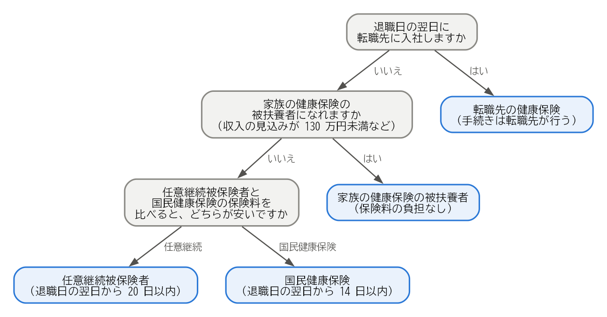

健康保険の手続き
================

日本では、すべての人がいずれかの公的な医療保険に加入する必要があります。会社の健康保険の資格は退職日の翌日に失われるため、退職後に加入する医療保険を自分で選び、手続きする必要があります。この章では、その選択肢と手続きを説明します。

退職後の医療保険の選択肢
------------------------

退職後に加入する医療保険には、次の 4 つの選択肢があります。

.. list-table:: 退職後の医療保険の選択肢
   :name: table-health-options
   :header-rows: 1
   :widths: 22 30 24 24

   * - 選択肢
     - 対象となる人
     - 手続きの期限
     - 窓口
   * - 転職先の健康保険
     - 退職日の翌日に転職先に入社する人
     - 入社時
     - 転職先の会社
   * - 任意継続被保険者
     - 退職日までに継続して 2 か月以上、健康保険の被保険者だった人
     - 退職日の翌日から 20 日以内
     - 協会けんぽの都道府県支部、または健康保険組合
   * - 国民健康保険
     - 他の医療保険に加入しない人
     - 退職日の翌日から 14 日以内
     - 住所地の市区町村
   * - 家族の健康保険の被扶養者
     - 収入などの条件を満たす人
     - 速やかに（家族の勤務先を通じて手続きします）
     - 家族の勤務先

転職先に入社するまでに 1 日でも間が空く場合は、その期間について、任意継続被保険者、国民健康保険、家族の被扶養者のいずれかを選ぶ必要があります。

任意継続被保険者
----------------

**任意継続被保険者**\ とは、退職した後も、在職中に加入していた健康保険に、本人の希望で引き続き加入する制度です。

* **加入できる期間**：最長 2 年間です。2022 年 1 月からは、本人が申し出れば、2 年を待たずに脱退できるようになりました。
* **保険料**：在職中は会社が保険料の半分を負担していましたが、任意継続被保険者になると全額を自分で負担します。そのため、保険料はおおむね在職中の 2 倍になります。ただし、保険料の計算のもとになる標準報酬月額には上限があります（上限は健康保険によって異なります）。
* **家族**：在職中に被扶養者だった家族は、引き続き被扶養者として加入できます。追加の保険料はかかりません。
* **給付**：医療費の自己負担の割合などは、在職中とほぼ同じです。ただし、病気やけがで働けないときの傷病手当金や、出産で休んだときの出産手当金は、原則として支給されません（後述の継続給付を除きます）。
* **注意点**：保険料を納付期限までに納めないと、資格を失います。

申し出の期限である 20 日は、正当な理由がない限り延長されません。任意継続を選ぶ可能性がある場合は、退職前に申出書を入手し、保険料の額を確認しておきましょう。

国民健康保険
------------

**国民健康保険**\ は、市区町村などが運営する医療保険です。会社の健康保険や任意継続被保険者に加入しない人が加入します。

* **保険料**：前年の所得と、加入する世帯の人数などをもとに計算します。計算方法と金額は市区町村によって異なります。
* **家族**：国民健康保険には被扶養者という考え方がありません。家族も一人一人が加入者となり、人数に応じて保険料が加算されます。
* **手続き**：資格喪失証明書（または退職証明書など、退職日が分かる書類）とマイナンバーが分かる書類を持って、市区町村の窓口で手続きします。

手続きが 14 日を過ぎた場合でも、国民健康保険の資格は、会社の健康保険の資格を失った日にさかのぼって得られます。保険料も、その日にさかのぼって納めることになります。手続きが済むまでの間に医療機関で医療費を全額支払った場合は、手続きの後に申請すれば、自己負担分を除いた額が払い戻されます。

会社の都合で退職した人の保険料の軽減
------------------------------------

会社の倒産や解雇などで退職した人は、国民健康保険料が軽減される制度があります。雇用保険の特定受給資格者または特定理由離職者（:doc:`09_employment_insurance`\ を参照）で、離職した日に 65 歳未満の人が対象です。

この制度では、前年の給与所得を 100 分の 30 とみなして保険料を計算します。軽減を受けられる期間は、離職日の翌日が属する月から、その翌年度の末までです。申請には、ハローワークで交付される雇用保険受給資格者証などが必要です。

このほか、市区町村によっては、所得が大きく減った場合などに保険料を減免する独自の制度があります。

家族の健康保険の被扶養者
------------------------

配偶者などの家族が会社の健康保険に加入している場合は、その被扶養者になれることがあります。被扶養者は、保険料を負担せずに医療保険に加入できます。

主な条件は、次のとおりです（家族と同居している場合。金額は 2026 年 10 月 7 日確認）。

* 今後 1 年間の収入の見込みが 130 万円未満であること（60 歳以上の人や、一定の障害がある人は 180 万円未満）。
* 収入が、被保険者である家族の収入の半分未満であること。

雇用保険の基本手当も、この収入に含まれます。協会けんぽでは、基本手当の日額が 3,612 円以上（60 歳以上の人などは 5,000 円以上。2026 年 10 月 7 日確認）の場合、基本手当を受け取っている間は被扶養者になれません。130 万円を 360 日で割ると約 3,611 円になるためです。基本手当の受け取りが始まるまでの待期期間や給付制限の期間は、被扶養者になれる場合があります。認定の基準は健康保険によって異なることがあるため、家族の勤務先に確認してください。

医療保険の選び方
----------------

転職先に入社しない場合は、次の順に検討するとよいでしょう。全体の流れを\ :numref:`fig-health-insurance` に示します。

.. _fig-health-insurance:

   退職後の医療保険の選び方

1. **家族の被扶養者になれるかを確認します。**\ なれる場合は、保険料の負担がないため、最も有利です。
2. **任意継続被保険者と国民健康保険の保険料を比べます。**\ 国民健康保険料は、市区町村の窓口やウェブサイトで、前年の所得をもとに試算できます。会社の都合で退職した場合は、軽減後の金額で比べます。

一般に、扶養している家族が多い人は、家族の分の保険料がかからない任意継続被保険者が有利になりやすい傾向があります。前年の所得が高かった人は、国民健康保険料が高くなるため、任意継続被保険者が有利になることがあります。

任意継続被保険者を選んだ場合でも、退職した翌年度には国民健康保険料の計算のもとになる所得が下がり、国民健康保険のほうが安くなることがあります。その場合は、任意継続被保険者を脱退して国民健康保険に切り替えることを検討してください。

.. note::

   **傷病手当金の継続給付**

   病気やけがで働けない状態のまま退職する場合、退職日までに継続して 1 年以上被保険者であったなどの条件を満たせば、退職後も傷病手当金を受け取れることがあります。これを継続給付と呼びます。退職日に出勤すると条件を満たさなくなることがあるため、該当する可能性がある場合は、退職前に加入している健康保険に確認してください。

まとめ
------

* 退職後の医療保険には、転職先の健康保険、任意継続被保険者、国民健康保険、家族の被扶養者の 4 つの選択肢があります。
* 任意継続被保険者は退職日の翌日から 20 日以内、国民健康保険は 14 日以内に手続きします。
* 任意継続被保険者の保険料は、在職中のおおむね 2 倍になります。国民健康保険料は前年の所得などで決まり、会社の都合で退職した人には軽減の制度があります。
* 家族の被扶養者になれる場合は、保険料の負担がありません。基本手当の日額によっては、受給中は被扶養者になれないことがあります。
