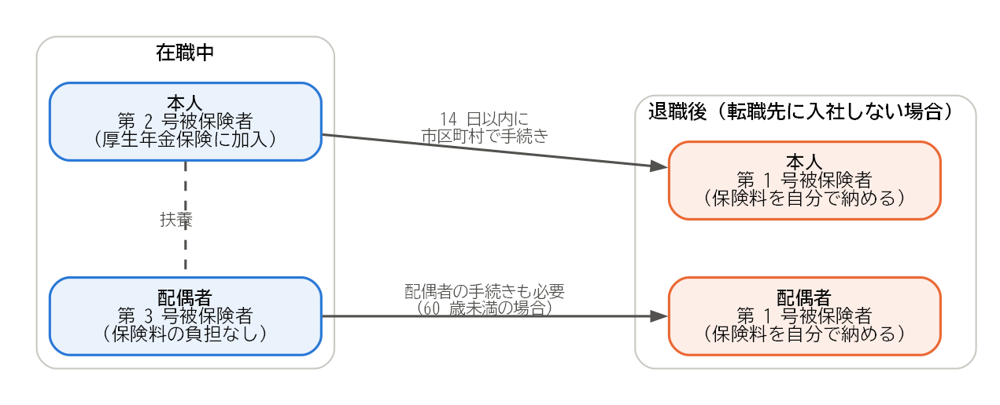

年金の手続き
============

日本に住む 20 歳以上 60 歳未満の人は、すべて国民年金に加入します。会社員は厚生年金保険にも加入していますが、退職するとその資格を失うため、国民年金の加入の種別を切り替える手続きが必要になります。この章では、公的年金の手続きと、企業年金の扱いを説明します。

国民年金の被保険者の種別
------------------------

国民年金の被保険者は、働き方などによって 3 つの種別に分かれています。

.. list-table:: 国民年金の被保険者の種別
   :header-rows: 1
   :widths: 20 45 35

   * - 種別
     - 対象となる人
     - 保険料
   * - 第 1 号被保険者
     - 自営業者、学生、無職の人など、第 2 号・第 3 号被保険者以外の人
     - 定額の国民年金保険料を自分で納めます。
   * - 第 2 号被保険者
     - 会社員や公務員など、厚生年金保険に加入している人
     - 給与に応じた厚生年金保険料を、会社と折半して納めます。
   * - 第 3 号被保険者
     - 第 2 号被保険者に扶養されている、年収が原則 130 万円未満（2026 年 10 月 7 日確認）の配偶者
     - 自分で納める必要はありません。

会社員は第 2 号被保険者です。退職すると、退職後の状況に応じて、次のように種別が変わります。

.. list-table:: 退職後の種別と手続き
   :header-rows: 1
   :widths: 35 25 40

   * - 退職後の状況
     - 種別
     - 手続き
   * - 退職日の翌日に転職先に入社する
     - 第 2 号被保険者のまま
     - 転職先の会社が行います。
   * - 第 2 号被保険者である配偶者に扶養される
     - 第 3 号被保険者
     - 配偶者の勤務先を通じて行います。
   * - 上記以外（求職中、独立など）
     - 第 1 号被保険者
     - 退職日の翌日から 14 日以内に、住所地の市区町村で行います。

第 1 号被保険者への切り替えの手続きには、基礎年金番号が分かる書類（基礎年金番号通知書または年金手帳）と、退職日が分かる書類（離職票や退職証明書など）が必要です。マイナポータルから電子申請できる場合もあります。

配偶者の手続きを忘れない
------------------------

在職中に配偶者を第 3 号被保険者として扶養していた場合は、注意が必要です。自分が第 2 号被保険者でなくなると、配偶者も第 3 号被保険者の資格を失います。配偶者が 60 歳未満であれば、配偶者についても第 1 号被保険者への切り替えの手続きが必要です（:numref:`fig-pension-types`）。

.. _fig-pension-types:

   退職による国民年金の種別の変化（配偶者を扶養している場合）

なお、60 歳以上の人は国民年金に加入する義務がありません。ただし、老齢基礎年金を満額に近づけるために、65 歳まで任意で加入することができます。

保険料の免除と納付猶予
----------------------

収入が減って国民年金保険料を納めるのが難しい場合は、保険料の免除や納付猶予を申請できます。

* **免除**：所得に応じて、保険料の全額、4 分の 3、半額、4 分の 1 が免除されます。
* **納付猶予**：50 歳未満の人は、保険料の納付を先送りできます。
* **失業による特例**：退職した人は、本人の所得をないものとして審査を受けられます。そのため、前年の所得が多くても、免除を受けられることがあります。申請には、離職票や雇用保険受給資格者証など、失業したことが分かる書類が必要です。ただし、配偶者や世帯主の所得も審査されます。

免除や納付猶予を受けた期間は、年金を受け取るために必要な加入期間に含まれます。全額免除を受けた期間は、保険料を納めた場合の 2 分の 1 の額が老齢基礎年金に反映されます（国庫負担分）。免除や納付猶予を受けた保険料は、10 年以内であれば、後から納める（追納する）ことができます。

保険料を納めずに放置すると、未納の期間となり、将来の老齢基礎年金が減るだけでなく、障害や死亡のときに障害基礎年金や遺族基礎年金を受け取れなくなるおそれがあります。納めるのが難しい場合は、未納のままにせず、免除や納付猶予を申請してください。

企業年金の扱い
--------------

勤務先に企業年金がある場合は、退職時にその扱いを確認します。企業年金には、主に次の 2 つがあります。

確定給付企業年金
^^^^^^^^^^^^^^^^

**確定給付企業年金**\ （DB）は、将来受け取る給付の額があらかじめ決まっている企業年金です。退職時の受け取り方は規約によって異なり、一時金として受け取る、将来年金として受け取る、転職先の企業年金や企業年金連合会に移すなどの方法があります。退職前に、会社の担当者や企業年金の運営者に確認してください。

企業型確定拠出年金
^^^^^^^^^^^^^^^^^^

**企業型確定拠出年金**\ （企業型 DC）は、会社が拠出した掛金を加入者自身が運用し、その結果によって将来の給付の額が決まる企業年金です。原則として 60 歳になるまで引き出せないため、退職したときは、資産を次のいずれかに移す（移換する）手続きが必要です。

* 転職先の企業型確定拠出年金
* 個人型確定拠出年金（\ **iDeCo**\ ）

移換の手続きは、資格を失った月の翌月から 6 か月以内に行います。この期間内に手続きをしないと、資産は国民年金基金連合会に自動的に移されます（\ **自動移換**\ ）。自動移換されると、資産は運用されず、管理の手数料が差し引かれ続けます。また、自動移換されていた期間は、老齢給付金を受け取るための加入期間に含まれません。自動移換を避けるため、退職したら早めに手続きしましょう。

なお、確定拠出年金は制度の見直しが続いており、2026 年 12 月以降、掛金の上限額や iDeCo に加入できる年齢などが変わります。手続きの前に、最新の制度を確認してください。

年金の記録を確認する
--------------------

退職を機に、自分の年金の加入記録を確認しておくとよいでしょう。日本年金機構の「ねんきんネット」では、これまでの加入記録や、将来受け取る年金の見込み額を確認できます。記録に漏れがある場合は、年金事務所に相談してください。

まとめ
------

* 退職して転職先に入社しない場合は、退職日の翌日から 14 日以内に、国民年金の第 1 号被保険者への切り替えの手続きを市区町村で行います。
* 配偶者を第 3 号被保険者として扶養していた場合は、配偶者の手続きも必要です。
* 保険料を納めるのが難しい場合は、未納のままにせず、免除や納付猶予を申請します。退職した人には失業による特例があります。
* 企業型確定拠出年金は、資格を失った月の翌月から 6 か月以内に移換の手続きをしないと、自動移換されて不利になります。
