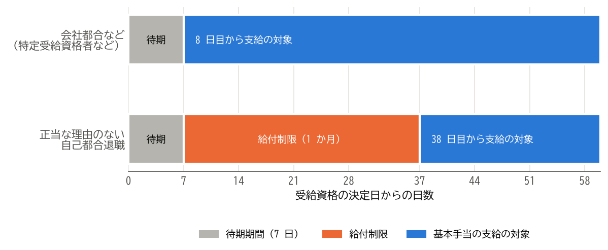

雇用保険の基本手当
==================

雇用保険に加入していた人が退職し、次の仕事を探している間は、雇用保険から\ **基本手当**\ を受け取ることができます。この章では、基本手当を受け取るための条件、手続きの流れ、受け取れる額と日数を説明します。

.. important::

   この章の内容は、制度改正の影響を特に受けやすい部分です。雇用保険の制度は毎年のように見直されており、例えば自己都合退職の給付制限は 2025 年 4 月に 2 か月から 1 か月に短縮されました。また、基本手当日額の上限額と下限額は毎年 8 月に改定されます。この章は 2026 年 10 月 7 日時点の制度に基づいています。手続きの前に、ハローワークや厚生労働省のウェブサイトで最新の情報を確認してください。

基本手当を受け取れる人
----------------------

基本手当は、「失業の状態」にある人に支給されます。失業の状態とは、就職しようとする意思と、いつでも就職できる能力（健康状態や環境など）があり、積極的に求職活動を行っているにもかかわらず、就職できない状態のことです。

そのため、次のような人は、基本手当を受け取れません。

* 病気やけが、妊娠、出産、育児などのため、すぐに働けない人（受給期間の延長の対象になることがあります）
* 次の就職先が決まっている人
* 自営業を始めた人や、始める準備に専念している人
* しばらく休養するつもりで、求職活動をしない人

また、離職日以前の一定の期間に、雇用保険の被保険者だった期間が必要です。

.. list-table:: 基本手当を受け取るために必要な被保険者期間
   :header-rows: 1
   :widths: 40 60

   * - 離職理由
     - 必要な被保険者期間
   * - 一般の離職者（自己都合退職など）
     - 離職日以前 2 年間に、被保険者期間が通算して 12 か月以上
   * - 特定受給資格者、特定理由離職者
     - 離職日以前 1 年間に、被保険者期間が通算して 6 か月以上（上の条件を満たしてもよい）

被保険者期間は、賃金の支払いの基礎となった日数が 11 日以上、または労働時間が 80 時間以上ある月を 1 か月として数えます。

離職理由による区分
------------------

基本手当は、離職理由によって、受け取れるまでの期間や日数が異なります。離職理由は、次の 3 つに区分されます。

.. list-table:: 離職理由による区分
   :header-rows: 1
   :widths: 25 75

   * - 区分
     - 主な例
   * - 特定受給資格者
     - 倒産、事業所の廃止、解雇（自分の責めに帰すべき重大な理由によるものを除きます）、退職勧奨、賃金の大幅な減額や未払い、法律の基準を超える長時間の残業、ハラスメントなどによって離職した人
   * - 特定理由離職者
     - 期間の定めがある雇用契約が、本人が更新を希望したにもかかわらず更新されなかった人。病気やけが、妊娠、出産、家族の介護、配偶者の転勤に伴う転居など、正当な理由がある自己都合退職をした人
   * - 一般の離職者
     - 上記以外の理由で離職した人（正当な理由がない自己都合退職、定年退職など）

離職理由は、会社が離職票に記載し、本人が内容を確認します。ハローワークは、会社と本人の双方の主張と資料をもとに、離職理由を判定します。離職票に記載された離職理由に納得できない場合は、ハローワークで手続きするときに、その旨を申し出てください。長時間の残業やハラスメントが理由の場合は、勤務記録やメールなど、事実を示す資料があると判定に役立ちます。

手続きの流れ
------------

基本手当は、次の流れで受け取ります。

.. list-table:: 基本手当を受け取るまでの流れ
   :header-rows: 1
   :widths: 30 70

   * - 段階
     - 内容
   * - 1. 離職票を受け取る
     - 会社がハローワークで手続きした後、離職票が届きます（:doc:`06_documents`\ を参照）。
   * - 2. 求職の申し込みをする
     - 住所地を管轄するハローワークで求職の申し込みをし、離職票を提出します。ハローワークが受給の要件を満たしていることを確認すると、受給資格が決定します。
   * - 3. 待期期間
     - 受給資格が決定した日から、失業の状態にあった日が通算して 7 日になるまでの期間は、離職理由にかかわらず支給されません。
   * - 4. 雇用保険受給者初回説明会
     - 制度の説明を受け、雇用保険受給資格者証などを受け取ります。
   * - 5. 給付制限の期間
     - 正当な理由のない自己都合退職などの場合は、待期期間の後、一定の期間は支給されません（次の節を参照）。
   * - 6. 失業の認定
     - 原則として 4 週間に 1 回、指定された日にハローワークで失業の認定を受けます。認定を受けた日数分の基本手当が、指定した口座に振り込まれます。

ハローワークでの最初の手続きには、主に次のものが必要です。

* 離職票（離職票-1 と離職票-2）
* マイナンバーカード（ない場合は、マイナンバーが分かる書類と、運転免許証などの身元を確認できる書類）
* 写真 2 枚（マイナンバーカードを提示する場合は、省略できることがあります）
* 本人名義の預金通帳またはキャッシュカード

給付制限
--------

**給付制限**\ とは、離職理由によって、待期期間の後も一定の期間、基本手当が支給されない仕組みです。

.. list-table:: 給付制限の期間
   :header-rows: 1
   :widths: 60 40

   * - 離職理由
     - 給付制限の期間
   * - 特定受給資格者、特定理由離職者
     - なし
   * - 正当な理由のない自己都合退職
     - 原則として 1 か月
   * - 正当な理由のない自己都合退職で、離職日以前 5 年間に、同じ理由で 2 回以上受給資格の決定を受けている場合
     - 3 か月
   * - 自分の責めに帰すべき重大な理由による解雇
     - 3 か月

自己都合退職の給付制限は、2025 年 4 月 1 日以降に離職した人から、2 か月から 1 か月に短縮されました。また、離職日以前 1 年以内や離職後に、一定の教育訓練を自ら受講した場合は、給付制限が解除されます。

待期期間と給付制限の関係を、離職理由ごとに\ :numref:`fig-benefit-timeline` に示します。図では、給付制限の 1 か月を 30 日として描いています。

.. _fig-benefit-timeline:

   基本手当の支給の対象になるまでの期間

このように、自己都合退職の場合は、待期期間と給付制限の期間があるため、手続きをしてから最初の基本手当が振り込まれるまでに、おおむね 1 か月半から 2 か月ほどかかります。

基本手当の額
------------

基本手当の 1 日あたりの額を\ **基本手当日額**\ と呼びます。基本手当日額は、退職前の賃金をもとに、次の手順で計算します。

まず、離職日の直前 6 か月間に毎月決まって支払われた賃金（賞与を除きます）の合計を 180 で割り、\ **賃金日額**\ を求めます。

.. math::

   \text{賃金日額} = \frac{\text{離職前 6 か月間の賃金の合計}}{180}

次に、賃金日額に給付率を掛けて、基本手当日額を求めます。

.. math::

   \text{基本手当日額} = \text{賃金日額} \times \text{給付率}

給付率は、離職日に 60 歳未満の人は 50〜80%、60 歳以上 65 歳未満の人は 45〜80% です。賃金日額が低い人ほど、給付率が高くなります。また、賃金日額と基本手当日額には、年齢ごとに上限額と下限額があり、毎年 8 月に改定されます。

例えば、毎月の賃金が 30 万円の人の賃金日額は、次のとおりです。

.. math::

   \frac{300{,}000 \times 6}{180} = 10{,}000 \text{（円）}

この人の給付率が仮に 60% であれば、基本手当日額は 6,000 円です。実際の給付率は、ハローワークで確認してください。

基本手当を受け取れる日数
------------------------

基本手当を受け取れる日数の上限を\ **所定給付日数**\ と呼びます。所定給付日数は、離職理由、離職日の年齢、被保険者であった期間によって決まります。

一般の離職者の所定給付日数は、年齢にかかわらず、被保険者であった期間だけで決まります。

.. list-table:: 一般の離職者の所定給付日数
   :header-rows: 1
   :widths: 34 22 22 22

   * - 被保険者であった期間
     - 10 年未満
     - 10 年以上 20 年未満
     - 20 年以上
   * - 所定給付日数
     - 90 日
     - 120 日
     - 150 日

特定受給資格者と、一部の特定理由離職者（雇用契約が更新されなかった人）の所定給付日数は、次のとおりです。

.. list-table:: 特定受給資格者などの所定給付日数
   :header-rows: 1
   :widths: 20 16 16 16 16 16

   * - 離職日の年齢
     - 1 年未満
     - 1 年以上 5 年未満
     - 5 年以上 10 年未満
     - 10 年以上 20 年未満
     - 20 年以上
   * - 30 歳未満
     - 90 日
     - 90 日
     - 120 日
     - 180 日
     - ―
   * - 30 歳以上 35 歳未満
     - 90 日
     - 120 日
     - 180 日
     - 210 日
     - 240 日
   * - 35 歳以上 45 歳未満
     - 90 日
     - 150 日
     - 180 日
     - 240 日
     - 270 日
   * - 45 歳以上 60 歳未満
     - 90 日
     - 180 日
     - 240 日
     - 270 日
     - 330 日
   * - 60 歳以上 65 歳未満
     - 90 日
     - 150 日
     - 180 日
     - 210 日
     - 240 日

表の列は、被保険者であった期間を表します。障害者などの就職が困難な人には、別の所定給付日数が定められています。

受給期間と延長
--------------

基本手当を受け取れる期間（\ **受給期間**\ ）は、原則として離職日の翌日から 1 年間です。受給期間を過ぎると、所定給付日数が残っていても、基本手当を受け取れません。手続きが遅れると、受給期間内に所定給付日数をすべて受け取れなくなることがあります。

次のような場合は、申請によって受給期間を延長できます。

.. list-table:: 受給期間の延長
   :header-rows: 1
   :widths: 50 50

   * - 理由
     - 延長できる期間
   * - 病気、けが、妊娠、出産、育児、親族の介護などのため、引き続き 30 日以上働けない
     - 働けない日数分（最長 3 年間。本来の 1 年と合わせて最長 4 年間）
   * - 60 歳以上の定年などで離職し、しばらく休養する
     - 最長 1 年間（離職日の翌日から 2 か月以内に申請します）

受給中の求職活動と仕事
----------------------

失業の認定を受けるには、原則として、前回の認定日から今回の認定日までの間に、2 回以上の求職活動の実績が必要です。求職活動には、求人への応募、ハローワークでの職業相談、ハローワークなどが行うセミナーへの参加などが含まれます。求人情報を閲覧するだけでは、求職活動の実績になりません。

基本手当を受け取っている間に、アルバイトなどで働いた場合は、失業の認定のときに必ず申告します。働いた時間や収入によって、その日の基本手当が支給されなかったり、減額されたりします。申告をしないと不正受給となり、受け取った額の返還に加えて、最大でその 2 倍の額の納付を命じられることがあります。

再就職手当
----------

基本手当の受給資格が決定した後、早い時期に安定した仕事に就いた場合は、\ **再就職手当**\ を受け取れることがあります。主な条件は、次のとおりです。

* 待期期間が過ぎた後に就職したこと。
* 就職日の前日までの失業の認定を受けた後の、基本手当の支給の残りの日数（支給残日数）が、所定給付日数の 3 分の 1 以上あること。
* 1 年を超えて勤務することが確実であること。
* 給付制限がある場合、待期期間が過ぎた後の 1 か月間は、ハローワークなどの紹介によって就職したこと。

再就職手当の額は、次の式で計算します。

.. math::

   \text{再就職手当} = \text{基本手当日額} \times \text{支給残日数} \times \text{給付率}

給付率は、支給残日数が所定給付日数の 3 分の 2 以上であれば 70%、3 分の 1 以上であれば 60% です。計算に使う基本手当日額には、上限額があります。再就職手当は、就職日の翌日から 1 か月以内に申請します。

まとめ
------

* 基本手当は、就職する意思と能力があり、求職活動をしている失業の状態の人に支給されます。
* 離職理由は、特定受給資格者、特定理由離職者、一般の離職者に区分され、受給の条件、給付制限、所定給付日数に影響します。
* 正当な理由のない自己都合退職では、7 日間の待期期間の後、原則として 1 か月の給付制限があります。
* 基本手当日額は、離職前 6 か月間の賃金から計算した賃金日額に、50〜80%（60 歳以上 65 歳未満は 45〜80%）の給付率を掛けて求めます。
* 受給期間は原則として離職日の翌日から 1 年間です。基本手当を受け取る場合は、早めに手続きしましょう。
