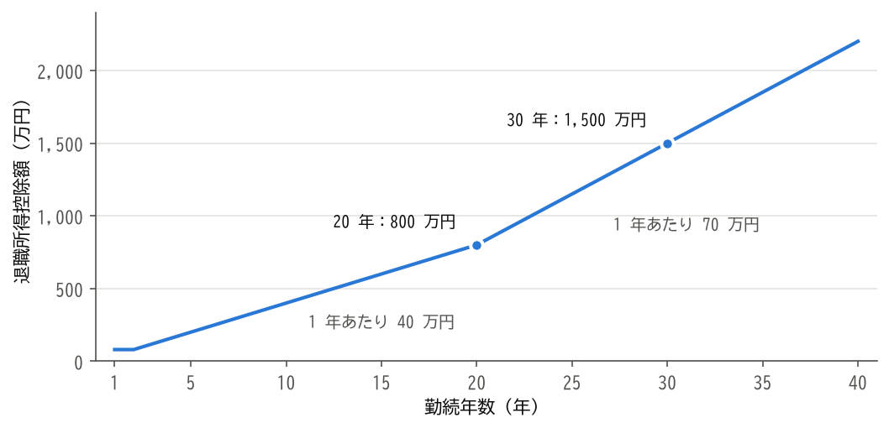
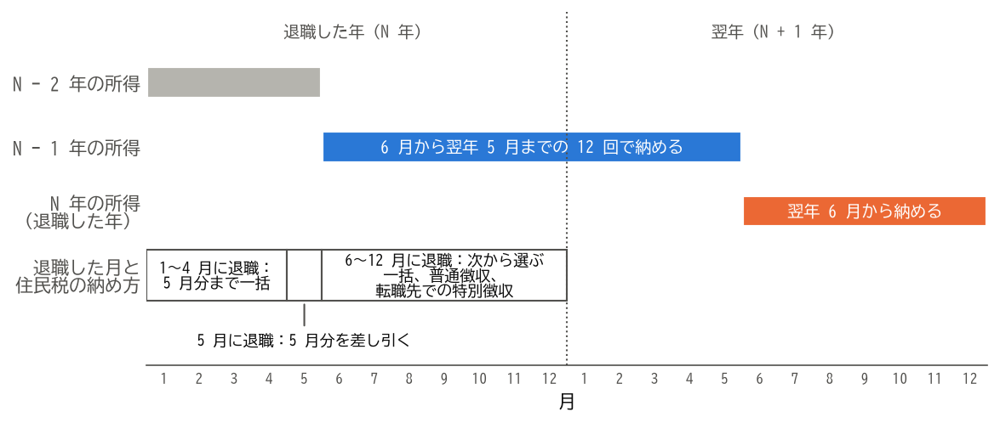

税金の手続き
============

会社員の所得税と住民税は、在職中は会社が給与から差し引いて納めています。退職すると、その一部を自分で手続きすることになります。この章では、給与にかかる所得税、退職金にかかる税金、住民税について説明します。

給与にかかる所得税
------------------

在職中は、毎月の給与から所得税が源泉徴収され、年末に会社が\ **年末調整**\ を行って、1 年間の税額を精算しています。年の途中で退職すると、退職した会社では年末調整が行われません。

その年のうちに転職先に入社した場合は、前の会社から受け取った給与所得の源泉徴収票を転職先に提出します。転職先が、前の会社の給与と合わせて年末調整を行います。

その年のうちに再就職しなかった場合は、翌年に自分で\ **確定申告**\ を行います。毎月の源泉徴収では、1 年間働き続けることを前提に税額が計算されているため、年の途中で退職した人は、確定申告をすると所得税の一部が戻ってくる（還付される）ことが多くあります。

確定申告の期間は、原則として翌年の 2 月 16 日から 3 月 15 日までです。ただし、税金の還付を受けるための申告（\ **還付申告**\ ）は、翌年の 1 月 1 日から 5 年間行うことができます。

確定申告では、次のような控除も受けられます。

* 退職後に自分で納めた国民健康保険料、国民年金保険料、任意継続被保険者の保険料（社会保険料控除）
* iDeCo の掛金（小規模企業共済等掛金控除）
* 生命保険料控除、医療費控除など、在職中は年末調整で受けていた控除や、年末調整では受けられない控除

確定申告書は、国税庁の「確定申告書等作成コーナー」で作成し、e-Tax で提出できます。必要な書類は、給与所得の源泉徴収票と、控除を受けるための証明書などです。

なお、雇用保険の基本手当は非課税のため、確定申告で申告する必要はありません。

退職金にかかる税金
------------------

退職金は、長年の勤務に対する報酬であり、退職後の生活の資金でもあるため、給与よりも税金の負担が軽くなるように配慮されています。退職金にかかる所得を\ **退職所得**\ と呼び、他の所得とは分けて税額を計算します（分離課税）。

退職所得控除
^^^^^^^^^^^^

退職金からは、勤続年数に応じた\ **退職所得控除**\ を差し引くことができます。勤続年数に 1 年未満の端数がある場合は、1 年に切り上げます。退職所得控除額は、次のとおりです（2026 年 10 月 7 日確認）。

.. list-table:: 退職所得控除額
   :header-rows: 1
   :widths: 40 60

   * - 勤続年数
     - 退職所得控除額
   * - 20 年以下
     - 40 万円 × 勤続年数（80 万円に満たない場合は 80 万円）
   * - 20 年超
     - 800 万円 + 70 万円 × （勤続年数 − 20 年）

障害者になったことが直接の原因で退職した場合は、上の金額に 100 万円が加算されます。

勤続年数と退職所得控除額の関係を\ :numref:`fig-retirement-deduction` に示します。勤続 20 年を境に、1 年あたりの控除額が 40 万円から 70 万円に増えます。

.. _fig-retirement-deduction:

   勤続年数と退職所得控除額

退職所得の計算
^^^^^^^^^^^^^^

退職所得の金額は、原則として次の式で計算します。

.. math::

   \text{退職所得} = (\text{退職金の額} - \text{退職所得控除額}) \times \frac{1}{2}

ただし、勤続年数が 5 年以下の場合は、退職金の額から退職所得控除額を差し引いた残りのうち、300 万円を超える部分には 2 分の 1 を掛けません。

計算の例
^^^^^^^^

勤続 30 年で、2,000 万円の退職金を受け取る場合を考えます。

.. math::

   \text{退職所得控除額} = 800 + 70 \times (30 - 20) = 1{,}500 \text{（万円）}

.. math::

   \text{退職所得} = (2{,}000 - 1{,}500) \times \frac{1}{2} = 250 \text{（万円）}

この 250 万円に所得税の税率を当てはめます（税率は 2026 年 10 月 7 日確認）。課税される所得が 195 万円を超え 330 万円以下の場合、所得税の額は「課税される所得 × 10% − 97,500 円」で求めます。

.. math::

   2{,}500{,}000 \times 0.1 - 97{,}500 = 152{,}500 \text{（円）}

さらに、所得税の額の 2.1% の復興特別所得税がかかるため、所得税と合わせて 155,702 円（1 円未満の端数は切り捨て）が源泉徴収されます。これとは別に、住民税として退職所得の 10%（25 万円）が特別徴収されます。

このように、勤続年数が長い人ほど退職所得控除額が大きくなり、退職金の大部分に税金がかからないこともあります。

退職所得の受給に関する申告書
^^^^^^^^^^^^^^^^^^^^^^^^^^^^

退職金を受け取るときに、会社に「退職所得の受給に関する申告書」を提出すると、会社が上の計算に従って所得税と住民税を源泉徴収します。この場合、退職金について確定申告をする必要はありません。

申告書を提出しないと、退職所得控除を適用せずに、退職金の額の 20.42% が所得税と復興特別所得税として源泉徴収されます。この場合は、確定申告をすることで、払い過ぎた税金が還付されます。

.. note::

   同じ年や近い年に、複数の退職金や、確定拠出年金の一時金を受け取る場合は、退職所得控除の計算で勤続期間の重なりを調整する規定があります。2026 年 1 月 1 日以後に受け取る確定拠出年金の一時金については、この調整の対象となる期間が延長されました。該当する場合は、税務署などで確認してください。

住民税
------

住民税は、前年の 1 月から 12 月までの所得をもとに計算され、その年の 6 月から翌年の 5 月までの 12 回に分けて納めます。在職中は、会社が毎月の給与から差し引いて納めています（\ **特別徴収**\ ）。

住民税は前年の所得にかかるため、退職して収入がなくなっても、住民税の納付はすぐには終わりません。:numref:`fig-resident-tax` に示すように、退職した年（N 年）の 6 月から翌年の 5 月までは、前年（N − 1 年）の所得にかかる住民税を納めます。さらに、翌年の 6 月からは、退職した年の 1 月から退職日までの給与などにかかる住民税を納めます。退職の翌年に収入が少なくても、住民税の納付書が届くのはこのためです。

.. _fig-resident-tax:

   住民税の対象となる所得と、納める期間

退職した後の住民税の残りの納め方は、退職した時期によって次のように異なります。

.. list-table:: 退職した時期と住民税の納め方
   :header-rows: 1
   :widths: 25 75

   * - 退職した時期
     - 納め方
   * - 1 月 1 日〜 4 月 30 日
     - 5 月分までの残りの税額が、原則として最後の給与や退職金から一括で差し引かれます。
   * - 5 月 1 日〜 5 月 31 日
     - 5 月分の税額が、最後の給与から差し引かれます。
   * - 6 月 1 日〜 12 月 31 日
     - 次のいずれかを選びます。

       * 本人が希望し、最後の給与や退職金から翌年 5 月分までの残りの税額を一括で差し引いてもらう。
       * 市区町村から届く納付書で、自分で納める（\ **普通徴収**\ ）。
       * 転職先が決まっている場合に、転職先で特別徴収を続けてもらう。

普通徴収に切り替わると、市区町村から納付書が届き、通常は年 4 回に分けて納めます。1 回に納める額が在職中の毎月の額より大きくなるため、資金を準備しておきましょう。

住民税の納付が難しい場合は、市区町村に相談すると、分割での納付や、減免を受けられることがあります。

まとめ
------

* 年の途中で退職し、その年のうちに再就職しなかった場合は、確定申告をすると所得税が還付されることが多くあります。還付申告は 5 年間行えます。
* 退職金には、勤続年数に応じた退職所得控除が適用され、残りの額の 2 分の 1 だけに課税されます。
* 「退職所得の受給に関する申告書」を提出すれば、退職金について確定申告をする必要はありません。
* 住民税は前年の所得にかかるため、退職した年と、その翌年も納める必要があります。退職した時期によって、一括で差し引かれるか、自分で納めるかが変わります。
