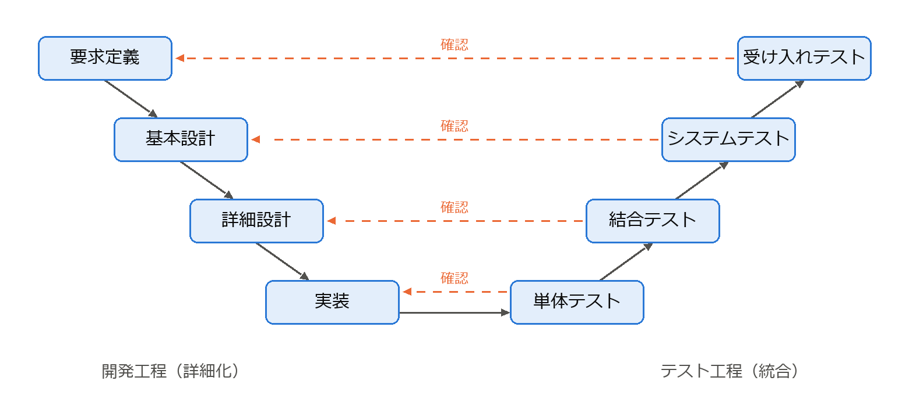

ソフトウェア開発プロセス
========================

ソフトウェア開発には、要求の定義、設計、実装、テストなど多くの活動がある。これらの活動をどの順序で、どの程度の単位で進めるかを定めたものを開発プロセス（プロセスモデル）と呼ぶ。本章では代表的なプロセスモデルを紹介し、その選び方を説明する。

ソフトウェアライフサイクル
--------------------------

ソフトウェアが構想されてから使われなくなるまでの全期間を\ :term:`ソフトウェアライフサイクル`\ と呼ぶ。ライフサイクルは一般に次の活動から構成される。

.. list-table:: ライフサイクルを構成する主な活動
   :header-rows: 1
   :widths: 20 80

   * - 活動
     - 内容
   * - 要求定義
     - ソフトウェアが満たすべき要求を明らかにし、文書化する（第 3 章）。
   * - 設計
     - 要求を満たすソフトウェアの構造を決める（第 4 章、第 5 章）。
   * - 実装
     - 設計に基づいてプログラムを作成する（第 6 章）。
   * - テスト
     - ソフトウェアが要求と設計どおりに動作するかを確認する（第 7 章）。
   * - 導入・運用
     - 本番環境に配置し、利用者に提供する。
   * - 保守
     - 不具合の修正や機能の追加・変更を行う（第 9 章）。
   * - 廃棄
     - 利用を終了し、データの移行などを行う。

プロセスモデルの違いは、主にこれらの活動を「1 回ずつ順番に行う」か「小さく何度も繰り返す」かという点にある。

ウォーターフォールモデル
------------------------

:term:`ウォーターフォールモデル`\ は、要求定義・設計・実装・テスト・運用の各工程を順番に 1 回ずつ実施するモデルである。前の工程の成果物（要求仕様書、設計書など）が完成し、レビューで承認されてから次の工程に進む（\ :numref:`fig-waterfall`\ ）。水が上から下へ流れ落ちる様子に例えてこの名前が付いた。

.. graphviz::
   :name: fig-waterfall
   :alt: 要求定義、設計、実装、テスト、運用・保守の順に進み、テストから設計への手戻りがある
   :caption: ウォーターフォールモデル
   :align: center

   digraph waterfall {
     rankdir=LR;
     nodesep=0.3;
     req [label="要求定義"];
     design [label="設計"];
     impl [label="実装"];
     test [label="テスト"];
     ops [label="運用・保守"];
     req -> design -> impl -> test -> ops;
     test -> design [style=dashed, color="#eb6834", fontcolor="#eb6834", label="手戻り", constraint=false];
   }

このモデルは Royce の 1970 年の論文 [Royce1970]_ に由来するとされることが多い。ただし、Royce 自身は単純な一方向の流れには危険があると指摘し、前の工程への手戻りや試作の必要性を論じていた。

ウォーターフォールモデルには次の長所と短所がある。

.. list-table:: ウォーターフォールモデルの長所と短所
   :header-rows: 1
   :widths: 50 50

   * - 長所
     - 短所
   * - 工程の区切りが明確で、進捗を管理しやすい。
     - 動くソフトウェアが開発の終盤まで得られない。
   * - 成果物が文書として残るため、契約や監査に対応しやすい。
     - 要求の誤りや変更が後の工程で判明すると、手戻りのコストが大きい。
   * - 要求が安定している場合は効率よく開発できる。
     - 利用者からのフィードバックを得る機会が少ない。

V 字モデル
----------

V 字モデルは、ウォーターフォールモデルの各工程と、それを確認するテスト工程との対応関係を明示したモデルである。左側を上から下へ「要求定義 → 基本設計 → 詳細設計 → 実装」と進み、右側を下から上へ「単体テスト → 結合テスト → システムテスト → 受け入れテスト」と進む。全体が V の字の形になることからこの名前が付いた（\ :numref:`fig-v-model`\ ）。

   V 字モデル（破線は、各テストがどの開発工程の成果物を確認するかを表す）

.. list-table:: V 字モデルにおける工程とテストの対応
   :header-rows: 1
   :widths: 50 50

   * - 開発工程
     - 対応するテスト
   * - 要求定義
     - 受け入れテスト
   * - 基本設計（アーキテクチャ設計）
     - システムテスト
   * - 詳細設計
     - 結合テスト
   * - 実装
     - 単体テスト

V 字モデルの利点は、各開発工程の段階で対応するテストの計画を立てられることである。例えば、要求定義の時点で受け入れテストの基準を決めておけば、要求の曖昧さを早い段階で発見できる。テストレベルの詳細は第 7 章で説明する。

反復型開発とインクリメンタル開発
--------------------------------

ウォーターフォールモデルの「動くソフトウェアが遅くまで得られない」という問題に対して、開発を小さな単位に分けて繰り返す方法が考えられた。

**インクリメンタル開発**\ （漸増型開発）は、システムを機能ごとに分割し、少しずつ機能を追加しながら完成させる方法である。最初のリリースで中核機能を提供し、以降のリリースで機能を増やしていく。

**反復型開発**\ （イテレーティブ開発）は、要求定義からテストまでの一連の活動を短い期間で何度も繰り返す方法である。各反復（イテレーション）の終わりに動くソフトウェアを得て、そのフィードバックを次の反復に反映する。

実際には両者を組み合わせ、「反復ごとに機能を追加し、その都度フィードバックを得る」形で用いることが多い。

スパイラルモデル
----------------

スパイラルモデルは Boehm が 1988 年に提案した、リスクを重視した反復型のモデルである [Boehm1988]_。各反復を「目標の設定」「リスクの分析と低減」「開発と検証」「次の反復の計画」の 4 つの段階で構成し、これを螺旋（スパイラル）状に繰り返す。各反復で最も大きなリスク（技術的に実現できるか、要求が正しいか、など）から優先して対処し、必要に応じてプロトタイプを作成して確かめる点に特徴がある。

アジャイル開発
--------------

:term:`アジャイル開発`\ は、変化への素早い対応を重視する軽量な開発手法の総称である。2001 年、軽量な開発手法を提唱していた 17 人の技術者が集まり、共通する価値観を「アジャイルソフトウェア開発宣言」としてまとめた [AgileManifesto]_。宣言では次の 4 つの価値を掲げている。

* プロセスやツールよりも個人と対話を
* 包括的なドキュメントよりも動くソフトウェアを
* 契約交渉よりも顧客との協調を
* 計画に従うことよりも変化への対応を

宣言には「左記のことがらに価値があることを認めながらも、私たちは右記のことがらにより価値をおく」と書かれている。すなわち、ドキュメントや計画が不要だと主張しているわけではなく、優先順位を示している点に注意が必要である。

スクラム
^^^^^^^^

:term:`スクラム`\ は、最も広く用いられているアジャイル開発の枠組みである [ScrumGuide]_。スプリントと呼ばれる 1 か月以内（多くは 1〜2 週間）の固定した期間を繰り返し、スプリントごとに利用可能な成果物（インクリメント）を作成する。スクラムは次の 3 つの責任、5 つのイベント、3 つの作成物で構成され、これらは\ :numref:`fig-scrum` のように連携する。

.. list-table:: スクラムの構成要素
   :header-rows: 1
   :widths: 20 30 50

   * - 分類
     - 名称
     - 内容
   * - 責任
     - プロダクトオーナー
     - プロダクトの価値を最大化する責任を持ち、プロダクトバックログの優先順位を決める。
   * - 責任
     - スクラムマスター
     - スクラムが正しく実践されるようにチームと組織を支援する。
   * - 責任
     - 開発者
     - 各スプリントでインクリメントを作成する。
   * - イベント
     - スプリント
     - 他のすべてのイベントを含む、固定長の開発期間。
   * - イベント
     - スプリントプランニング
     - スプリントで達成する目標と作業を計画する。
   * - イベント
     - デイリースクラム
     - 開発者が毎日 15 分以内で進捗を確認し、計画を調整する。
   * - イベント
     - スプリントレビュー
     - 成果を利害関係者に示し、フィードバックを得る。
   * - イベント
     - スプリントレトロスペクティブ
     - チームの進め方を振り返り、改善策を決める。
   * - 作成物
     - プロダクトバックログ
     - プロダクトに必要な項目を優先順位順に並べた一覧。
   * - 作成物
     - スプリントバックログ
     - スプリントで取り組む項目と、その実施計画。
   * - 作成物
     - インクリメント
     - スプリントで完成した、利用可能な成果物。

.. graphviz::
   :name: fig-scrum
   :class: fig-medium
   :alt: プロダクトバックログからスプリントプランニング、スプリントバックログ、スプリント、インクリメント、スプリントレビュー、スプリントレトロスペクティブへ進む流れ
   :caption: スクラムの流れ（角の丸い四角形はイベント、右上が折れた四角形は作成物を表す）
   :align: center

   digraph scrum {
     layout=circo;
     mindist=0.4;
     pb [label="プロダクト\nバックログ", shape=note, style=filled, fillcolor="#fde8df", color="#eb6834"];
     planning [label="スプリント\nプランニング"];
     sb [label="スプリント\nバックログ", shape=note, style=filled, fillcolor="#fde8df", color="#eb6834"];
     sprint [label="スプリント\n（1 か月以内）\n毎日デイリースクラム"];
     inc [label="インクリメント", shape=note, style=filled, fillcolor="#fde8df", color="#eb6834"];
     review [label="スプリント\nレビュー"];
     retro [label="スプリント\nレトロスペクティブ"];
     pb -> planning -> sb -> sprint -> inc -> review -> retro;
     review -> pb [style=dashed, label="フィードバックを反映"];
     retro -> planning [style=dashed, label="次のスプリントへ"];
   }

エクストリームプログラミング
^^^^^^^^^^^^^^^^^^^^^^^^^^^^

エクストリームプログラミング（XP）は Kent Beck らが提唱したアジャイル開発手法であり、スクラムが管理の枠組みであるのに対して、XP は開発者の具体的な技術的プラクティスを多く含む。代表的なプラクティスには、ペアプログラミング、テスト駆動開発（第 7 章）、継続的インテグレーション（第 8 章）、リファクタリング（第 9 章）、小さなリリースなどがある。実際のプロジェクトでは、スクラムの枠組みの中で XP のプラクティスを採用することも多い。

DevOps
------

:term:`DevOps` は、開発（Development）と運用（Operations）を組み合わせた言葉であり、両者が協力してソフトウェアを素早く安定して届けるための文化・慣行・ツールの総称である。従来、開発チームは「変更を早く届けたい」、運用チームは「システムを安定させたい」という相反する目標を持ち、対立しがちであった。DevOps では、ビルド・テスト・デプロイの自動化（第 8 章）、運用状況の監視とフィードバック、共通の目標と責任の共有などによってこの対立を解消する。アジャイル開発が「作る」までの速さを高めたのに対し、DevOps は「届けて運用する」までを含めた全体の速さと安定性を高めるものといえる。

プロセスモデルの比較と選び方
----------------------------

ここまでに説明したプロセスモデルを比較すると次のようになる。

.. list-table:: プロセスモデルの比較
   :header-rows: 1
   :widths: 22 26 26 26

   * - 観点
     - ウォーターフォール / V 字
     - スパイラル
     - アジャイル
   * - 進め方
     - 工程を順番に 1 回実施する
     - リスク分析を中心に反復する
     - 短い期間で反復する
   * - 要求の変更への対応
     - 難しい
     - 反復ごとに対応できる
     - 容易
   * - 動くソフトウェアが得られる時期
     - 終盤
     - 各反復でプロトタイプが得られる
     - 各反復の終わり
   * - 文書の量
     - 多い
     - 中程度
     - 必要最小限
   * - 向いている状況
     - 要求が明確で安定している、規制や契約で文書が必要である
     - 大規模でリスクの高い開発
     - 要求が不確実で変化しやすい、早期にフィードバックが必要である

どのモデルにも長所と短所があり、すべてのプロジェクトに最適なモデルは存在しない。要求の安定性、規模、チームの経験、顧客との関係、法規制の有無などを考慮して選択し、必要に応じて組み合わせることが重要である。

まとめ
------

* プロセスモデルは、開発の活動をどの順序・単位で進めるかを定めたものである。
* ウォーターフォールモデルと V 字モデルは工程を順番に進め、管理しやすいが変更に弱い。
* 反復型開発、スパイラルモデル、アジャイル開発は、小さく繰り返すことで変化とリスクに対応する。
* DevOps は、開発と運用が協力して素早く安定してソフトウェアを届けるための考え方である。
* プロセスモデルはプロジェクトの性質に応じて選択する。

演習問題
--------

解答例は「\ :ref:`answers-ch02`\ 」にある。

**問題 2-1**\ ：次の (a) と (b) の開発に適したプロセスモデルを本章から選び、その理由を述べよ。

\(a) 法規制により、要求仕様書や設計書などの文書の提出が義務付けられている医療機器の制御ソフトウェア。要求は開発の開始時点でほぼ確定している。

\(b) 新しい Web サービス。どのような機能が利用者に受け入れられるかは、実際に使ってもらうまで分からない。

**問題 2-2**\ ：アジャイルソフトウェア開発宣言の「包括的なドキュメントよりも動くソフトウェアを」は、「ドキュメントは不要である」という意味か。宣言の文言に基づいて説明せよ。

**問題 2-3**\ ：スクラムのスプリントレビューとスプリントレトロスペクティブは、それぞれ何を対象として振り返るイベントか。違いを説明せよ。

発展課題
--------

演習問題より発展的な課題である。正解が 1 つに定まらないものも含む。解答例や解答の方針は「\ :ref:`answers-ch02`\ 」にある。

**発展課題 2-A**\ ：4 人のチームでスクラムを導入する。スプリントの長さを 1 週間にする場合と 4 週間にする場合のそれぞれについて、利点と欠点を挙げよ。そのうえで、要求が頻繁に変わる新規の Web サービスの開発では、どちらを選ぶべきかを理由とともに論じよ。
