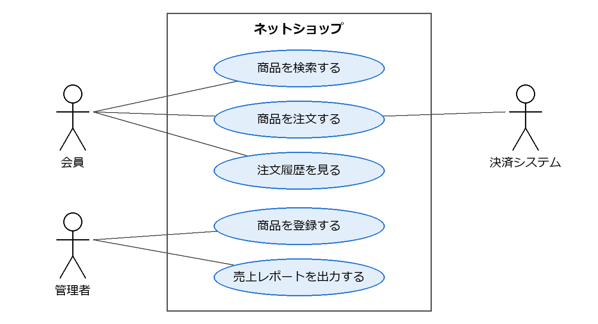

要求工学
========

ソフトウェアが「正しく作られている」ことと「正しいものが作られている」ことは別の問題である。どれほど品質の高いプログラムでも、利用者が必要としていないものであれば価値はない。要求工学は、ソフトウェアに求められていることを明らかにし、文書化し、管理するための分野である。

要求とは何か
------------

要求とは、ソフトウェアが満たすべき条件や能力のことである。要求は大きく機能要求と非機能要求に分けられる。

:term:`機能要求`\ は、ソフトウェアが「何をするか」を表す。例えば「利用者は商品をカートに追加できる」「管理者は月次の売上レポートを出力できる」などである。

:term:`非機能要求`\ は、ソフトウェアが機能を「どの程度うまく実現するか」を表す。性能、可用性、セキュリティ、使いやすさ、保守性などが含まれる。例えば「検索結果を 2 秒以内に表示する」「年間の稼働率を 99.9 % 以上とする」などである。非機能要求は見落とされやすいが、アーキテクチャの選択に大きな影響を与えるため、早い段階で明らかにする必要がある。非機能要求の分類には、第 10 章で説明する品質モデルが参考になる。

また、要求はその詳しさによって次のように分けられることもある。

.. list-table:: 要求の詳しさによる分類
   :header-rows: 1
   :widths: 25 75

   * - 分類
     - 内容
   * - ビジネス要求
     - 組織がソフトウェアによって達成したい目的。例: 「注文処理の人件費を 30 % 削減する」
   * - ユーザー要求
     - 利用者がソフトウェアを使って行いたいこと。例: 「顧客は自宅から商品を注文できる」
   * - システム要求
     - ソフトウェアが実現すべき機能や制約を、開発者が実装できる程度まで詳しく記述したもの。

要求の獲得
----------

要求は利用者や発注者の頭の中に最初から明確な形で存在するわけではない。利害関係者（ステークホルダー）との対話を通じて引き出す必要があり、この活動を要求の獲得（要求の抽出）と呼ぶ。代表的な手法を次に示す。

.. list-table:: 要求獲得の代表的な手法
   :header-rows: 1
   :widths: 25 75

   * - 手法
     - 内容
   * - インタビュー
     - 利害関係者に個別に質問する。あらかじめ質問を決めておく方法と、自由に話してもらう方法がある。
   * - ワークショップ
     - 複数の利害関係者が集まって議論する。立場の異なる人の意見の対立を早い段階で明らかにできる。
   * - 観察
     - 利用者の実際の業務を観察する。利用者自身が意識していない手順や問題を発見できる。
   * - プロトタイピング
     - 画面の試作品などを作って利用者に見せ、意見を得る。完成形が想像しにくい場合に有効である。
   * - 既存資料の調査
     - 現行システムの仕様書、業務マニュアル、帳票などを調査する。

要求の獲得では、利用者が「解決策」を要求として語ることが多い点に注意が必要である。例えば「Excel に出力する機能がほしい」という要望の背後には「集計結果を上司に報告したい」という本当の目的があるかもしれない。「なぜそれが必要か」を掘り下げることで、よりよい解決策が見つかることがある。

要求の分析と記述
----------------

獲得した要求は、矛盾や漏れがないかを分析し、関係者が共有できる形で記述する。ここでは代表的な記述方法としてユースケースとユーザーストーリーを紹介する。

ユースケース
^^^^^^^^^^^^

ユースケースは、システムの利用者（アクター）がシステムを使って目的を達成するまでのやり取りを記述したものである。次に例を示す。

.. list-table:: ユースケースの例「商品を注文する」
   :header-rows: 0
   :widths: 25 75

   * - アクター
     - 会員
   * - 事前条件
     - 会員がログインしている。
   * - 基本フロー
     - 1. 会員が商品をカートに追加する。
       2. 会員が注文手続きを開始する。
       3. システムが配送先と合計金額を表示する。
       4. 会員が注文を確定する。
       5. システムが注文を登録し、確認メールを送信する。
   * - 代替フロー
     - 3a. 在庫が不足している場合、システムはその旨を表示し、手順 1 に戻る。
   * - 事後条件
     - 注文が登録され、在庫が引き当てられている。

ユースケースは、正常な流れ（基本フロー）だけでなく、例外的な流れ（代替フロー）も記述することで、要求の漏れを発見しやすくする。

システム全体のユースケースとアクターの関係は、UML のユースケース図（第 5 章）で一覧できる。ネットショップの例を\ :numref:`fig-use-case` に示す。四角形がシステムの範囲、楕円がユースケース、人の形がアクターを表す。アクターは人だけでなく、決済システムのような外部のシステムであってもよい。ユースケース図は要求の全体像を把握し、利害関係者と範囲を合意するのに役立つが、各ユースケースの詳細は上の表のような記述で補う必要がある。

   ネットショップのユースケース図

ユーザーストーリー
^^^^^^^^^^^^^^^^^^

:term:`ユーザーストーリー`\ は、アジャイル開発でよく用いられる簡潔な要求の記述方法であり、次の形式で書くことが多い。

.. code-block:: text
   :linenos:

   <利用者の役割> として、<目的> のために、<機能> がほしい。

例えば「会員として、以前と同じ商品を素早く注文するために、注文履歴から再注文できる機能がほしい」のように書く。ユーザーストーリーは詳細な仕様ではなく、開発者と利用者の会話のきっかけとして用いる。詳細は会話を通じて明らかにし、受け入れ基準として記録する。受け入れ基準は、次のような Given-When-Then 形式で書くと、そのままテストの条件として使える。

.. code-block:: text
   :linenos:

   Given 会員が過去に商品 A を注文している
   When  会員が注文履歴から商品 A の「再注文」を選ぶ
   Then  商品 A が 1 個入ったカートが表示される

よいユーザーストーリーの条件として、INVEST という頭字語がよく知られている。

.. list-table:: よいユーザーストーリーの条件（INVEST）
   :header-rows: 1
   :widths: 25 75

   * - 条件
     - 意味
   * - Independent（独立している）
     - 他のストーリーに依存せず、単独で開発できる。
   * - Negotiable（交渉可能である）
     - 詳細は固定されておらず、話し合いで調整できる。
   * - Valuable（価値がある）
     - 利用者や顧客にとって価値がある。
   * - Estimable（見積もり可能である）
     - 開発に必要な工数を見積もれる。
   * - Small（小さい）
     - 1 回の反復で完成できる大きさである。
   * - Testable（テスト可能である）
     - 完成したかどうかを判定できる。

よい要求の条件
--------------

要求の記述方法にかかわらず、個々の要求は一定の品質を備えている必要がある。国際規格 ISO/IEC/IEEE 29148 [ISO29148]_ では、よい要求が持つべき特性を定めている。主なものを次に示す。

.. list-table:: よい要求の主な特性
   :header-rows: 1
   :widths: 25 75

   * - 特性
     - 意味
   * - 必要である
     - 取り除くと、ソフトウェアに欠陥が生じる。
   * - 曖昧でない
     - 1 通りにしか解釈できない。
   * - 完全である
     - 理解に必要な情報がすべて含まれている。
   * - 単一である
     - 1 つの要求に 1 つの事柄だけが書かれている。
   * - 実現可能である
     - 技術・予算・期間の制約の中で実現できる。
   * - 検証可能である
     - 要求を満たしているかどうかを確認する方法がある。

特に「曖昧でない」と「検証可能である」は重要である。例えば「システムは高速に応答する」という要求は、何秒以内なら「高速」なのかが分からないため、満たしているかを判定できない。「利用者が検索ボタンを押してから、95 % の要求について 2 秒以内に結果を表示する」のように、測定可能な形で書く必要がある。

要求の検証と管理
----------------

要求の検証
^^^^^^^^^^

記述した要求に誤りや漏れがないかを確認する活動を要求の検証と呼ぶ。代表的な方法は、利害関係者と開発者による要求仕様のレビューである。また、プロトタイプを利用者に操作してもらう方法や、要求からテストケースを作成してみる方法も有効である。テストケースを作成できない要求は、検証可能でない可能性が高い。

要求の誤りは、発見が遅れるほど修正のコストが大きくなる。要求の段階で見つければ文書の修正で済むが、リリース後に見つかれば、設計・実装・テストのやり直しが必要になる。要求の検証に十分な時間をかけることは、プロジェクト全体のコストを下げることにつながる。

トレーサビリティ
^^^^^^^^^^^^^^^^

:term:`トレーサビリティ`\ （追跡可能性）とは、要求と、それに対応する設計・ソースコード・テストケースとの対応関係をたどれることである。トレーサビリティを確保すると、次のことが可能になる。

* すべての要求が設計・実装・テストされているかを確認できる。
* 要求が変更されたとき、影響を受ける設計・コード・テストを特定できる。
* あるコードがなぜ存在するのか（どの要求に基づくのか）を説明できる。

対応関係の例を\ :numref:`fig-traceability` に示す。

.. graphviz::
   :name: fig-traceability
   :alt: 要求 R1 から R3 が設計とソースコードを経てテストケースに対応付けられており、R3 には対応するテストケースがない
   :caption: 要求からテストケースまでの対応関係（R3 には対応するテストケースがない）
   :align: center

   digraph traceability {
     rankdir=LR;
     nodesep=0.25;
     ranksep=0.6;
     subgraph cluster_req { label="要求"; fontname="Meiryo"; color="#dddcd8"; style=rounded;
       r3 [label="R3 注文履歴を見る", fillcolor="#fde8df", color="#eb6834"]; r2 [label="R2 商品を注文する"]; r1 [label="R1 商品を検索する"]; }
     subgraph cluster_design { label="設計"; fontname="Meiryo"; color="#dddcd8"; style=rounded;
       dh [label="履歴機能の設計"]; do [label="注文機能の設計"]; ds [label="検索機能の設計"]; }
     subgraph cluster_code { label="ソースコード"; fontname="Meiryo"; color="#dddcd8"; style=rounded;
       ch [label="history.py"]; co [label="order.py"]; cs [label="search.py"]; }
     subgraph cluster_test { label="テストケース"; fontname="Meiryo"; color="#dddcd8"; style=rounded;
       t3 [label="T3 在庫不足のテスト"]; t2 [label="T2 注文のテスト"]; t1 [label="T1 検索のテスト"]; }
     r3 -> dh -> ch;
     co -> t3;
     r2 -> do -> co -> t2;
     r1 -> ds -> cs -> t1;
   }

対応関係は、要求とテストケースを行と列に並べた表（トレーサビリティマトリクス）で管理することが多い。\ :numref:`fig-traceability` の対応関係をトレーサビリティマトリクスで表すと、次のようになる。表の「○」は、その要求をそのテストケースで確認することを表す。

.. list-table:: トレーサビリティマトリクスの例
   :header-rows: 1
   :widths: 40 20 20 20

   * - 要求
     - T1
     - T2
     - T3
   * - R1 商品を検索する
     - ○
     - \-
     - \-
   * - R2 商品を注文する
     - \-
     - ○
     - ○
   * - R3 注文履歴を見る
     - \-
     - \-
     - \-

R3 の行には「○」が 1 つもないため、R3 を確認するテストケースが不足していることがすぐに分かる。

要求の変更管理
^^^^^^^^^^^^^^

要求は開発の途中でも変化する。ビジネス環境の変化、利用者の理解の深まり、技術的な制約の判明などがその原因である。変更そのものを避けることはできないため、変更を管理する仕組みが必要である。一般に、変更の要望を記録し、影響（工数、スケジュール、他の要求への影響）を分析したうえで、承認された変更だけを取り込む。アジャイル開発では、プロダクトバックログの優先順位を見直すことで変更を扱う。

まとめ
------

* 要求には、ソフトウェアが何をするかを表す機能要求と、どの程度うまく実現するかを表す非機能要求がある。
* 要求は利害関係者との対話を通じて獲得し、ユースケースやユーザーストーリーなどで記述する。
* よい要求は、曖昧でなく、検証可能でなければならない。
* トレーサビリティを確保し、要求の変更を管理する。

演習問題
--------

解答例は「\ :ref:`answers-ch03`\ 」にある。

**問題 3-1**\ ：次の (a)〜(d) を、機能要求と非機能要求に分類せよ。

\(a) 会員は自分のパスワードを再設定できる。

\(b) 同時に 1000 人が利用しても、画面の応答時間は 3 秒以内である。

\(c) 管理者は売上データを CSV 形式で出力できる。

\(d) 会員の個人情報は暗号化して保存する。

**問題 3-2**\ ：「システムは使いやすいこと」という要求は、よい要求の条件のうち何を満たしていないか。また、検証可能な形に書き換えよ。

**問題 3-3**\ ：「ポイント会員が、買い物の前に、自分のポイント残高を確認できる」という機能について、ユーザーストーリーを書け。また、受け入れ基準を Given-When-Then 形式で 1 つ書け。

発展課題
--------

演習問題より発展的な課題である。正解が 1 つに定まらないものも含む。解答例や解答の方針は「\ :ref:`answers-ch03`\ 」にある。

**発展課題 3-A**\ ：市立図書館の蔵書検索システムを開発する。機能要求を 5 つ以上、非機能要求を 3 つ以上書き出せ。書き出した要求を「よい要求の主な特性」の表に照らして自己レビューし、曖昧な要求や検証できない要求があれば書き直せ。さらに、アクターとユースケースを洗い出し、ユースケース図を描け。
