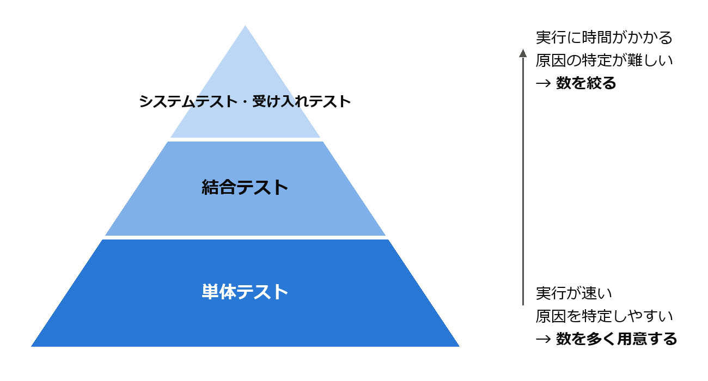

テスト
======

テストは、ソフトウェアを実行して不具合を発見し、品質を確認する活動である。本章では、テストの目的と分類、テストケースの設計技法、単体テストの書き方、テスト駆動開発を説明する。

検証と妥当性確認
----------------

ソフトウェアの品質を確認する活動は、検証と妥当性確認の 2 つの観点に分けられる。両者を合わせて V&V（Verification and Validation）と呼ぶ。Boehm はこの違いを次のように表現した [Boehm1981]_。

.. list-table:: 検証と妥当性確認
   :header-rows: 1
   :widths: 20 40 40

   * - 観点
     - 問い
     - 内容
   * - :term:`検証`
     - 製品を正しく作っているか
     - 成果物が仕様や設計を満たしているかを確認する。
   * - :term:`妥当性確認`
     - 正しい製品を作っているか
     - 成果物が利用者の本当の要求を満たしているかを確認する。

仕様どおりに完璧に動作するソフトウェアでも、仕様そのものが利用者の要求とずれていれば役に立たない。検証だけでなく妥当性確認も行う必要がある。

また、テストには本質的な限界がある。Dijkstra は「テストはバグの存在を示すことはできるが、バグが存在しないことを示すことはできない」と述べた。入力の組み合わせは膨大であり、すべてを試すことは現実的に不可能である。そのため、限られたテストケースで効率よく不具合を発見するための設計技法が重要になる。

テストレベル
------------

テストは、対象の範囲によって次のレベルに分けられる。これらは第 2 章で説明した V 字モデルの右側に対応する。

.. list-table:: テストレベル
   :header-rows: 1
   :widths: 20 40 40

   * - テストレベル
     - 対象
     - 主な確認内容
   * - 単体テスト
     - 関数やクラスなど、個々のモジュール
     - モジュールが詳細設計どおりに動作するか。
   * - 結合テスト
     - 複数のモジュールの組み合わせ
     - モジュール間のインターフェースや連携が正しいか。
   * - システムテスト
     - システム全体
     - システムが機能要求と非機能要求を満たしているか。
   * - 受け入れテスト
     - システム全体
     - 利用者や発注者が、システムを業務で使えると判断できるか。

単体テストは実行が速く、不具合の箇所を特定しやすいため、数を多く用意する。上位のテストは実行に時間がかかり、不具合の原因の特定も難しいため、数を絞る。この考え方は、下の段ほど数が多いピラミッドの形に例えて、テストピラミッドと呼ばれる（\ :numref:`fig-test-pyramid`\ ）。

   テストピラミッド

また、修正や機能追加によって既存の機能が壊れていないかを確認するために、以前に実施したテストを再度実行することを回帰テスト（リグレッションテスト）と呼ぶ。回帰テストは繰り返し実行するため、自動化しておくことが重要である。

ブラックボックステスト
----------------------

ブラックボックステストは、プログラムの内部構造を考慮せず、仕様に基づいて入力と期待される出力からテストケースを設計する技法である。ここでは、次の仕様を持つ関数 ``admission_fee`` を例に説明する。

.. literalinclude:: ../examples/ch07_boundary.py
   :language: python
   :linenos:
   :caption: ch07_boundary.py

ダウンロード: :download:`ch07_boundary.py <../examples/ch07_boundary.py>`

同値分割
^^^^^^^^

:term:`同値分割`\ は、入力の値の範囲を、プログラムが同じように扱うと考えられるグループ（同値クラス）に分け、各クラスから代表値を 1 つずつ選んでテストする技法である。同じクラスの値はどれも同じ結果になると考えられるため、1 つを試せば十分とみなす。

.. list-table:: admission_fee の同値クラス
   :header-rows: 1
   :widths: 30 25 20 25

   * - 同値クラス
     - 範囲
     - 代表値
     - 期待される結果
   * - 無効（負の年齢）
     - 0 未満
     - -10
     - ValueError
   * - 幼児
     - 0 以上 5 以下
     - 3
     - 0 円
   * - 子ども
     - 6 以上 12 以下
     - 10
     - 500 円
   * - 大人
     - 13 以上 64 以下
     - 30
     - 1000 円
   * - シニア
     - 65 以上
     - 70
     - 700 円

有効な値だけでなく、無効な値のクラスも必ずテストする。

境界値分析
^^^^^^^^^^

不具合は、同値クラスの境界付近に集中する傾向がある。例えば ``age <= 12`` と書くべきところを ``age < 12`` と書いてしまう誤りは、境界の値である 12 を入力しなければ発見できない。:term:`境界値分析`\ は、各同値クラスの境界の値とその隣の値をテストケースとして選ぶ技法である。``admission_fee`` の場合、境界値は -1、0、5、6、12、13、64、65 となる。

境界値分析に基づくテストを、Python 標準ライブラリの unittest [unittest]_ を用いて書くと次のようになる。

.. literalinclude:: ../examples/ch07_test_boundary.py
   :language: python
   :linenos:
   :caption: ch07_test_boundary.py

ダウンロード: :download:`ch07_test_boundary.py <../examples/ch07_test_boundary.py>`

``subTest`` を用いると、1 つのテストメソッドの中で複数の入力を試し、失敗した入力を個別に報告させることができる。テストは、2 つのファイルを置いたフォルダーで次のコマンドを実行すると実行できる。

.. code-block:: text
   :linenos:

   python -m unittest ch07_test_boundary

デシジョンテーブル
^^^^^^^^^^^^^^^^^^

複数の条件の組み合わせによって結果が変わる場合は、条件と結果の組み合わせを表に整理したデシジョンテーブルを用いる。例えば「会員で、かつ購入金額が 5000 円以上なら送料無料」という仕様は、次のように整理できる。

.. list-table:: デシジョンテーブルの例
   :header-rows: 1
   :widths: 40 15 15 15 15

   * - 条件・結果
     - 規則 1
     - 規則 2
     - 規則 3
     - 規則 4
   * - 会員である
     - Y
     - Y
     - N
     - N
   * - 購入金額が 5000 円以上
     - Y
     - N
     - Y
     - N
   * - 送料無料にする
     - X
     - \-
     - \-
     - \-

各規則（列）を 1 つのテストケースとすれば、条件の組み合わせを漏れなくテストできる。

ホワイトボックステスト
----------------------

ホワイトボックステストは、プログラムの内部構造（制御の流れ）に基づいてテストケースを設計する技法である。テストによってプログラムの各部分がどれだけ実行されたかを表す割合を\ :term:`コードカバレッジ`\ （網羅率）と呼ぶ。主なカバレッジの基準を次に示す。

.. list-table:: 主なカバレッジの基準
   :header-rows: 1
   :widths: 30 70

   * - 基準
     - 内容
   * - 命令網羅（C0）
     - すべての命令を少なくとも 1 回実行する。
   * - 分岐網羅（C1）
     - すべての分岐について、真と偽の両方の結果を少なくとも 1 回ずつ実行する。
   * - 条件網羅（C2）
     - 分岐の判定に含まれる個々の条件について、真と偽の両方を少なくとも 1 回ずつ実行する。

例えば ``if a > 0 and b > 0:`` という分岐では、分岐網羅は判定全体が真になる場合と偽になる場合を求めるが、条件網羅は ``a > 0`` と ``b > 0`` のそれぞれが真と偽になる場合を求める。なお、条件網羅を満たしても分岐網羅を満たすとは限らないため、両者を組み合わせた基準が用いられることもある。

カバレッジは、テストされていない部分を発見するための指標として有用である。ただし、カバレッジが 100 % であっても、仕様の誤りや、実装されていない機能に関する不具合は発見できない。カバレッジの数値を高めること自体を目的にせず、ブラックボックステストと組み合わせて用いる。Python では coverage.py などのツールでカバレッジを測定できる。

テスト駆動開発
--------------

:term:`テスト駆動開発`\ （TDD）は、Kent Beck が提唱した、テストを先に書いてから実装を行う開発手法である [Beck2002]_。次の 3 つの手順を短い周期で繰り返す。

.. list-table:: テスト駆動開発の手順
   :header-rows: 1
   :widths: 20 80

   * - 手順
     - 内容
   * - レッド
     - これから実装する機能のテストを 1 つ書き、そのテストが失敗することを確認する。
   * - グリーン
     - テストが成功する最小限のコードを書く。
   * - リファクタリング
     - テストが成功する状態を保ったまま、重複の除去や名前の改善などを行い、コードを整理する（第 9 章）。

この周期を\ :numref:`fig-tdd` に示す。

.. graphviz::
   :name: fig-tdd
   :alt: レッド、グリーン、リファクタリングを繰り返す周期
   :class: fig-narrow
   :caption: テスト駆動開発の周期
   :align: center

   digraph tdd {
     layout=circo;
     node [width=1.8];
     red [label="レッド\n失敗するテストを書く", fillcolor="#fde2e2", color="#e34948"];
     green [label="グリーン\nテストを通す", fillcolor="#dff3e4", color="#008300"];
     refactor [label="リファクタリング\nコードを整理する"];
     red -> green -> refactor -> red;
   }

TDD の利点は、テストが自動的にそろうことだけではない。テストを先に書くことで、実装の前に「この関数をどう使うか」というインターフェースを利用者の立場で考えることになり、使いやすくテストしやすい設計が得られる。

次に、TDD で作成したスタックのテストと実装を示す。テストメソッドは追加した順に並んでいる。最初に「作成直後は空である」というテストを書いて失敗させ、``is_empty`` を実装して成功させる。次に「要素を積むと空ではなくなる」というテストを追加し、``push`` を実装する。以降も同様に、テストを 1 つ追加しては実装を進めた。

.. literalinclude:: ../examples/ch07_test_stack.py
   :language: python
   :linenos:
   :caption: ch07_test_stack.py

ダウンロード: :download:`ch07_test_stack.py <../examples/ch07_test_stack.py>`

.. literalinclude:: ../examples/ch07_stack.py
   :language: python
   :linenos:
   :caption: ch07_stack.py

ダウンロード: :download:`ch07_stack.py <../examples/ch07_stack.py>`

まとめ
------

* テストには、仕様を満たすかを確認する検証と、利用者の要求を満たすかを確認する妥当性確認の観点がある。
* テストはバグがないことを証明できないため、効率よく不具合を発見する設計技法が重要である。
* ブラックボックステストでは同値分割と境界値分析、ホワイトボックステストではカバレッジを用いる。
* テスト駆動開発では、テストを先に書き、レッド・グリーン・リファクタリングの周期を繰り返す。

演習問題
--------

解答例は「\ :ref:`answers-ch07`\ 」にある。

**問題 7-1**\ ：購入点数に応じて割引率を決める関数がある。仕様は次のとおりである。同値クラスを列挙し、境界値分析によってテストする入力値を挙げよ。

* 購入点数が 0 以下: ValueError を送出する
* 1 点以上 9 点以下: 割引なし（0 %）
* 10 点以上 49 点以下: 5 % 割引
* 50 点以上: 10 % 割引

**問題 7-2**\ ：次の関数について、命令網羅（C0）と分岐網羅（C1）をそれぞれ満たす最小のテストケースを示せ。

.. code-block:: python
   :linenos:

   def clamp_negative(x: int) -> int:
       if x < 0:
           x = 0
       return x

**問題 7-3**\ ：本章のデシジョンテーブル（会員で、かつ購入金額が 5000 円以上なら送料無料）を実装した関数 ``is_free_shipping`` の単体テストを、unittest で書け。対象の関数は :download:`ex07_shipping.py <../examples/ex07_shipping.py>` にある。

**問題 7-4**\ ：``ch07_stack.py`` のスタックに、最後に積んだ要素を取り出さずに返す ``peek`` メソッドを、テスト駆動開発の手順で追加せよ。空のスタックに対しては IndexError を送出すること。

発展課題
--------

演習問題より発展的な課題である。正解が 1 つに定まらないものも含む。解答例や解答の方針は「\ :ref:`answers-ch07`\ 」にある。

**発展課題 7-A**\ ：仕様の表から期待値を求める単純な関数（テストオラクル）を作成し、ランダムに選んだ多数の年齢について ``admission_fee`` の結果と比較するテストを書け。テストが失敗したときに同じ入力で再現できるよう工夫すること。

**発展課題 7-B**\ ：テストの品質を評価する方法として、プログラムにわざと小さな誤り（変異）を入れ、テストがそれを検出できるかを調べるミューテーションテストがある。``ch07_boundary.py`` に次の 3 つの変異をそれぞれ 1 つずつ入れたとき、``ch07_test_boundary.py`` のテストは失敗する（変異を検出できる）か。また、同値分割の代表値（-10、3、10、30、70）だけのテストではどうか。

\(1) 15 行目の ``age < 0`` を ``age <= 0`` に変える。

\(2) 17 行目の ``age <= 5`` を ``age < 5`` に変える。

\(3) 19 行目の ``age <= 12`` を ``age < 12`` に変える。
