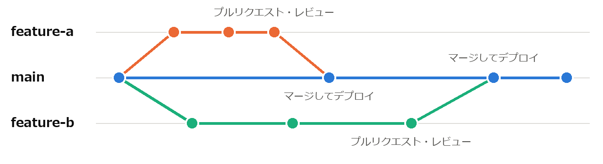
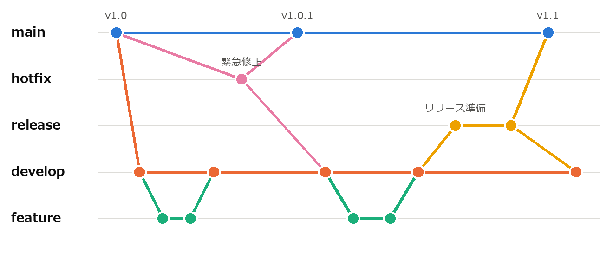

構成管理と継続的インテグレーション
==================================

ソフトウェアの開発では、ソースコード、文書、設定ファイルなど多くのファイルが、複数の人によって並行して変更される。本章では、これらの変更を安全に管理する構成管理と、変更を頻繁に統合・リリースするための継続的インテグレーションと継続的デリバリーを説明する。

構成管理とは
------------

:term:`構成管理`\ とは、ソフトウェアを構成する要素（構成品目）を識別し、その変更を記録・管理して、いつでも特定の時点の状態を再現できるようにする活動である。構成品目には、ソースコードだけでなく、要求仕様書や設計書、テストケース、ビルドスクリプト、使用するライブラリのバージョンなども含まれる。

構成管理が行われていないと、次のような問題が起こる。

* 複数の人が同じファイルを同時に変更し、一方の変更が失われる。
* 不具合が見つかったとき、いつ・誰が・なぜその変更を行ったのかが分からない。
* 利用者に提供したバージョンを再現できず、そのバージョンの不具合を調査できない。

構成管理の中心となる道具がバージョン管理システムである。

バージョン管理システム
----------------------

バージョン管理システムは、ファイルの変更履歴を記録し、過去の任意の状態に戻したり、複数人の変更を統合したりするためのシステムである。現在最も広く使われているのは Git [ProGit]_ である。Git は分散型のバージョン管理システムであり、各開発者が履歴を含むリポジトリの完全な複製を手元に持つ。Git の主な概念を次に示す。

.. list-table:: Git の主な概念
   :header-rows: 1
   :widths: 25 75

   * - 概念
     - 内容
   * - リポジトリ
     - ファイルとその変更履歴を保存する場所。
   * - コミット
     - ある時点のファイルの状態を、変更内容の説明（コミットメッセージ）とともに記録したもの。
   * - ブランチ
     - コミットの系列を分岐させたもの。他の作業に影響を与えずに、独立して変更を進められる。
   * - マージ
     - あるブランチの変更を、別のブランチに統合すること。
   * - コンフリクト
     - マージの際に、同じ箇所が両方のブランチで異なる内容に変更されていて、自動的に統合できない状態。
   * - プルリクエスト
     - ブランチの変更を統合してほしいという依頼。GitHub などのサービスが提供する機能であり、コードレビューの場として用いられる。

コミットは、1 つの目的を持った小さな単位で行い、コミットメッセージには変更の理由が分かるように書く。後から履歴を調べるとき、「何を変えたか」は差分を見れば分かるが、「なぜ変えたか」はメッセージにしか残らないためである。

ブランチ戦略
------------

ブランチをどのように作成し、統合するかの方針をブランチ戦略と呼ぶ。代表的なものを次に示す。

.. list-table:: 代表的なブランチ戦略
   :header-rows: 1
   :widths: 25 50 25

   * - 戦略
     - 内容
     - 向いている状況
   * - Git Flow
     - 開発用の develop ブランチと、リリース済みの状態を表す main ブランチを常に持ち、機能開発、リリース準備、緊急修正のためにそれぞれ専用のブランチを作成する。
     - リリースの時期が決まっている、複数のバージョンを並行して保守する。
   * - GitHub Flow
     - main ブランチを常にリリース可能な状態に保ち、作業ごとに main からブランチを作成する。作業が終わったらプルリクエストを作成し、レビュー後に main へマージする。
     - Web サービスなど、頻繁にリリースする。
   * - トランクベース開発
     - 全員が main ブランチ（トランク）に直接、またはごく短命なブランチを経由して、少なくとも 1 日に 1 回は変更を統合する。
     - 継続的インテグレーションを徹底する、自動テストが充実している。

GitHub Flow と Git Flow のブランチの例を、それぞれ\ :numref:`fig-github-flow` と\ :numref:`fig-git-flow` に示す。点はコミット、線はブランチの流れを表す。GitHub Flow では、短命な作業用のブランチが main から分かれて main に戻るだけであるのに対し、Git Flow では役割の異なる複数のブランチが並行して存在する。

   GitHub Flow

   Git Flow（緊急修正とリリース準備のブランチは、main と develop の両方にマージする）

ブランチが長く存在するほど、main ブランチとの差が大きくなり、マージの際のコンフリクトが増える。近年は、ブランチを短命に保ち、頻繁に統合する方針が主流となっている。

継続的インテグレーション
------------------------

:term:`継続的インテグレーション`\ （CI）は、開発者が自分の変更を頻繁に（少なくとも 1 日に 1 回）共有のブランチに統合し、統合のたびにビルドとテストを自動的に実行する慣行である。

かつては、各開発者が長期間個別に開発を進め、終盤にまとめて統合することが多かった。その結果、統合の段階で大量の不整合が見つかり、原因の特定と修正に多くの時間がかかった。CI では統合を小さく頻繁に行うため、問題が発生しても直前の小さな変更が原因であると分かり、すぐに修正できる。

CI では、一般に次の処理を自動化する。この一連の処理をパイプラインと呼ぶ（\ :numref:`fig-ci-pipeline`\ ）。

#. リポジトリへの変更の送信やプルリクエストの作成を検知する。
#. ソースコードを取得し、ビルドする。
#. リンターと静的型検査を実行する（第 6 章）。
#. 単体テストなどの自動テストを実行する（第 7 章）。
#. 結果を開発者に通知する。失敗した場合は、すぐに修正する。

.. graphviz::
   :name: fig-ci-pipeline
   :alt: 変更の送信からビルド、リンターと静的型検査、自動テスト、結果の通知へ進み、失敗したら修正して再送信する
   :caption: CI のパイプラインの例
   :align: center

   digraph ci {
     rankdir=LR;
     nodesep=0.3;
     push [label="変更の送信\nプルリクエスト", fillcolor="#fde8df", color="#eb6834"];
     build [label="ビルド"];
     lint [label="リンター\n静的型検査"];
     test [label="自動テスト"];
     notify [label="結果の通知"];
     push -> build -> lint -> test -> notify;
     notify -> push [style=dashed, color="#eb6834", fontcolor="#eb6834", label="失敗したら修正して再送信", constraint=false];
   }

例えば、本書のサンプルコードを検査するパイプラインでは、次のコマンドを順に実行すればよい。

.. code-block:: text
   :linenos:

   python -m flake8 examples
   python -m mypy --strict examples
   python -m unittest discover -s examples -p "*_test_*.py"

CI を支えるサービスとして、GitHub Actions、GitLab CI/CD、Jenkins などがある。CI の効果を得るには、テストが十分にそろっていること、パイプラインが短時間で終わること、失敗したら最優先で修正するというチームの規律があることが前提となる。

継続的デリバリーと継続的デプロイ
--------------------------------

:term:`継続的デリバリー`\ （CD）は、CI をさらに進め、すべての変更をいつでも本番環境にリリースできる状態に保つ慣行である [Humble2010]_。CI のパイプラインに加えて、本番に近い環境への自動的な配置と、受け入れテストなどの自動実行を行う。本番環境へのリリース自体は、人が判断して実行する。

継続的デプロイは、リリースの判断も自動化し、パイプラインのすべての段階に合格した変更を自動的に本番環境に配置する慣行である。両者の違いを\ :numref:`fig-cd` に示す。

.. graphviz::
   :name: fig-cd
   :alt: 継続的デリバリーでは本番環境への配置の前に人の判断が入り、継続的デプロイでは自動的に本番環境に配置される
   :caption: 継続的デリバリーと継続的デプロイの違い
   :align: center

   digraph cd {
     rankdir=LR;
     nodesep=0.3;
     subgraph cluster_deploy { label="継続的デプロイ"; fontname="Meiryo"; color="#dddcd8"; style=rounded;
       ci2 [label="CI\n（ビルド・テスト）"]; st2 [label="本番に近い環境で\n受け入れテスト"]; auto [label="自動的に\nリリース"]; prod2 [label="本番環境"];
       ci2 -> st2 -> auto -> prod2; }
     subgraph cluster_delivery { label="継続的デリバリー"; fontname="Meiryo"; color="#dddcd8"; style=rounded;
       ci1 [label="CI\n（ビルド・テスト）"]; st1 [label="本番に近い環境で\n受け入れテスト"]; human [label="人が判断して\nリリース", fillcolor="#fde8df", color="#eb6834"]; prod1 [label="本番環境"];
       ci1 -> st1 -> human -> prod1; }
   }

小さな変更を頻繁にリリースすると、1 回のリリースに含まれる変更が少なくなるため、問題が起きたときの影響が小さく、原因の特定や切り戻しも容易になる。これは第 2 章で説明した DevOps の中心的な実践の 1 つである。

ビルドと依存関係の管理
----------------------

ソフトウェアは多くの外部ライブラリに依存している。ライブラリのバージョンが開発者ごとに異なると、「自分の環境では動くが、他の環境では動かない」という問題が起こる。これを防ぐために、使用するライブラリとそのバージョンを明示し、構成品目として管理する。

Python では、プロジェクトごとに独立した実行環境を作る仮想環境（``venv``）を用い、依存するパッケージを ``pyproject.toml`` や ``requirements.txt`` に記述する。例えば、次のコマンドで仮想環境を作成し、記述したパッケージをインストールできる（Windows の場合）。

.. code-block:: text
   :linenos:

   python -m venv .venv
   .venv\Scripts\activate
   python -m pip install -r requirements.txt

また、ビルドの手順は人手に頼らず、スクリプトなどで自動化する。誰がいつ実行しても同じ結果が得られるビルドは、CI の前提でもある。

まとめ
------

* 構成管理は、ソフトウェアの構成要素とその変更を管理し、任意の時点の状態を再現できるようにする活動である。
* バージョン管理システム（Git）で変更履歴を記録し、ブランチ戦略に従って複数人の変更を統合する。
* 継続的インテグレーションでは、変更を頻繁に統合し、ビルドとテストを自動的に実行する。
* 継続的デリバリーでは、すべての変更をいつでもリリースできる状態に保つ。

演習問題
--------

解答例は「\ :ref:`answers-ch08`\ 」にある。

**問題 8-1**\ ：次のコミットメッセージのうち、よいものはどれか。理由とともに答えよ。

\(a) 「修正」

\(b) 「ログイン時にパスワードの前後の空白を除去する（コピーして貼り付けた場合に認証に失敗するため）」

\(c) 「金曜日の作業分」

**問題 8-2**\ ：ブランチを長期間マージせずに開発を続けると、どのような問題が起こるか。継続的インテグレーションの考え方と関連付けて説明せよ。

**問題 8-3**\ ：継続的デリバリーと継続的デプロイの違いを説明せよ。

発展課題
--------

演習問題より発展的な課題である。正解が 1 つに定まらないものも含む。解答例や解答の方針は「\ :ref:`answers-ch08`\ 」にある。

**発展課題 8-A**\ ：GitHub Actions を用いて、main ブランチへの送信とプルリクエストの作成のたびに、本書のサンプルコードの検査（発展課題 6-A のスクリプト）を自動的に実行するワークフローを作成せよ。Python の 2 つのバージョンで検査すること。

**発展課題 8-B**\ ：手元に Git のリポジトリを作成し、2 つのブランチで同じファイルの同じ行を異なる内容に変更してマージし、コンフリクトを発生させよ。そのうえで、コンフリクトを解消してマージを完了させよ。
