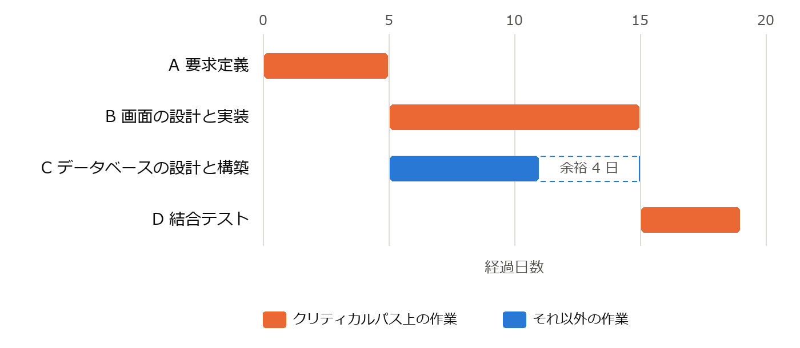
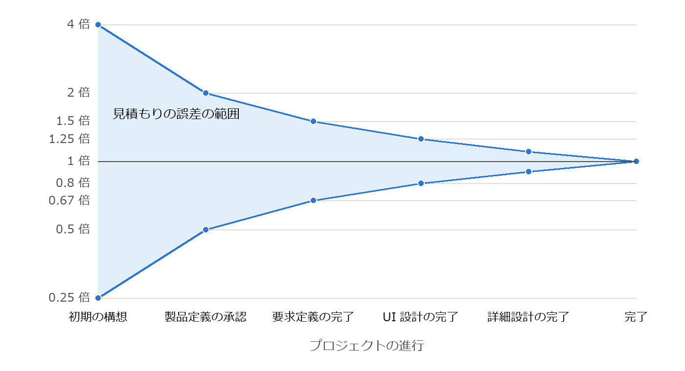

プロジェクト管理
================

ソフトウェア開発の多くは、決められた予算と期間の中で、チームによって行われる。技術的に優れたチームであっても、計画や管理が不適切であればプロジェクトは失敗する。本章では、ソフトウェア開発プロジェクトを管理するための基本的な考え方と技法を説明する。

プロジェクト管理の基本
----------------------

プロジェクトとは、独自の成果を生み出すために行う、始まりと終わりのある一時的な活動である。プロジェクト管理では、品質（Quality）、コスト（Cost）、納期（Delivery）の 3 つの要素のバランスを取ることが求められる。これらの頭文字を取って QCD と呼ぶ。3 つの要素は互いに関係しており、例えば機能や品質を変えずに納期を短くしようとすれば、一般にコストが増える。

プロジェクト管理の知識体系としては、PMI（Project Management Institute）が発行する PMBOK ガイド [PMBOK]_ が広く知られている。PMBOK ガイドは、業種を問わないプロジェクト管理の原則と実践を体系化したものであり、ソフトウェア開発にも適用できる。

WBS とスケジュール
------------------

WBS
^^^

:term:`WBS`\ （Work Breakdown Structure、作業分解構成図）は、プロジェクトで作成する成果物と作業を、階層的に細かく分解したものである。例えば「会員管理機能の開発」を「会員登録画面」「会員検索画面」「会員データベース」などに分解し、さらにそれぞれを設計、実装、テストなどの作業に分解する。

分解は、各作業の工数を見積もることができ、担当者を割り当てられる程度の大きさになるまで行う。WBS を作成することで、必要な作業の漏れを防ぎ、見積もりとスケジュールの基礎を得ることができる。

スケジュールとクリティカルパス
^^^^^^^^^^^^^^^^^^^^^^^^^^^^^^

WBS で洗い出した作業に、所要期間と作業間の順序関係（ある作業が終わらないと次の作業を始められない、など）を設定すると、スケジュールを作成できる。スケジュールは、横軸を時間として各作業の期間を横棒で表すガントチャートで表現することが多い。

作業の順序関係をたどったとき、開始から終了までの経路のうち、所要期間の合計が最も長い経路を\ :term:`クリティカルパス`\ と呼ぶ。クリティカルパス上の作業が 1 日遅れると、プロジェクト全体の完了も 1 日遅れる。一方、クリティカルパス上にない作業には、全体の完了に影響を与えずに遅らせることのできる余裕がある。次の例で考える。

.. list-table:: 作業と順序関係の例
   :header-rows: 1
   :widths: 15 45 20 20

   * - 作業
     - 内容
     - 所要日数
     - 先行作業
   * - A
     - 要求定義
     - 5
     - なし
   * - B
     - 画面の設計と実装
     - 10
     - A
   * - C
     - データベースの設計と構築
     - 6
     - A
   * - D
     - 結合テスト
     - 4
     - B、C

作業の順序関係を図に表すと\ :numref:`fig-network` のようになる。経路は A → B → D（19 日）と A → C → D（15 日）の 2 つであり、クリティカルパスは A → B → D である。

.. graphviz::
   :name: fig-network
   :alt: A の後に B と C を並行して行い、両方が終わった後に D を行う。A、B、D がクリティカルパス
   :caption: 作業の順序関係（太線と色付きの作業はクリティカルパスを表す）
   :align: center

   digraph network {
     rankdir=LR;
     nodesep=0.5;
     start [label="開始", shape=ellipse];
     a [label="A 要求定義\n5 日", fillcolor="#fde8df", color="#eb6834"];
     b [label="B 画面の設計と実装\n10 日", fillcolor="#fde8df", color="#eb6834"];
     c [label="C データベースの設計と構築\n6 日"];
     d [label="D 結合テスト\n4 日", fillcolor="#fde8df", color="#eb6834"];
     end [label="終了", shape=ellipse];
     start -> a [color="#eb6834", penwidth=2.5];
     a -> b [color="#eb6834", penwidth=2.5];
     b -> d [color="#eb6834", penwidth=2.5];
     d -> end [color="#eb6834", penwidth=2.5];
     a -> c;
     c -> d;
   }

これをガントチャートで表すと\ :numref:`fig-gantt` のようになる。作業 C には 4 日の余裕があるが、作業 B が遅れるとプロジェクト全体が遅れる。

   作業の例のガントチャート進捗管理では、クリティカルパス上の作業を重点的に監視する。

見積もり
--------

プロジェクトの計画には、必要な工数（作業量）と期間の見積もりが欠かせない。工数は、1 人が 1 か月で行う作業量を単位とする人月で表すことが多い。代表的な見積もりの手法を次に示す。

.. list-table:: 代表的な見積もりの手法
   :header-rows: 1
   :widths: 25 75

   * - 手法
     - 内容
   * - 類推見積もり
     - 過去の類似したプロジェクトの実績を基に見積もる。手軽だが、類似したプロジェクトの実績が必要である。
   * - ボトムアップ見積もり
     - WBS で分解した個々の作業の工数を見積もり、合計する。精度は高いが、作業が詳細に分かっている必要がある。
   * - ファンクションポイント法
     - ファンクションポイント（第 10 章）で機能の規模を測定し、生産性の実績値から工数を求める。
   * - パラメトリック見積もり
     - 規模などの変数と工数の関係を表す数式（モデル）を用いて工数を計算する。COCOMO が代表的である。

COCOMO
^^^^^^

:term:`COCOMO`\ （Constructive Cost Model）は、Boehm が 1981 年に発表した見積もりのモデルである [Boehm1981]_。最も単純な基本 COCOMO では、ソフトウェアの規模 KLOC（千行）から、工数 :math:`E`\ （人月）と開発期間 :math:`D`\ （月）を次の式で求める。

.. math::

   E = a \times \mathrm{KLOC}^{b}, \qquad D = c \times E^{d}

係数 :math:`a, b, c, d` は、プロジェクトの種類（モード）によって次の値をとる。

.. list-table:: 基本 COCOMO の係数
   :header-rows: 1
   :widths: 40 15 15 15 15

   * - モード
     - a
     - b
     - c
     - d
   * - organic（小規模なチームで、よく知っている分野の開発）
     - 2.4
     - 1.05
     - 2.5
     - 0.38
   * - semi-detached（organic と embedded の中間）
     - 3.0
     - 1.12
     - 2.5
     - 0.35
   * - embedded（ハードウェアや厳しい制約の下での開発）
     - 3.6
     - 1.20
     - 2.5
     - 0.32

指数 :math:`b` が 1 より大きいことは、規模が 2 倍になると工数は 2 倍より大きくなること、すなわち規模の不経済を表している。規模が大きくなると、コミュニケーションや調整の作業が増えるためである。

次のプログラムは、基本 COCOMO で工数と開発期間を計算する。

.. literalinclude:: ../examples/ch11_cocomo.py
   :language: python
   :linenos:
   :caption: ch11_cocomo.py

ダウンロード: :download:`ch11_cocomo.py <../examples/ch11_cocomo.py>`

規模を 50 KLOC として実行した結果を次に示す。

.. code-block:: text
   :linenos:

   organic: 工数 145.9 人月, 期間 16.6 か月, 平均要員 8.8 人
   semi-detached: 工数 239.9 人月, 期間 17.0 か月, 平均要員 14.1 人
   embedded: 工数 393.6 人月, 期間 16.9 か月, 平均要員 23.3 人

基本 COCOMO は規模だけから計算する粗いモデルである。その後、要員の能力や信頼性の要求などの補正係数を加えた中間 COCOMO や、現代の開発手法に対応した COCOMO II が提案されている。いずれのモデルも、係数は組織の実績データで補正して用いる必要がある。

見積もりの不確実性
^^^^^^^^^^^^^^^^^^

見積もりは、プロジェクトの初期ほど不確実である。要求が固まっていない段階の見積もりは、実際の値の 4 分の 1 から 4 倍の範囲でずれることもある。開発が進み、要求や設計が明らかになるにつれて、見積もりの誤差は小さくなっていく。この様子は、誤差の範囲が次第に狭まる形から「不確実性のコーン」と呼ばれる（\ :numref:`fig-cone`\ ） [McConnell2006]_。

   不確実性のコーン（縦軸は、実際の値に対する見積もりの比を対数目盛りで表す）

そのため、見積もりは 1 つの値ではなく幅を持たせて示し、開発の進行に合わせて見直すことが望ましい。また、見積もり（どれくらいかかりそうか）と目標（いつまでに終えたいか）を混同しないことも重要である。

リスク管理
----------

リスクとは、発生すればプロジェクトの目標に影響を与える、不確実な事象である。リスク管理は、リスクが問題になる前に対処するための活動であり、次の手順で行う。

#. **リスクの識別**\ ：プロジェクトにどのようなリスクがあるかを洗い出す。
#. **リスクの分析**\ ：各リスクの発生確率と、発生した場合の影響の大きさを評価し、対処の優先順位を決める。
#. **対応策の計画**\ ：優先度の高いリスクについて、対応策を決める。
#. **監視**\ ：リスクの状況を定期的に確認し、新たなリスクを識別する。

リスクへの代表的な対応策には次のものがある。

.. list-table:: リスクへの対応策
   :header-rows: 1
   :widths: 20 45 35

   * - 対応策
     - 内容
     - 例
   * - 回避
     - リスクの原因を取り除き、リスクが発生しないようにする。
     - 実績のない新技術の採用をやめる。
   * - 軽減
     - 発生確率または影響を小さくする。
     - 技術的に不確実な部分をプロトタイプで先に検証する。
   * - 転嫁
     - リスクの影響を第三者に移す。
     - 保険をかける、専門の会社に外部委託する。
   * - 受容
     - 対策をとらずに受け入れる。必要に応じて予備の予算や期間を確保する。
     - 影響の小さいリスクを受け入れる。

ソフトウェア開発でよく見られるリスクには、要求の変更や増大、見積もりの誤り、主要な要員の離脱、新技術の習熟不足、外部の組織やシステムへの依存などがある。第 2 章で説明したスパイラルモデルは、このリスク管理を開発プロセスの中心に据えたものである。

チームとコミュニケーション
--------------------------

ソフトウェア開発は人による知的な共同作業であり、チームの構成やコミュニケーションが成果に大きく影響する。

ブルックスの法則
^^^^^^^^^^^^^^^^

Brooks は「遅れているソフトウェアプロジェクトに要員を追加すると、さらに遅れる」と述べた [Brooks1995]_。これはブルックスの法則と呼ばれる。新しく加わった要員が戦力になるまでには教育の期間が必要であり、その間は既存の要員の時間も教育に割かれる。また、:math:`n` 人のチームでは、2 人の間の意思疎通の経路が :math:`n(n-1)/2` 本あり、人数が増えるほど調整の負担が急速に増大する。例えば 5 人のチームでは 10 本であるが、10 人のチームでは 45 本になる。

「人」と「月」は交換可能ではない。工数が 12 人月の作業を、12 人で 1 か月で終えられるとは限らない。人月という単位を扱う際には、このことに注意が必要である。

コンウェイの法則
^^^^^^^^^^^^^^^^

Conway は「システムを設計する組織は、その組織のコミュニケーション構造をそのまま写した構造の設計を生み出す」と述べた [Conway1968]_。これはコンウェイの法則と呼ばれる。例えば、3 つのチームでコンパイラを開発すると、3 段階の処理から構成されるコンパイラができあがりやすい。

この法則は、アーキテクチャ（第 5 章）とチームの構成を一緒に考える必要があることを示している。近年では逆に、望ましいアーキテクチャに合わせてチームを編成するという考え方（逆コンウェイ戦略）も用いられている。

まとめ
------

* プロジェクト管理では、品質・コスト・納期（QCD）のバランスを取る。
* WBS で作業を分解し、クリティカルパスに注目してスケジュールを管理する。
* 見積もりには類推、ボトムアップ、ファンクションポイント法、COCOMO などの手法があり、初期の見積もりほど不確実である。
* リスクは識別・分析・対応策の計画・監視の手順で管理する。
* 遅れたプロジェクトに要員を追加すると、さらに遅れることがある（ブルックスの法則）。

演習問題
--------

解答例は「\ :ref:`answers-ch11`\ 」にある。

**問題 11-1**\ ：次の作業について、クリティカルパスとプロジェクト全体の所要日数を求めよ。また、クリティカルパス上にない作業の余裕日数を求めよ。

.. list-table:: 問題 11-1 の作業
   :header-rows: 1
   :widths: 25 25 50

   * - 作業
     - 所要日数
     - 先行作業
   * - A
     - 3
     - なし
   * - B
     - 4
     - A
   * - C
     - 7
     - A
   * - D
     - 2
     - B
   * - E
     - 3
     - C、D
   * - F
     - 2
     - E

**問題 11-2**\ ：基本 COCOMO の organic モードで、規模が 100 KLOC のソフトウェアの工数と開発期間を求めよ。また、規模が 50 KLOC の場合と比べて、工数は何倍になるか。

**問題 11-3**\ ：6 人のチームに 3 人を追加すると、意思疎通の経路の数は何本から何本に増えるか。

**問題 11-4**\ ：次の (a)〜(c) のリスク対応は、回避・軽減・転嫁・受容のどれにあたるか。

\(a) 性能要件を満たせるか分からないため、開発の初期に性能の試作を行う。

\(b) 実績のない新しいフレームワークの採用をやめ、使い慣れたフレームワークを使う。

\(c) サーバーの運用を、障害時の補償契約を含めて専門の事業者に委託する。

発展課題
--------

演習問題より発展的な課題である。正解が 1 つに定まらないものも含む。解答例や解答の方針は「\ :ref:`answers-ch11`\ 」にある。

**発展課題 11-A**\ ：演習問題 11-1 の作業について、各作業の所要日数を楽観値・最頻値・悲観値の 3 点で見積もった（次の表）。所要日数を三角分布に従う乱数として 10000 回のシミュレーションを行い（モンテカルロ法）、プロジェクト全体の所要日数の平均と、50 % および 90 % の確率で終わる日数を求めよ。また、最頻値だけで計算した所要日数（15 日）と比べて何がいえるかを論じよ。

.. list-table:: 発展課題 11-A の 3 点見積もり（日）
   :header-rows: 1
   :widths: 25 25 25 25

   * - 作業
     - 楽観値
     - 最頻値
     - 悲観値
   * - A
     - 2
     - 3
     - 5
   * - B
     - 3
     - 4
     - 8
   * - C
     - 5
     - 7
     - 12
   * - D
     - 1
     - 2
     - 4
   * - E
     - 2
     - 3
     - 6
   * - F
     - 1
     - 2
     - 3
