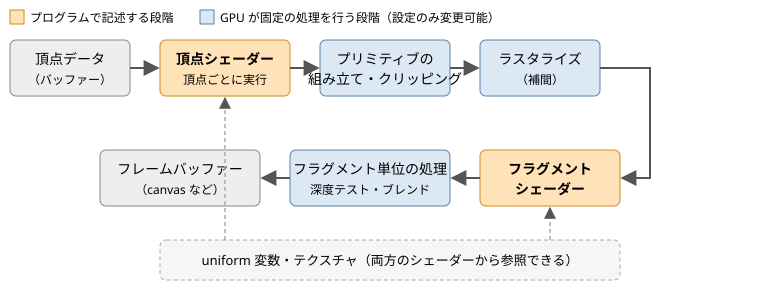

.. _chap-overview:

WebGL の概要
============

この章では、WebGL がどのような技術で、どのような仕組みで描画を行うのかを概観します。

WebGL とは
----------

:term:`WebGL` は、Web ブラウザーから GPU を使って 2D・3D グラフィックスを描画するための JavaScript API です。HTML の ``canvas`` 要素に対して描画を行います。仕様は 3D グラフィックスの標準化団体である Khronos Group が策定しています。

WebGL は、組み込み機器向けのグラフィックス API である :term:`OpenGL ES` をもとに設計されています。\ :numref:`table-webgl-versions` に示すように、WebGL のバージョンは OpenGL ES のバージョンに対応しています。

.. _table-webgl-versions:

.. list-table:: WebGL と OpenGL ES の対応
   :header-rows: 1
   :widths: 20 25 25 30

   * - WebGL
     - ベースとなる API
     - シェーダー言語
     - コンテキストの取得
   * - WebGL 1.0
     - OpenGL ES 2.0
     - GLSL ES 1.00
     - ``canvas.getContext("webgl")``
   * - WebGL 2.0
     - OpenGL ES 3.0
     - GLSL ES 3.00
     - ``canvas.getContext("webgl2")``

WebGL 1.0 と 2.0 の違い
-----------------------

WebGL 2.0 では、WebGL 1.0 で拡張機能として提供されていた機能の多くが標準機能になり、さらに新しい機能が追加されました。主な違いを\ :numref:`table-webgl2-features` に示します。

.. _table-webgl2-features:

.. list-table:: WebGL 2.0 で標準になった主な機能
   :header-rows: 1
   :widths: 35 65

   * - 機能
     - 概要
   * - 頂点配列オブジェクト（VAO）
     - 頂点属性の設定をまとめて保存し、1 回の呼び出しで切り替えられます（:numref:`chap-buffer`）
   * - インスタンス描画
     - 同じ形状を 1 回の描画コールで多数描画します（:numref:`chap-advanced`）
   * - Uniform Buffer Object
     - 複数の uniform 変数をバッファーにまとめ、プログラム間で共有します（:numref:`chap-advanced`）
   * - 複数レンダーターゲット（MRT）
     - フラグメントシェーダーから複数のカラーバッファーへ同時に出力します
   * - 3D テクスチャ、テクスチャ配列
     - 3 次元のテクスチャや、同じ大きさのテクスチャを束ねた配列を使います
   * - 2 のべき乗以外のサイズのテクスチャ
     - WebGL 1.0 ではミップマップや REPEAT が使えなかったが、2.0 では制限なく使えます
   * - Transform Feedback
     - 頂点シェーダーの出力をバッファーに書き戻します
   * - GLSL ES 3.00
     - ``in`` / ``out`` による変数の受け渡し、整数演算、\ ``layout`` 修飾子などが使えます

本書では WebGL 2.0 だけを扱います。インターネット上の WebGL の解説には WebGL 1.0 を前提にしたものも多いため、読み比べる際は注意してください。シェーダーの書き方の違いは\ :numref:`chap-shader`\ で説明します。

WebGPU との関係
---------------

:term:`WebGPU` は、WebGL の後継として W3C で策定された新しいグラフィックス API です。Vulkan、Metal、Direct3D 12 といった現代的なネイティブ API の設計を取り入れており、GPU を汎用計算に使うコンピュートシェーダーにも対応しています。

一方、WebGL は長年にわたって主要なブラウザーで安定して動作しており、既存のライブラリや資料も豊富です。また、頂点データ、シェーダー、座標変換、テクスチャといった本書で学ぶ概念は WebGPU でもそのまま通用します。WebGL でこれらの基礎を身に付けておけば、WebGPU へ移行する際にも役立ちます。

GPU による描画の仕組み
----------------------

WebGL での描画は、CPU 上の JavaScript が GPU に命令を送り、GPU が大量の頂点やピクセルを並列に処理するという形で行われます。JavaScript で 1 ピクセルずつ色を計算するのではなく、「どのような形を、どのような方法で塗るか」を GPU に伝えるのが WebGL プログラムの役割です。

GPU が頂点データから画面のピクセルを作り出すまでの一連の処理を\ :term:`レンダリングパイプライン`\ と呼びます。WebGL 2.0 のレンダリングパイプラインの概略を\ :numref:`fig-pipeline` に示します。

.. _fig-pipeline:

   レンダリングパイプラインの概略

各段階の役割は次のとおりです。

1. **頂点シェーダー**: 頂点 1 つごとに実行されるプログラムです。頂点の座標を変換し、画面上のどこに表示するかを決めます。
2. **プリミティブの組み立て・クリッピング**: 頂点をまとめて三角形や線分（\ :term:`プリミティブ`\ ）を組み立てます。表示範囲の外にはみ出した部分は切り取られます。
3. **ラスタライズ**: 三角形が覆うピクセルを求め、ピクセルごとの処理単位である\ :term:`フラグメント`\ を生成します。このとき、頂点シェーダーが出力した値（色やテクスチャ座標など）は、三角形の内部で補間されます。
4. **フラグメントシェーダー**: フラグメント 1 つごとに実行されるプログラムです。ピクセルの色を決めます。
5. **フラグメント単位の処理**: 深度テスト（\ :numref:`chap-depth`\ ）やブレンド（\ :numref:`chap-advanced`\ ）を行い、最終的な色を\ :term:`フレームバッファー`\ に書き込みます。

この中で、プログラマーが記述するのは頂点シェーダーとフラグメントシェーダーの 2 つです。シェーダーは :term:`GLSL` という C 言語に似た言語で記述し、実行時にコンパイルして GPU に転送します。その他の段階は GPU が固定の処理を行い、プログラムからは有効・無効や計算方法などの設定だけを変更できます。

WebGL の API は、この設定を変更する関数と、描画を指示する関数の集まりだと考えることができます。WebGL は内部に多数の設定（\ :term:`ステート`\ ）を持っており、\ ``gl.enable`` や ``gl.bindBuffer`` などの関数でそれを書き換えてから、\ ``gl.drawArrays`` などの描画関数を呼び出します。描画関数は、呼び出された時点のステートに従って描画を行います。この「ステートマシン」としての性質は WebGL を理解するうえで重要です。
