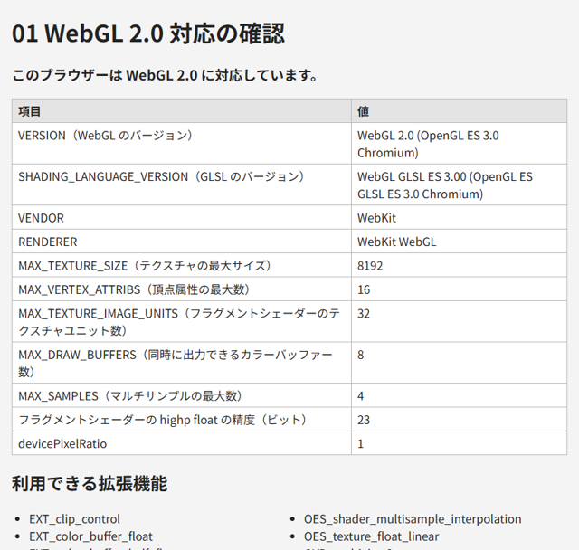

.. _chap-setup:

開発環境の準備
==============

この章では、WebGL のプログラムを作成・実行するための環境を整えます。

必要なもの
----------

WebGL のプログラムは HTML ファイルと JavaScript だけで作成できるので、特別なビルドツールは必要ありません。必要なものを\ :numref:`table-tools` に示します。

.. _table-tools:

.. list-table:: 開発に必要なもの
   :header-rows: 1
   :widths: 25 75

   * - 種類
     - 内容
   * - ブラウザー
     - WebGL 2.0 に対応したブラウザー。Chrome または Edge を推奨します。開発者ツールが充実しており、本書のサンプルの動作も確認しています。
   * - テキストエディター
     - HTML と JavaScript を編集できるもの。Visual Studio Code などが便利です。GLSL の構文を色分けする拡張機能もあります。
   * - Python 3
     - ローカルサーバー（後述）と、本書の補助スクリプトの実行に使います。Python 3.10 以降を想定しています。
   * - Pillow
     - テクスチャ画像を生成するスクリプト ``gen_texture.py`` を実行する場合だけ必要です。\ ``pip install pillow`` でインストールできます。

WebGL 2.0 への対応を確認する
----------------------------

まず、使用するブラウザーが WebGL 2.0 に対応しているかを確認します。WebGL 2.0 のコンテキストは ``canvas.getContext("webgl2")`` で取得します。ブラウザーが WebGL 2.0 に対応していない場合や、GPU のドライバーの問題で無効になっている場合は ``null`` が返ります。

.. code-block:: javascript
   :linenos:

   const canvas = document.getElementById("canvas");
   const gl = canvas.getContext("webgl2");
   if (!gl) {
     // WebGL 2.0 が使えない場合の処理
     console.log("このブラウザーは WebGL 2.0 に対応していません。");
   }

サンプル ``01_check_support.html`` は、WebGL 2.0 に対応しているかどうかに加えて、\ ``gl.getParameter`` で取得した実装の情報や上限値と、利用できる拡張機能の一覧を表示します。

.. _fig-sample-01:

   01_check_support.html の実行結果

* `01_check_support.html をブラウザーで開く <examples/01_check_support.html>`__
* :download:`01_check_support.html をダウンロード <../examples/01_check_support.html>`

表示される上限値（テクスチャの最大サイズなど）は、GPU やブラウザーによって異なります。多くの環境で動作するプログラムを作るには、この上限値を超えないようにする必要があります。

.. note::

   ``RENDERER`` に表示される GPU の名前は、プライバシー保護のため、ブラウザーによっては一般的な名前に置き換えられます。

ローカルサーバーを起動する
--------------------------

HTML ファイルをダブルクリックすると、ブラウザーは ``file://`` で始まる URL でファイルを開きます。ほとんどのサンプルはこの方法で動作しますが、画像ファイルをテクスチャとして使うサンプルは動作しません。ブラウザーのセキュリティー機能により、\ ``file://`` で開いたページでは画像の出どころ（\ :term:`オリジン`\ ）が異なるものとして扱われ、WebGL へ画像を転送できないためです（詳しくは\ :numref:`chap-texture`\ で説明します）。

そこで、手元の PC で HTTP サーバーを起動し、\ ``http://localhost:8000/`` のような URL でページを開きます。本書では、Python の標準ライブラリだけで動作する ``serve.py`` を用意しています。

.. code-block:: console
   :linenos:

   > cd examples
   > python serve.py
   配信フォルダー: C:\...\examples
   http://localhost:8000/ を開いてください。終了するには Ctrl+C を押します。

ブラウザーで ``http://localhost:8000/`` を開くと、サンプルの一覧が表示されます。主なオプションを\ :numref:`table-serve-options` に示します。

.. _table-serve-options:

.. list-table:: serve.py のオプション
   :header-rows: 1
   :widths: 30 70

   * - オプション
     - 内容
   * - ``--port 番号``
     - 待ち受けるポート番号（既定値は 8000）
   * - ``--directory フォルダー``
     - 配信するフォルダー（既定値は ``serve.py`` があるフォルダー）
   * - ``--bind アドレス``
     - 待ち受けるアドレス（既定値は ``127.0.0.1``。自分の PC からのみ接続できます）
   * - ``--open``
     - 起動後に既定のブラウザーでページを開きます

``serve.py`` の内容は次のとおりです。標準ライブラリの ``http.server`` を使い、指定したフォルダーを配信します。

.. literalinclude:: ../examples/serve.py
   :language: python
   :linenos:

* :download:`serve.py をダウンロード <../examples/serve.py>`

.. note::

   Python を使わない場合は、Node.js の ``npx http-server`` や、Visual Studio Code の拡張機能 Live Server など、他の HTTP サーバーを使ってもかまいません。

開発者ツールの使い方
--------------------

WebGL のプログラムでは、シェーダーのコンパイルエラーや API の使い方の誤りがあっても、画面には何も表示されないことがよくあります。原因を調べるために、ブラウザーの開発者ツール（Chrome と Edge では F12 キーで開きます）のコンソールを常に開いておくことを勧めます。

WebGL の API の誤り（存在しないバッファーをバインドした、引数の値が不正である、など）は、ブラウザーによって ``WebGL: INVALID_OPERATION: ...`` のような警告としてコンソールに表示されます。本書のサンプルでは、シェーダーのコンパイルエラーなどの例外を、canvas の上にも赤い文字で表示するようにしています。デバッグの方法は\ :numref:`chap-debug`\ で詳しく説明します。
