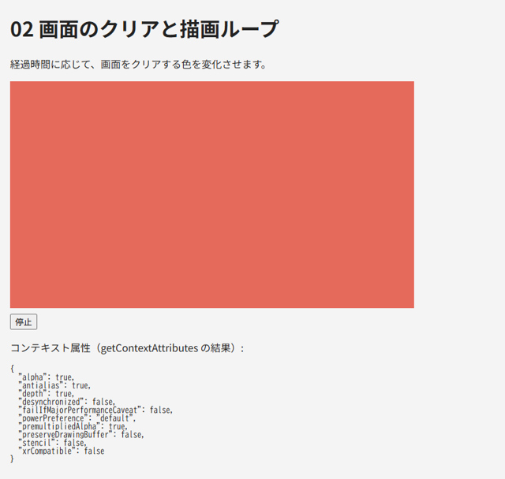

.. _chap-first-drawing:

最初の描画
==========

この章では、canvas を用意して WebGL のコンテキストを取得し、画面を単色で塗りつぶします。さらに、描画を毎フレーム繰り返す描画ループを作ります。

canvas を用意する
-----------------

WebGL は HTML の ``canvas`` 要素に描画します。canvas には、\ **描画バッファーの大きさ**\ と\ **表示サイズ**\ という 2 つの大きさがあることに注意してください。

* 描画バッファーの大きさは、\ ``width`` 属性と ``height`` 属性（JavaScript では ``canvas.width`` と ``canvas.height``）で指定します。WebGL が実際に描画するピクセル数です。既定値は 300 × 150 です。
* 表示サイズは、CSS の ``width`` と ``height`` で指定します。描画バッファーの内容は、この大きさに拡大・縮小して表示されます。

.. code-block:: html
   :linenos:

   <!-- 描画バッファーは 640 × 360 ピクセル -->
   <canvas id="canvas" width="640" height="360"></canvas>

CSS だけで canvas の大きさを変えると、描画バッファーが引き伸ばされて表示がぼやけます。表示サイズに描画バッファーを合わせる方法は\ :numref:`chap-interaction`\ で説明します。この章からしばらくは、\ ``width`` 属性と ``height`` 属性で大きさを固定した canvas を使います。

コンテキストを取得する
----------------------

canvas の ``getContext`` メソッドに ``"webgl2"`` を指定すると、WebGL 2.0 のコンテキスト（\ ``WebGL2RenderingContext``\ ）が得られます。以降、WebGL の API はすべてこのオブジェクトのメソッドとして呼び出します。

``getContext`` の第 2 引数には、描画バッファーの性質を指定する\ **コンテキスト属性**\ をオブジェクトで渡せます。主な属性を\ :numref:`table-context-attributes` に示します。コンテキスト属性は、コンテキストを作るときにしか指定できません。

.. _table-context-attributes:

.. list-table:: 主なコンテキスト属性
   :header-rows: 1
   :widths: 25 12 63

   * - 属性
     - 既定値
     - 意味
   * - ``alpha``
     - ``true``
     - 描画バッファーがアルファ（不透明度）を持つか。\ ``true`` の場合、アルファが 1 未満のピクセルでは canvas の背後にある Web ページが透けて見えます
   * - ``depth``
     - ``true``
     - 深度バッファーを持つか（:numref:`chap-depth`）
   * - ``stencil``
     - ``false``
     - ステンシルバッファーを持つか
   * - ``antialias``
     - ``true``
     - アンチエイリアス（ポリゴンの縁のギザギザを滑らかにする処理）を行うか。実際に行われるかどうかは実装に依存します
   * - ``premultipliedAlpha``
     - ``true``
     - 描画バッファーの色を、アルファを掛け合わせた値（乗算済みアルファ）として扱うか
   * - ``preserveDrawingBuffer``
     - ``false``
     - 画面に表示した後も描画バッファーの内容を保持するか。\ ``false`` の場合、表示後の内容は保証されません
   * - ``powerPreference``
     - ``"default"``
     - 複数の GPU がある環境で、省電力（\ ``"low-power"``\ ）と高性能（\ ``"high-performance"``\ ）のどちらを優先するか

``preserveDrawingBuffer`` が ``false`` の場合、ブラウザーは描画結果を画面に表示した後に描画バッファーを消去してよいことになっています。そのため、毎フレーム画面全体を描き直すのが WebGL の基本的な使い方です。\ ``canvas.toDataURL`` で描画結果を画像として保存したい場合などは、描画した直後（同じフレームの処理の中）に呼び出すか、\ ``preserveDrawingBuffer`` を ``true`` にします。

画面をクリアする
----------------

描画の最初に、描画バッファー全体を 1 色で塗りつぶします。これを\ :term:`クリア`\ と呼びます。

.. code-block:: javascript
   :linenos:

   gl.clearColor(0.2, 0.4, 0.8, 1.0);  // クリアする色（R, G, B, A）を設定する
   gl.clear(gl.COLOR_BUFFER_BIT);      // カラーバッファーをクリアする

WebGL では、色の各成分を 0 から 255 の整数ではなく、0.0 から 1.0 の実数で表します。\ ``gl.clearColor`` はクリアに使う色をステートとして設定するだけで、実際に塗りつぶすのは ``gl.clear`` です。\ ``gl.clear`` の引数には、クリアするバッファーをビットの論理和で指定します。\ :numref:`chap-depth`\ で深度バッファーを使うようになると、\ ``gl.COLOR_BUFFER_BIT | gl.DEPTH_BUFFER_BIT`` のように指定します。

描画ループを作る
----------------

アニメーションを行うには、描画を繰り返し実行します。ブラウザーで繰り返し描画を行うには、\ ``requestAnimationFrame`` を使います。\ ``requestAnimationFrame`` に渡した関数は、ブラウザーが次に画面を更新する直前に 1 回だけ呼び出されます。その関数の中で再び ``requestAnimationFrame`` を呼ぶことで、画面の更新に合わせて描画を繰り返せます。

.. code-block:: javascript
   :linenos:

   function render(time) {
     // time はページの読み込みからの経過時間（ミリ秒）
     // ... ここで描画する ...
     requestAnimationFrame(render);  // 次のフレームの描画を予約する
   }
   requestAnimationFrame(render);

``setInterval`` を使う方法と比べて、\ ``requestAnimationFrame`` には次の利点があります。

* 画面の更新タイミング（多くの環境で 1 秒間に 60 回）に同期するため、ちらつきや無駄な描画が起きません。
* タブが非表示になっている間は呼び出されないため、電力を無駄に消費しません。

経過時間に基づいて動かす
------------------------

画面の更新頻度は環境によって異なります。1 秒間に 60 回の環境もあれば、120 回や 144 回の環境もあります。「1 フレームごとに 1 度回転する」ように書くと、更新頻度の高い環境ほど速く回転してしまいます。

これを避けるには、前のフレームからの経過時間（\ :term:`デルタタイム`\ ）を求め、それに比例して動かします。

.. code-block:: javascript
   :linenos:

   let previousTime = null;
   let angle = 0;

   function render(time) {
     // 前のフレームからの経過時間（秒）。最初のフレームは 0 とする
     const deltaTime = previousTime === null ? 0 : (time - previousTime) / 1000;
     previousTime = time;

     angle += 90 * deltaTime;  // 1 秒あたり 90 度回転する
     // ... angle を使って描画する ...
     requestAnimationFrame(render);
   }
   requestAnimationFrame(render);

一定の速さで動き続けるだけであれば、\ ``time`` から直接角度を計算する方法もあります（\ ``angle = 90 * time / 1000``）。一時停止や速度の変更が必要な場合は、デルタタイムを積算する方法が便利です。

エラーに備える
--------------

WebGL のプログラムは、次のような理由で動作しないことがあります。

* ブラウザーが WebGL 2.0 に対応していない、または GPU の問題で WebGL が無効になっています。
* シェーダーのコンパイルに失敗しました（:numref:`chap-shader`）。
* 実行中に GPU がリセットされ、コンテキストが失われました（:numref:`chap-debug`）。

何も表示されないまま終わると利用者は原因が分からないので、少なくともメッセージを表示するようにします。本書のサンプルでは、次のように ``main`` 関数全体を ``try`` ～ ``catch`` で囲み、例外のメッセージをページに表示しています。

.. code-block:: javascript
   :linenos:

   function showError(message) {
     const element = document.getElementById("error");
     element.textContent += message + "\n";
     element.hidden = false;
   }

   try {
     main();
   } catch (error) {
     showError(error.message);
   }

サンプル
--------

``02_clear.html`` は、経過時間に応じて色相を変えながら画面をクリアします。ボタンで色の変化を停止・再開でき、フレームレートと、\ ``gl.getContextAttributes`` で取得した実際のコンテキスト属性も表示します。

   02_clear.html の実行結果

* `02_clear.html をブラウザーで開く <examples/02_clear.html>`__
* :download:`02_clear.html をダウンロード <../examples/02_clear.html>`

``main`` 関数の内容を次に示します。

.. literalinclude:: ../examples/02_clear.html
   :language: javascript
   :start-at: function main()
   :end-before: // HSV
   :lineno-match:
