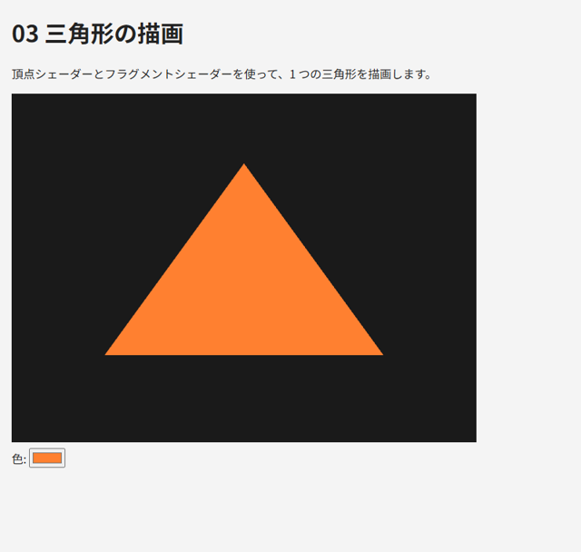

.. _chap-shader:

シェーダーの基礎
================

この章では、GPU 上で実行されるプログラムである\ :term:`シェーダー`\ の書き方と、それを WebGL で使う手順を説明し、最初の三角形を描画します。

頂点シェーダーとフラグメントシェーダー
--------------------------------------

:numref:`chap-overview`\ で説明したように、WebGL で描画するには 2 種類のシェーダーが必要です。

* :term:`頂点シェーダー`\ は、頂点 1 つごとに実行されます。入力された頂点の座標を変換し、組み込み変数 ``gl_Position`` に\ :term:`クリップ座標`\ として書き込みます。
* :term:`フラグメントシェーダー`\ は、ラスタライズで生成されたフラグメント 1 つごとに実行されます。そのフラグメントの色を出力します。

頂点シェーダーとフラグメントシェーダーの組を、WebGL では\ :term:`プログラム`\ （プログラムオブジェクト）と呼びます。描画の際は、使用するプログラムを ``gl.useProgram`` で選んでから描画関数を呼び出します。

最も簡単なシェーダーの例を次に示します。頂点シェーダーは受け取った 2 次元の座標をそのまま出力し、フラグメントシェーダーは uniform 変数で指定された色を出力します。

.. code-block:: glsl
   :linenos:
   :caption: 頂点シェーダー

   #version 300 es
   layout(location = 0) in vec2 a_position;

   void main() {
     gl_Position = vec4(a_position, 0.0, 1.0);
   }

.. code-block:: glsl
   :linenos:
   :caption: フラグメントシェーダー

   #version 300 es
   precision mediump float;

   uniform vec4 u_color;
   out vec4 outColor;

   void main() {
     outColor = u_color;
   }

``gl_Position`` の x 座標と y 座標は、何も変換しなければ、canvas の左端が -1、右端が 1、下端が -1、上端が 1 に対応します（正確には w 成分で割った後の値です。\ :numref:`chap-transform`\ で説明します）。

GLSL ES 3.00 の基本
-------------------

シェーダーは :term:`GLSL`\ （OpenGL Shading Language）で記述します。WebGL 2.0 で使うのは、OpenGL ES 3.0 向けの GLSL ES 3.00 です。文法は C 言語に似ており、\ ``main`` 関数から実行が始まります。

データ型
~~~~~~~~

主なデータ型を\ :numref:`table-glsl-types` に示します。

.. _table-glsl-types:

.. list-table:: GLSL ES 3.00 の主なデータ型
   :header-rows: 1
   :widths: 30 70

   * - 型
     - 内容
   * - ``float``\ 、\ ``int``\ 、\ ``uint``\ 、\ ``bool``
     - スカラー（浮動小数点数、符号付き整数、符号なし整数、真偽値）
   * - ``vec2``\ 、\ ``vec3``\ 、\ ``vec4``
     - 2 ～ 4 個の ``float`` からなるベクトル
   * - ``ivec2`` ～ ``ivec4``\ 、\ ``bvec2`` ～ ``bvec4``
     - ``int`` と ``bool`` のベクトル
   * - ``mat2``\ 、\ ``mat3``\ 、\ ``mat4``
     - 2 × 2 ～ 4 × 4 の ``float`` の行列（列優先）
   * - ``sampler2D`` など
     - テクスチャを参照するための型（:numref:`chap-texture`）

ベクトルの成分は ``.x``\ 、\ ``.y``\ 、\ ``.z``\ 、\ ``.w``\ （色の場合は ``.r``\ 、\ ``.g``\ 、\ ``.b``\ 、\ ``.a``\ ）で参照します。\ ``v.xy`` や ``color.rgb`` のように複数の成分をまとめて取り出したり、\ ``v.zyx`` のように並べ替えたりすることもできます。これを\ :term:`スウィズル`\ と呼びます。

.. code-block:: glsl
   :linenos:

   vec4 color = vec4(1.0, 0.5, 0.0, 1.0);  // コンストラクターで作る
   vec3 rgb = color.rgb;                    // (1.0, 0.5, 0.0)
   vec4 position = vec4(rgb, 1.0);          // vec3 と float から vec4 を作る
   vec2 swapped = color.yx;                 // (0.5, 1.0)

GLSL は型に厳格で、\ ``int`` から ``float`` への暗黙の型変換を行いません。\ ``float x = 1;`` はコンパイルエラーになるので、\ ``float x = 1.0;`` と書きます。型を変換するには ``float(i)`` のようにコンストラクターを使います。

組み込み関数
~~~~~~~~~~~~

GLSL には、グラフィックスでよく使う計算のための関数が用意されています。主なものを\ :numref:`table-glsl-functions` に示します。これらの関数の多くは、\ ``float`` だけでなくベクトルにも適用でき、その場合は成分ごとに計算されます。

.. _table-glsl-functions:

.. list-table:: 主な組み込み関数
   :header-rows: 1
   :widths: 35 65

   * - 関数
     - 内容
   * - ``dot(a, b)``\ 、\ ``cross(a, b)``
     - 内積、外積（:numref:`chap-math`）
   * - ``length(v)``\ 、\ ``normalize(v)``\ 、\ ``distance(a, b)``
     - ベクトルの長さ、正規化、2 点間の距離
   * - ``reflect(i, n)``
     - 入射ベクトル ``i`` を、法線 ``n`` の面で反射したベクトル
   * - ``mix(a, b, t)``
     - 線形補間 ``a * (1 - t) + b * t``
   * - ``clamp(x, lo, hi)``\ 、\ ``min``\ 、\ ``max``
     - 範囲の制限、最小値、最大値
   * - ``pow(x, y)``\ 、\ ``sqrt(x)``\ 、\ ``abs(x)``\ 、\ ``floor(x)``\ 、\ ``fract(x)``
     - べき乗、平方根、絶対値、切り捨て、小数部
   * - ``sin``\ 、\ ``cos``\ 、\ ``tan``\ 、\ ``atan``
     - 三角関数（角度はラジアン）
   * - ``texture(s, uv)``
     - テクスチャから色を読み出します（:numref:`chap-texture`）

変数の修飾子
~~~~~~~~~~~~

シェーダーの外部とデータをやり取りする変数には、修飾子を付けて宣言します（\ :numref:`table-glsl-qualifiers`\ ）。

.. _table-glsl-qualifiers:

.. list-table:: データの受け渡しに使う修飾子
   :header-rows: 1
   :widths: 30 70

   * - 宣言
     - 意味
   * - 頂点シェーダーの ``in``
     - :term:`頂点属性`\ 。バッファーから、頂点ごとに異なる値を受け取ります。\ ``layout(location = 0)`` のように番号（location）を指定できます
   * - ``uniform``
     - :term:`uniform 変数`\ 。JavaScript から設定し、1 回の描画の間はすべての頂点・フラグメントで同じ値になります
   * - 頂点シェーダーの ``out`` とフラグメントシェーダーの ``in``
     - 頂点シェーダーからフラグメントシェーダーへ渡す値。ラスタライズの際に三角形の内部で補間されます。両方のシェーダーで同じ名前と型で宣言します
   * - フラグメントシェーダーの ``out``
     - 出力する色。\ ``vec4`` で宣言します

組み込み変数
~~~~~~~~~~~~

GLSL には、特別な意味を持つ変数があらかじめ用意されています（\ :numref:`table-glsl-builtins`\ ）。

.. _table-glsl-builtins:

.. list-table:: 主な組み込み変数
   :header-rows: 1
   :widths: 25 20 55

   * - 変数
     - シェーダー
     - 内容
   * - ``gl_Position``
     - 頂点
     - 出力。頂点のクリップ座標（\ ``vec4``\ ）。必ず書き込みます
   * - ``gl_PointSize``
     - 頂点
     - 出力。\ ``gl.POINTS`` で描画するときの点の大きさ（ピクセル）
   * - ``gl_VertexID``
     - 頂点
     - 入力。処理中の頂点の番号
   * - ``gl_InstanceID``
     - 頂点
     - 入力。インスタンス描画（\ :numref:`chap-advanced`\ ）で処理中のインスタンスの番号
   * - ``gl_FragCoord``
     - フラグメント
     - 入力。フラグメントのウィンドウ座標（左下が原点、単位はピクセル）

精度修飾子
~~~~~~~~~~

GLSL ES では、浮動小数点数の精度を ``highp``\ （高）、\ ``mediump``\ （中）、\ ``lowp``\ （低）の 3 段階で指定できます。頂点シェーダーの ``float`` の既定の精度は ``highp`` ですが、フラグメントシェーダーには既定の精度がありません。そのため、フラグメントシェーダーの先頭には、次のような精度の宣言が必須です。

.. code-block:: glsl
   :linenos:

   precision mediump float;

PC の GPU では、精度の指定にかかわらず 32 ビットの浮動小数点数で計算されることがほとんどです。一方、モバイル端末の GPU では ``mediump`` が 16 ビットで計算されることがあり、大きな座標値などを扱うと精度が不足します。本書では、色の計算だけを行うフラグメントシェーダーには ``mediump``\ 、ライティングで座標を扱うフラグメントシェーダーには ``highp`` を使います。

シェーダーをコンパイルしてプログラムを作る
------------------------------------------

シェーダーのソースコードは JavaScript の文字列として用意し、実行時に WebGL へ渡してコンパイルします。手順は次のとおりです。

1. ``gl.createShader`` でシェーダーオブジェクトを作り、\ ``gl.shaderSource`` でソースコードを設定し、\ ``gl.compileShader`` でコンパイルします。
2. 頂点シェーダーとフラグメントシェーダーのそれぞれで 1. を行います。
3. ``gl.createProgram`` でプログラムオブジェクトを作り、\ ``gl.attachShader`` で 2 つのシェーダーを取り付け、\ ``gl.linkProgram`` でリンクします。

コンパイルやリンクに失敗しても例外は発生しないので、\ ``gl.getShaderParameter`` と ``gl.getProgramParameter`` で結果を確認し、失敗した場合はエラーメッセージ（\ :term:`情報ログ`\ ）を取得します。本書のサンプルでは、この処理を次の 2 つの関数にまとめています。

.. literalinclude:: ../examples/03_triangle.html
   :language: javascript
   :start-after: // ---- 共通の補助関数 ----
   :end-before: // "#rrggbb"
   :lineno-match:

リンクが済んだら、シェーダーオブジェクトは不要なので削除できます（プログラムには影響しません）。

uniform 変数を設定する
----------------------

uniform 変数に値を設定するには、まず ``gl.getUniformLocation`` で変数の場所（\ :term:`ロケーション`\ ）を取得し、次に ``gl.useProgram`` でプログラムを選んでから、型に応じた ``gl.uniform*`` 関数を呼び出します。

.. code-block:: javascript
   :linenos:

   const colorLocation = gl.getUniformLocation(program, "u_color");  // 初期化時に 1 回だけ
   // ...
   gl.useProgram(program);
   gl.uniform4f(colorLocation, 1.0, 0.5, 0.2, 1.0);  // vec4 に 4 つの float を設定する

主な関数を\ :numref:`table-uniform-functions` に示します。関数名の数字は成分の数、\ ``f`` は ``float``\ 、\ ``i`` は ``int``\ 、末尾の ``v`` は配列で値を渡すことを表します。

.. _table-uniform-functions:

.. list-table:: uniform 変数を設定する主な関数
   :header-rows: 1
   :widths: 40 60

   * - GLSL の型
     - 関数の例
   * - ``float``
     - ``gl.uniform1f(location, x)``
   * - ``vec3``
     - ``gl.uniform3f(location, x, y, z)``\ 、\ ``gl.uniform3fv(location, [x, y, z])``
   * - ``vec4``
     - ``gl.uniform4f(location, x, y, z, w)``\ 、\ ``gl.uniform4fv(location, array)``
   * - ``int``\ 、\ ``bool``\ 、\ ``sampler2D``
     - ``gl.uniform1i(location, value)``
   * - ``mat3``
     - ``gl.uniformMatrix3fv(location, false, array)``
   * - ``mat4``
     - ``gl.uniformMatrix4fv(location, false, array)``

uniform 変数の値はプログラムごとに保存され、変更するまで保持されます。毎回の描画で設定し直す必要はありません。

よくある失敗
------------

シェーダーのコンパイルエラーは、情報ログを読めば原因が分かることがほとんどです。初めのうちによく起きる失敗を\ :numref:`table-shader-mistakes` に示します。

.. _table-shader-mistakes:

.. list-table:: シェーダーでよくある失敗
   :header-rows: 1
   :widths: 40 60

   * - 現象
     - 原因と対処
   * - ``#version directive must occur on the first line`` などのエラー
     - ``#version 300 es`` がソースの 1 行目にありません。テンプレートリテラルを開始するバッククォート（\`）の直後に改行を入れると、1 行目が空行になります。バッククォートの直後に ``#version 300 es`` を書きます
   * - ``No precision specified for (float)``
     - フラグメントシェーダーに ``precision mediump float;`` がありません
   * - ``'gl_FragColor' : undeclared identifier`` などのエラー
     - GLSL ES 1.00 の書き方をしています。\ ``out vec4`` の変数を宣言して出力します（次の節を参照）
   * - ``cannot convert from 'const int' to 'float'``
     - 整数と浮動小数点数を混ぜています。\ ``1`` ではなく ``1.0`` と書きます
   * - ``gl.getUniformLocation`` が ``null`` を返します
     - 名前の綴りが違います。または、シェーダー内で使われていない uniform 変数がコンパイラーの最適化で削除されました。\ ``null`` に値を設定してもエラーにはならず、無視されます
   * - リンクエラー
     - 頂点シェーダーの ``out`` とフラグメントシェーダーの ``in`` で、名前や型が一致していません

GLSL ES 1.00 との違い
---------------------

WebGL 1.0 向けの資料では、GLSL ES 1.00 でシェーダーが書かれています。WebGL 2.0 でも ``#version 300 es`` を書かなければ GLSL ES 1.00 として扱われますが、本書では GLSL ES 3.00 だけを使います。主な書き方の違いを\ :numref:`table-glsl-differences` に示します。

.. _table-glsl-differences:

.. list-table:: GLSL ES 1.00 と 3.00 の書き方の違い
   :header-rows: 1
   :widths: 30 35 35

   * - 項目
     - GLSL ES 1.00
     - GLSL ES 3.00
   * - バージョンの指定
     - なし
     - 1 行目に ``#version 300 es``
   * - 頂点属性
     - ``attribute vec3 a_position;``
     - ``in vec3 a_position;``
   * - 頂点シェーダーの出力
     - ``varying vec3 v_color;``
     - ``out vec3 v_color;``
   * - フラグメントシェーダーの入力
     - ``varying vec3 v_color;``
     - ``in vec3 v_color;``
   * - 色の出力
     - ``gl_FragColor = ...;``
     - ``out vec4 outColor;`` を宣言して ``outColor = ...;``
   * - テクスチャの読み出し
     - ``texture2D(s, uv)``
     - ``texture(s, uv)``
   * - 頂点属性の location の指定
     - JavaScript で ``gl.bindAttribLocation``
     - ``layout(location = 0)`` も使えます

サンプル
--------

``03_triangle.html`` は、この章で説明したシェーダーを使って 1 つの三角形を描画します。色は画面下のカラーピッカーで変更でき、変更すると uniform 変数 ``u_color`` が更新されます。頂点データをバッファーに転送して VAO に設定する部分（\ ``main`` 関数の 2. と 3.）は、\ :numref:`chap-buffer`\ で説明します。

   03_triangle.html の実行結果

* `03_triangle.html をブラウザーで開く <examples/03_triangle.html>`__
* :download:`03_triangle.html をダウンロード <../examples/03_triangle.html>`

サンプル全体を次に示します。

.. literalinclude:: ../examples/03_triangle.html
   :language: html
   :linenos:
