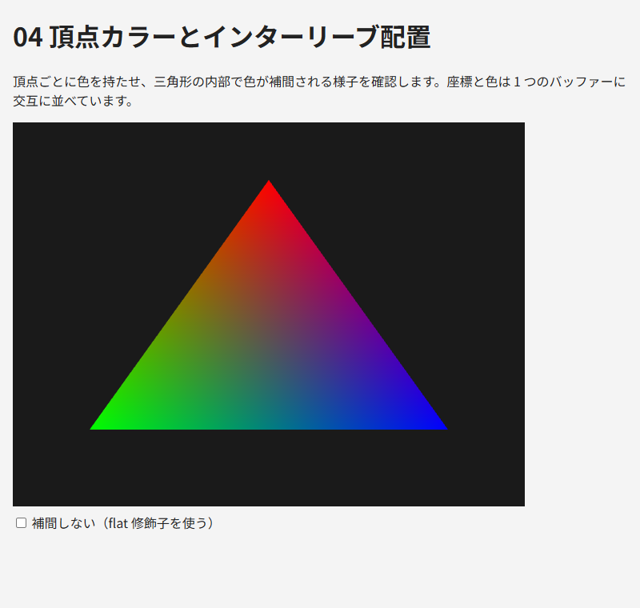
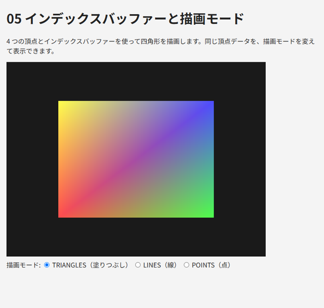

.. _chap-buffer:

バッファーと頂点データ
======================

この章では、頂点の座標や色などのデータを GPU に転送し、頂点シェーダーに渡す方法を説明します。

頂点バッファー
--------------

頂点シェーダーが受け取る頂点データは、GPU のメモリ上の\ :term:`バッファー`\ に格納します。頂点データを格納するバッファーを、頂点バッファー（VBO: Vertex Buffer Object）と呼びます。

.. code-block:: javascript
   :linenos:

   const positions = new Float32Array([
      0.0,  0.6,  // 頂点 0
     -0.6, -0.5,  // 頂点 1
      0.6, -0.5,  // 頂点 2
   ]);
   const buffer = gl.createBuffer();                             // バッファーを作る
   gl.bindBuffer(gl.ARRAY_BUFFER, buffer);                       // ARRAY_BUFFER にバインドする
   gl.bufferData(gl.ARRAY_BUFFER, positions, gl.STATIC_DRAW);    // データを転送する

WebGL の多くの関数は、操作対象のオブジェクトを引数で受け取るのではなく、あらかじめ\ :term:`バインド`\ （結び付け）されたオブジェクトを操作します。上の例では、\ ``gl.bindBuffer`` で ``buffer`` を ``gl.ARRAY_BUFFER`` という「差し込み口」にバインドし、\ ``gl.bufferData`` は ``gl.ARRAY_BUFFER`` にバインドされているバッファーにデータを転送します。

データは JavaScript の通常の配列ではなく、\ ``Float32Array`` などの型付き配列で渡します。GLSL の ``float`` は 32 ビットの浮動小数点数なので、\ ``Float32Array`` を使います。

``gl.bufferData`` の第 3 引数は、データをどのように使うかを GPU に伝えるヒントです（\ :numref:`table-buffer-usage`\ ）。ヒントに反した使い方をしてもエラーにはなりませんが、性能に影響することがあります。

.. _table-buffer-usage:

.. list-table:: バッファーの使用方法のヒント（主なもの）
   :header-rows: 1
   :widths: 30 70

   * - 値
     - 意味
   * - ``gl.STATIC_DRAW``
     - 一度設定したら、ほとんど変更しません（形状のデータなど）
   * - ``gl.DYNAMIC_DRAW``
     - 頻繁に変更します（\ ``gl.bufferSubData`` で毎フレーム更新するデータなど）
   * - ``gl.STREAM_DRAW``
     - 1 回か数回しか使いません

頂点属性の設定
--------------

バッファーに格納したデータを、頂点シェーダーのどの変数に、どのような形式で渡すかを設定します。これには ``gl.vertexAttribPointer`` を使います。

.. code-block:: javascript
   :linenos:

   gl.bindBuffer(gl.ARRAY_BUFFER, buffer);
   gl.enableVertexAttribArray(0);                         // location = 0 の頂点属性を有効にする
   gl.vertexAttribPointer(0, 2, gl.FLOAT, false, 0, 0);   // バッファーから float を 2 個ずつ読む

``gl.vertexAttribPointer`` は、\ **呼び出した時点で** ``gl.ARRAY_BUFFER`` にバインドされているバッファーを、指定した頂点属性のデータの読み出し元として記録します。引数の意味を\ :numref:`table-vertex-attrib-pointer` に示します。

.. _table-vertex-attrib-pointer:

.. list-table:: gl.vertexAttribPointer の引数
   :header-rows: 1
   :widths: 20 80

   * - 引数
     - 意味
   * - ``index``
     - 頂点属性の location。シェーダーの ``layout(location = 0)`` の番号
   * - ``size``
     - 1 頂点あたりの成分の数（1 ～ 4）。\ ``vec2`` なら 2、\ ``vec3`` なら 3
   * - ``type``
     - 1 成分のデータ型。\ ``Float32Array`` なら ``gl.FLOAT``
   * - ``normalized``
     - 整数型のデータを 0 ～ 1（符号付きなら -1 ～ 1）に正規化するか。\ ``gl.FLOAT`` では無視されます
   * - ``stride``
     - ある頂点のデータの先頭から、次の頂点のデータの先頭までのバイト数。0 の場合は、データが隙間なく並んでいるものとして自動的に計算されます
   * - ``offset``
     - バッファーの先頭から、最初のデータまでのバイト数

シェーダー側で ``layout(location = ...)`` を指定しない場合は、\ ``gl.getAttribLocation(program, "a_position")`` でリンク時に割り当てられた location を取得します。本書では、location をシェーダーとプログラムの両方で固定できる ``layout`` 修飾子を使います。

.. note::

   ``gl.enableVertexAttribArray`` を呼ばずに描画すると、その頂点属性はバッファーから読まれず、すべての頂点で同じ定数値になります。定数値は ``gl.vertexAttrib4f`` などで設定でき、既定値は (0, 0, 0, 1) です。\ :numref:`chap-advanced`\ のサンプル ``15_instancing.html`` では、この性質を比較用の描画に使っています。

頂点配列オブジェクト（VAO）
---------------------------

物体ごとに頂点属性の設定を毎回やり直すのは手間がかかり、処理も遅くなります。そこで、頂点属性の設定をまとめて保存しておく :term:`VAO`\ （Vertex Array Object、頂点配列オブジェクト）を使います。

.. code-block:: javascript
   :linenos:

   // 初期化時: VAO をバインドした状態で頂点属性を設定すると、その設定が VAO に記録される
   const vao = gl.createVertexArray();
   gl.bindVertexArray(vao);
   gl.bindBuffer(gl.ARRAY_BUFFER, buffer);
   gl.enableVertexAttribArray(0);
   gl.vertexAttribPointer(0, 2, gl.FLOAT, false, 0, 0);
   gl.bindVertexArray(null);  // 誤って変更しないようにバインドを解除する

   // 描画時: VAO をバインドするだけで、記録した設定がすべて復元される
   gl.bindVertexArray(vao);
   gl.drawArrays(gl.TRIANGLES, 0, 3);

VAO に記録されるのは、各頂点属性の有効・無効、\ ``gl.vertexAttribPointer`` で設定した内容（読み出し元のバッファーを含む）、およびインデックスバッファー（後述）のバインドです。\ ``gl.ARRAY_BUFFER`` のバインドそのものは VAO に記録されないことに注意してください。

本書では、描画する形状ごとに VAO を 1 つ作ります。

インターリーブ配置
------------------

頂点に座標と色など複数の属性を持たせる場合、データの並べ方には 2 通りあります。

* 属性ごとに別々のバッファーに格納します（例: 座標のバッファーと色のバッファー）。
* 1 つのバッファーに、頂点ごとに属性を交互に並べます（例: x, y, r, g, b, x, y, r, g, b, ...）。これを\ :term:`インターリーブ配置`\ と呼びます。

インターリーブ配置では、\ ``stride`` に 1 頂点分のバイト数を、\ ``offset`` に頂点の先頭からその属性までのバイト数を指定します。サンプル ``04_vertex_color.html`` から、該当部分を示します。

.. literalinclude:: ../examples/04_vertex_color.html
   :language: javascript
   :start-at: // 1 頂点あたり x, y, r, g, b
   :end-at: gl.bindVertexArray(null);
   :lineno-match:

インターリーブ配置は、1 つの頂点のデータがメモリ上でまとまっているため、GPU のキャッシュの効率が良くなる場合があります。一方、属性ごとに分ける方法は、一部の属性だけを更新しやすいという利点があります。どちらを使っても描画結果は同じです。

``04_vertex_color.html`` では、3 つの頂点にそれぞれ赤・緑・青を設定しています。頂点シェーダーが ``out`` で出力した色は、ラスタライズの際に三角形の内部で補間されるため、三角形の内部では色が滑らかに変化します。チェックボックスで ``flat`` 修飾子を付けたシェーダーに切り替えると補間が行われなくなり、三角形全体が最後の頂点（右下）の色で塗られます。

   04_vertex_color.html の実行結果

* `04_vertex_color.html をブラウザーで開く <examples/04_vertex_color.html>`__
* :download:`04_vertex_color.html をダウンロード <../examples/04_vertex_color.html>`

インデックスバッファー
----------------------

四角形は 2 つの三角形で描画します。三角形ごとに頂点を並べると 6 個の頂点が必要ですが、そのうち 2 個は重複しています。立方体では 12 個の三角形で 36 個の頂点が必要になり、重複はさらに増えます。

重複をなくすには、頂点データとは別に、三角形を構成する頂点の番号（インデックス）を並べた\ :term:`インデックスバッファー`\ を使います。インデックスバッファーは ``gl.ELEMENT_ARRAY_BUFFER`` にバインドし、描画には ``gl.drawArrays`` の代わりに ``gl.drawElements`` を使います。

.. literalinclude:: ../examples/05_index_buffer.html
   :language: javascript
   :start-at: // インデックス: 先頭 6 個が
   :end-before: const vao = gl.createVertexArray();
   :lineno-match:

.. literalinclude:: ../examples/05_index_buffer.html
   :language: javascript
   :start-at: // ELEMENT_ARRAY_BUFFER のバインドは
   :end-at: gl.bufferData(gl.ELEMENT_ARRAY_BUFFER
   :lineno-match:

``gl.ELEMENT_ARRAY_BUFFER`` のバインドは VAO に記録されるので、VAO をバインドした状態でインデックスバッファーをバインドします。

``gl.drawElements(mode, count, type, offset)`` の ``type`` はインデックスの型です。\ ``Uint16Array`` なら ``gl.UNSIGNED_SHORT`` を指定し、頂点の番号は 0 ～ 65535 の範囲に限られます。それより多くの頂点を使う場合は ``Uint32Array`` と ``gl.UNSIGNED_INT`` を使います。\ ``offset`` はバイト単位で指定することに注意してください。

描画モード
----------

``gl.drawArrays`` と ``gl.drawElements`` の第 1 引数で、頂点をどのように結ぶかを指定します（\ :numref:`table-draw-modes`\ ）。

.. _table-draw-modes:

.. list-table:: 描画モード
   :header-rows: 1
   :widths: 30 70

   * - モード
     - 内容
   * - ``gl.TRIANGLES``
     - 3 頂点ずつ独立した三角形を描きます
   * - ``gl.TRIANGLE_STRIP``
     - 隣り合う三角形が辺を共有する帯状の三角形を描きます
   * - ``gl.TRIANGLE_FAN``
     - 最初の頂点を共有する扇形の三角形を描きます
   * - ``gl.LINES``
     - 2 頂点ずつ独立した線分を描きます
   * - ``gl.LINE_STRIP``\ 、\ ``gl.LINE_LOOP``
     - 頂点を順に結ぶ折れ線を描きます。\ ``LINE_LOOP`` は最後の頂点と最初の頂点も結びます
   * - ``gl.POINTS``
     - 頂点ごとに点を描きます。大きさは頂点シェーダーの ``gl_PointSize`` で指定します

線の太さは ``gl.lineWidth`` で指定できることになっていますが、多くの環境では 1 ピクセルにしか対応していません。太い線を描くには、線を細長い三角形として描画します。

``05_index_buffer.html`` は、4 つの頂点を TRIANGLES、LINES、POINTS の 3 通りの描画モードで表示します。

   05_index_buffer.html の実行結果

* `05_index_buffer.html をブラウザーで開く <examples/05_index_buffer.html>`__
* :download:`05_index_buffer.html をダウンロード <../examples/05_index_buffer.html>`

頂点データを生成する
--------------------

立方体や球のように頂点の多い形状のデータを手で書くのは大変で、誤りも起きやすくなります。本書では、頂点データを JavaScript のコードとして出力する Python スクリプト ``gen_vertices.py`` を用意しています。

.. code-block:: console
   :linenos:

   > python gen_vertices.py cube                 # 1 辺 1 の立方体
   > python gen_vertices.py cube --size 2        # 1 辺 2 の立方体
   > python gen_vertices.py sphere --segments 32 --rings 16 -o sphere.js

出力は次のような形式です（一部を省略しています）。\ ``positions`` などの各配列は 1 行が立方体の 1 つの面に対応します。

.. code-block:: javascript
   :linenos:

   // python gen_vertices.py cube で生成（頂点数 24、三角形数 12）
   const CUBE = {
     positions: new Float32Array([
       0.5, -0.5, 0.5, 0.5, -0.5, -0.5, 0.5, 0.5, -0.5, 0.5, 0.5, 0.5,
       ...
     ]),
     colors: new Float32Array([ ... ]),
     normals: new Float32Array([ ... ]),
     uvs: new Float32Array([ ... ]),
     indices: new Uint16Array([
       0, 1, 2, 0, 2, 3,
       ...
     ]),
   };

立方体の頂点は 8 個ですが、出力される頂点数は 24 個です。立方体の角の頂点は 3 つの面で共有されますが、面ごとに色や法線（\ :numref:`chap-lighting`\ ）、テクスチャ座標（\ :numref:`chap-texture`\ ）が異なるため、面ごとに別の頂点として持つ必要があるからです。

三角形の頂点は、表側から見て反時計回りに並べています。この順序は\ :numref:`chap-depth`\ で説明する背面カリングで使われます。

:numref:`chap-transform`\ 以降のサンプルでは、このスクリプトで出力した立方体のデータをそのまま埋め込んでいます。球は分割数を変えて使うことが多いため、サンプルでは同じ計算を行う JavaScript の関数 ``createSphere`` で生成しています。

.. literalinclude:: ../examples/gen_vertices.py
   :language: python
   :linenos:

* :download:`gen_vertices.py をダウンロード <../examples/gen_vertices.py>`
