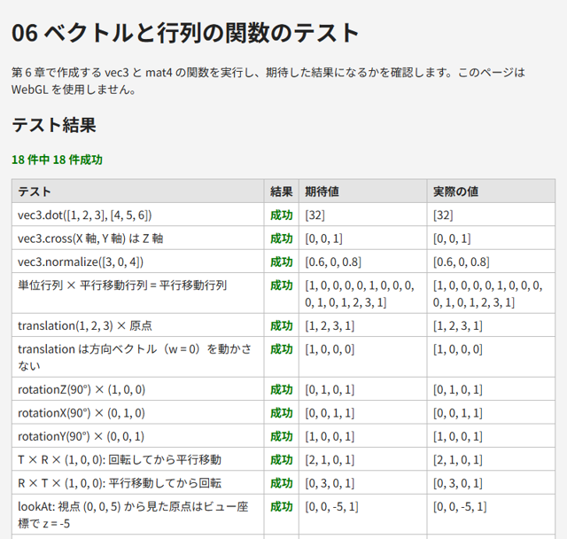

.. _chap-math:

ベクトルと行列
==============

3D グラフィックスでは、位置や向きをベクトルで、移動や回転などの変換を行列で表します。この章では、本書で必要になるベクトルと行列の基礎を説明し、それらを計算する JavaScript の関数を作ります。

ベクトル
--------

3 次元の\ :term:`ベクトル`\ は 3 つの数の組 :math:`\mathbf{a} = (a_x, a_y, a_z)` で、空間内の位置（点）や、向きと大きさ（方向）を表します。本書の JavaScript のコードでは、ベクトルを配列 ``[x, y, z]`` で表します。

和・差・スカラー倍
~~~~~~~~~~~~~~~~~~

ベクトルの和・差は成分ごとに計算し、スカラー倍（実数倍）はすべての成分に同じ数を掛けます。

.. math::

   \mathbf{a} + \mathbf{b} = (a_x + b_x,\ a_y + b_y,\ a_z + b_z), \qquad
   s\mathbf{a} = (s a_x,\ s a_y,\ s a_z)

2 点 P、Q があるとき、\ :math:`\mathbf{q} - \mathbf{p}` は P から Q へ向かうベクトルになります。

長さと正規化
~~~~~~~~~~~~

ベクトルの長さ（大きさ）は次の式で求めます。

.. math::

   |\mathbf{a}| = \sqrt{a_x^2 + a_y^2 + a_z^2}

長さが 1 のベクトルを\ :term:`単位ベクトル`\ と呼びます。ベクトルをその長さで割って単位ベクトルにすることを\ :term:`正規化`\ と呼びます。向きだけを表したい場合（光の方向や面の向きなど）は、正規化したベクトルを使います。

内積
~~~~

2 つのベクトルの\ :term:`内積`\ は、次の式で求める 1 つの数です。

.. math::

   \mathbf{a} \cdot \mathbf{b} = a_x b_x + a_y b_y + a_z b_z = |\mathbf{a}|\,|\mathbf{b}| \cos\theta

ここで :math:`\theta` は 2 つのベクトルのなす角です。\ :math:`\mathbf{a}` と :math:`\mathbf{b}` がどちらも単位ベクトルであれば、内積は :math:`\cos\theta` そのものになります。したがって、内積の値から次のことが分かります。

* 1 なら同じ向き、0 なら直交、-1 なら逆向き。
* 正なら 2 つのベクトルのなす角は 90 度未満、負なら 90 度より大きいです。

内積は\ :numref:`chap-lighting`\ のライティングで、面が光源の方向をどれだけ向いているかを求めるのに使います。

外積
~~~~

2 つのベクトルの\ :term:`外積`\ は、次の式で求めるベクトルです。

.. math::

   \mathbf{a} \times \mathbf{b} = (a_y b_z - a_z b_y,\ a_z b_x - a_x b_z,\ a_x b_y - a_y b_x)

外積 :math:`\mathbf{a} \times \mathbf{b}` は :math:`\mathbf{a}` と :math:`\mathbf{b}` の両方に直交し、その向きは右手系では「右手の親指を :math:`\mathbf{a}`\ 、人差し指を :math:`\mathbf{b}` に向けたときの中指の向き」になります。例えば、x 軸方向の単位ベクトルと y 軸方向の単位ベクトルの外積は、z 軸方向の単位ベクトルになります。順序を入れ替えると向きが逆になる（\ :math:`\mathbf{b} \times \mathbf{a} = -\mathbf{a} \times \mathbf{b}`\ ）ことに注意してください。

外積は、面に垂直なベクトル（法線）を求めたり、カメラの向きから右方向と上方向を求めたり（\ :numref:`chap-transform`\ ）するのに使います。

行列
----

:term:`行列`\ は数を長方形に並べたものです。本書で使うのは 4 行 4 列の行列です。\ :math:`i` 行 :math:`j` 列の要素を :math:`m_{ij}` と書きます。

行列とベクトルの積
~~~~~~~~~~~~~~~~~~

4 × 4 の行列 :math:`M` と 4 次元の列ベクトル :math:`\mathbf{v}` の積 :math:`M\mathbf{v}` は、次のように計算します。結果の :math:`i` 番目の成分は、\ :math:`M` の :math:`i` 行目と :math:`\mathbf{v}` の内積です。

.. math::

   \begin{pmatrix} m_{00} & m_{01} & m_{02} & m_{03} \\ m_{10} & m_{11} & m_{12} & m_{13} \\ m_{20} & m_{21} & m_{22} & m_{23} \\ m_{30} & m_{31} & m_{32} & m_{33} \end{pmatrix}
   \begin{pmatrix} x \\ y \\ z \\ w \end{pmatrix}
   =
   \begin{pmatrix} m_{00}x + m_{01}y + m_{02}z + m_{03}w \\ m_{10}x + m_{11}y + m_{12}z + m_{13}w \\ m_{20}x + m_{21}y + m_{22}z + m_{23}w \\ m_{30}x + m_{31}y + m_{32}z + m_{33}w \end{pmatrix}

ベクトルに行列を掛けることで、ベクトルを別のベクトルに変換できます。この変換を表す行列を変換行列と呼びます。

行列どうしの積
~~~~~~~~~~~~~~

2 つの行列の積 :math:`AB` の :math:`i` 行 :math:`j` 列の要素は、\ :math:`A` の :math:`i` 行目と :math:`B` の :math:`j` 列目の内積です。

.. math::

   (AB)_{ij} = \sum_{k=0}^{3} a_{ik}\, b_{kj}

行列の積には、次の重要な性質があります。

* :math:`(AB)\mathbf{v} = A(B\mathbf{v})` が成り立ちます。つまり、\ :math:`AB` は「先に :math:`B` で変換し、次に :math:`A` で変換する」変換を 1 つの行列で表したものです。\ **右側の行列から順に適用される**\ ことに注意してください。
* 一般に :math:`AB \neq BA` です。変換の順序を入れ替えると、結果が変わります。

対角成分が 1 で、それ以外が 0 の行列を\ :term:`単位行列` :math:`I` と呼びます。\ :math:`I\mathbf{v} = \mathbf{v}` であり、「何もしない」変換を表します。

同次座標
--------

3 次元の点を平行移動する（\ :math:`(x, y, z)` を :math:`(x + t_x, y + t_y, z + t_z)` に移す）変換は、3 × 3 の行列では表せません。そこで、3 次元の点に 4 番目の成分 :math:`w = 1` を加えた :math:`(x, y, z, 1)` で点を表します。これを\ :term:`同次座標`\ と呼びます。同次座標を使うと、平行移動を次のように 4 × 4 の行列で表せます。

.. math::

   \begin{pmatrix} 1 & 0 & 0 & t_x \\ 0 & 1 & 0 & t_y \\ 0 & 0 & 1 & t_z \\ 0 & 0 & 0 & 1 \end{pmatrix}
   \begin{pmatrix} x \\ y \\ z \\ 1 \end{pmatrix}
   =
   \begin{pmatrix} x + t_x \\ y + t_y \\ z + t_z \\ 1 \end{pmatrix}

一方、方向を表すベクトルは :math:`w = 0` とします。すると、上の行列を掛けても平行移動の成分が加わらず、方向は変わりません。方向（例えば光の向き）は、物体を平行移動しても変わるべきではないので、これは望ましい性質です。

回転、拡大縮小、平行移動はすべて 4 × 4 の行列で表せるので、行列の積によって 1 つの行列にまとめられます。

本書の規約
----------

ベクトルと行列の扱い方には、文献やライブラリによっていくつかの流儀があります。流儀の異なる資料のコードを混ぜると、変換の順序が逆になったり、行列が転置されたりする原因になります。本書では\ :numref:`table-math-conventions` の規約に従います。

.. _table-math-conventions:

.. list-table:: 本書の規約
   :header-rows: 1
   :widths: 30 70

   * - 項目
     - 本書の規約
   * - ベクトルの向き
     - 列ベクトル。行列は左から掛けます（\ :math:`\mathbf{v}' = M\mathbf{v}`\ ）。GLSL の ``M * v`` と同じです
   * - 行列のメモリ配置
     - 列優先（column-major）。長さ 16 の ``Float32Array`` に、1 列目の 4 要素、2 列目の 4 要素、……の順に格納します
   * - 座標系
     - 右手系。x 軸が右、y 軸が上のとき、z 軸は画面の手前を向きます。カメラは -z 方向を向きます（\ :numref:`chap-transform`\ ）
   * - 角度
     - ラジアン。軸の正の方向から原点を見て反時計回りが正の回転

行列のメモリ配置は特に重要です。\ :math:`i` 行 :math:`j` 列の要素は、配列の ``m[j * 4 + i]`` に格納されます（\ :numref:`table-column-major`\ ）。

.. _table-column-major:

.. list-table:: 列優先での要素と配列の添字の対応
   :header-rows: 1
   :stub-columns: 1
   :widths: 20 20 20 20 20

   * -
     - 0 列
     - 1 列
     - 2 列
     - 3 列
   * - 0 行
     - ``m[0]``
     - ``m[4]``
     - ``m[8]``
     - ``m[12]``
   * - 1 行
     - ``m[1]``
     - ``m[5]``
     - ``m[9]``
     - ``m[13]``
   * - 2 行
     - ``m[2]``
     - ``m[6]``
     - ``m[10]``
     - ``m[14]``
   * - 3 行
     - ``m[3]``
     - ``m[7]``
     - ``m[11]``
     - ``m[15]``

GLSL の行列も、\ ``gl.uniformMatrix4fv`` に渡す配列も列優先です。そのため、本書の行列は変換せずにそのまま ``gl.uniformMatrix4fv`` に渡せます。

``gl.uniformMatrix4fv`` の第 2 引数 ``transpose`` は、行列を転置して設定するかどうかの指定です。WebGL 1.0 では ``false`` 以外を指定できず、WebGL 2.0 では ``true`` も指定できますが、本書では常に ``false`` を指定します。

なお、列優先の配列をソースコードに書くと、見た目の 1 行が行列の 1 列に当たります。例えば平行移動行列の :math:`t_x, t_y, t_z` は、ソースコードでは最後の行に並びます（後述の ``mat4.translation`` を参照）。

ベクトルと行列の関数
--------------------

以上をもとに、ベクトルと行列を計算する関数を作ります。ベクトルの関数は ``vec3``\ 、行列の関数は ``mat4`` というオブジェクトにまとめます。どの関数も引数を変更せず、新しい配列を返します。

.. list-table:: 作成する関数
   :header-rows: 1
   :widths: 40 60

   * - 関数
     - 内容
   * - ``vec3.add``\ 、\ ``subtract``\ 、\ ``scale``
     - 和、差、スカラー倍
   * - ``vec3.dot``\ 、\ ``cross``
     - 内積、外積
   * - ``vec3.length``\ 、\ ``normalize``
     - 長さ、正規化
   * - ``mat4.identity``
     - 単位行列
   * - ``mat4.multiply(a, b)``
     - 行列の積 :math:`AB`
   * - ``mat4.translation``\ 、\ ``scaling``
     - 平行移動行列、拡大縮小行列（\ :numref:`chap-transform`\ ）
   * - ``mat4.rotationX``\ 、\ ``rotationY``\ 、\ ``rotationZ``
     - 各軸まわりの回転行列（\ :numref:`chap-transform`\ ）
   * - ``mat4.lookAt``
     - ビュー行列（\ :numref:`chap-transform`\ ）
   * - ``mat4.perspective``\ 、\ ``ortho``
     - 透視投影行列、正射影行列（\ :numref:`chap-transform`\ ）
   * - ``mat4.normalMatrix``
     - 法線行列（\ :numref:`chap-lighting`\ ）
   * - ``mat4.transformVec4``
     - 4 次元ベクトルに行列を掛けます（主にテスト用）

各関数の意味は、それぞれの章で説明します。ここでは、関数の一覧と実装を示します。

.. literalinclude:: ../examples/06_matrix_test.html
   :language: javascript
   :start-after: // ---- ベクトルと行列 ----
   :end-before: // ---- テスト ----
   :lineno-match:

``mat4.multiply`` は、行列の積の定義どおりに 3 重のループで計算しています。添字の計算 ``a[k * 4 + row]``\ （\ :math:`a_{\mathrm{row},k}`\ ）と ``b[col * 4 + k]``\ （\ :math:`b_{k,\mathrm{col}}`\ ）は、列優先の配置に従っています。

以降の章のサンプルには、この中から使う関数だけを抜き出して含めています。

サンプル
--------

``06_matrix_test.html`` は、作成した関数を実行し、結果が期待した値と一致するかを表で示します。WebGL は使いません。例えば「T × R × (1, 0, 0)」と「R × T × (1, 0, 0)」のテストでは、同じ平行移動 T と回転 R でも、掛ける順序によって結果が異なることを確認できます。また、平行移動行列の各要素が配列のどの添字に格納されるかも表示します。

   06_matrix_test.html の実行結果

* `06_matrix_test.html をブラウザーで開く <examples/06_matrix_test.html>`__
* :download:`06_matrix_test.html をダウンロード <../examples/06_matrix_test.html>`
