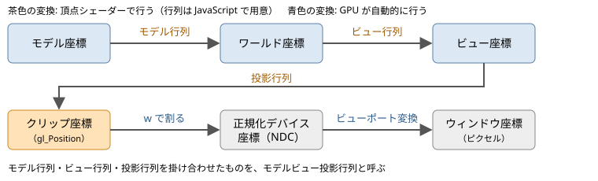
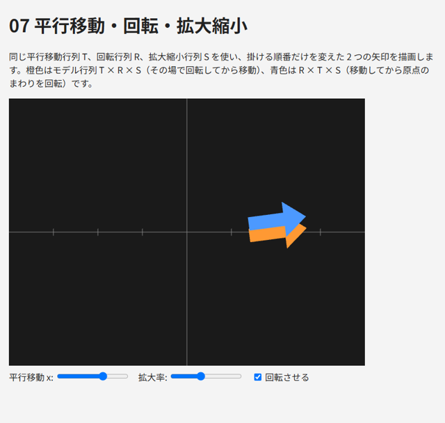
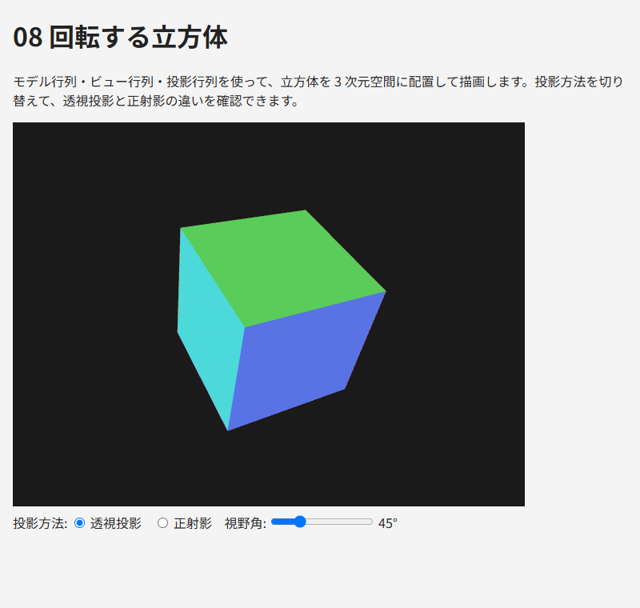

.. _chap-transform:

座標変換
========

この章では、3 次元空間に置いた物体を、カメラから見た 2 次元の画面に描画するための座標変換を説明します。

座標系の流れ
------------

頂点の座標は、\ :numref:`fig-coordinate-spaces` のように、いくつかの座標系を順に経由して画面上のピクセルの位置になります。

.. _fig-coordinate-spaces:

   座標系の流れ

各座標系の意味を\ :numref:`table-coordinate-spaces` に示します。

.. _table-coordinate-spaces:

.. list-table:: 座標系の種類
   :header-rows: 1
   :widths: 25 75

   * - 座標系
     - 意味
   * - モデル座標
     - 物体ごとの座標系。物体の中心などを原点とします。頂点データはこの座標系で記述します
   * - ワールド座標
     - シーン全体で共通の座標系。物体の配置はこの座標系で考えます
   * - ビュー座標
     - カメラ（視点）を原点とし、カメラが -z 方向を向く座標系
   * - クリップ座標
     - 頂点シェーダーが ``gl_Position`` に出力する座標。表示範囲の外にある部分は、この座標系で切り取られます（クリッピング）
   * - 正規化デバイス座標（NDC）
     - クリップ座標を w 成分で割ったもの。x、y、z のいずれも -1 ～ 1 の範囲が表示されます
   * - ウィンドウ座標
     - canvas 上のピクセルの位置。左下が原点

モデル座標からワールド座標への変換を\ :term:`モデル行列`\ 、ワールド座標からビュー座標への変換を\ :term:`ビュー行列`\ 、ビュー座標からクリップ座標への変換を\ :term:`投影行列`\ で行います。頂点シェーダーでは、これら 3 つを掛け合わせた行列（モデルビュー投影行列）を頂点の座標に掛けます。

.. math::

   \mathbf{v}_{\mathrm{clip}} = P \, V \, M \, \mathbf{v}_{\mathrm{model}}

右側の行列から順に適用されるので、モデル行列 :math:`M`\ 、ビュー行列 :math:`V`\ 、投影行列 :math:`P` の順に変換が行われます。

モデル変換
----------

モデル行列は、拡大縮小、回転、平行移動を組み合わせて作ります。

拡大縮小
~~~~~~~~

x、y、z 方向にそれぞれ :math:`s_x`\ 、\ :math:`s_y`\ 、\ :math:`s_z` 倍する行列は次のとおりです。

.. math::

   S = \begin{pmatrix} s_x & 0 & 0 & 0 \\ 0 & s_y & 0 & 0 \\ 0 & 0 & s_z & 0 \\ 0 & 0 & 0 & 1 \end{pmatrix}

:math:`s_x = s_y = s_z` の場合を一様スケール、そうでない場合を非一様スケールと呼びます。非一様スケールは法線の扱いに注意が必要です（\ :numref:`chap-lighting`\ ）。

回転
~~~~

x 軸、y 軸、z 軸のまわりに角度 :math:`\theta` だけ回転する行列は次のとおりです。

.. math::

   R_x = \begin{pmatrix} 1 & 0 & 0 & 0 \\ 0 & \cos\theta & -\sin\theta & 0 \\ 0 & \sin\theta & \cos\theta & 0 \\ 0 & 0 & 0 & 1 \end{pmatrix}

   R_y = \begin{pmatrix} \cos\theta & 0 & \sin\theta & 0 \\ 0 & 1 & 0 & 0 \\ -\sin\theta & 0 & \cos\theta & 0 \\ 0 & 0 & 0 & 1 \end{pmatrix}

   R_z = \begin{pmatrix} \cos\theta & -\sin\theta & 0 & 0 \\ \sin\theta & \cos\theta & 0 & 0 \\ 0 & 0 & 1 & 0 \\ 0 & 0 & 0 & 1 \end{pmatrix}

いずれも、回転軸の正の方向から原点を見て反時計回りが正の回転です。例えば :math:`R_z` で 90 度回転すると、x 軸上の点 (1, 0, 0) は y 軸上の点 (0, 1, 0) に移ります。

平行移動
~~~~~~~~

平行移動の行列 :math:`T` は\ :numref:`chap-math`\ で示したとおりです。

変換の順序
~~~~~~~~~~

物体をその場で回転させてから、所定の位置に移動するには、モデル行列を次のように作ります。

.. math::

   M = T \, R \, S

右から順に、拡大縮小 → 回転 → 平行移動 の順に適用されます。順序を変えて :math:`M = R \, T \, S` とすると、先に平行移動してから回転するので、物体は原点のまわりを公転します。回転と拡大縮小は原点を中心に行われるため、平行移動より先に適用するのが一般的です。

サンプル ``07_transform.html`` では、同じ :math:`T`\ 、\ :math:`R`\ 、\ :math:`S` を使い、掛ける順序だけが異なる 2 つの矢印を描画しています。投影には後述の正射影を使い、2 次元の図として表示しています。

.. literalinclude:: ../examples/07_transform.html
   :language: javascript
   :start-at: // 橙色: T × R × S
   :end-at: gl.drawArrays(gl.TRIANGLES, 0, arrow.count);
   :lineno-match:

   07_transform.html の実行結果

* `07_transform.html をブラウザーで開く <examples/07_transform.html>`__
* :download:`07_transform.html をダウンロード <../examples/07_transform.html>`

ビュー変換
----------

ビュー変換は、ワールド座標をカメラから見た座標に変換します。ビュー座標系では、カメラが原点にあり、-z 方向を向き、y 軸がカメラの上方向になります。

カメラの位置（視点）\ :math:`\mathbf{e}`\ 、カメラが見る点（注視点）\ :math:`\mathbf{t}`\ 、カメラの上方向の目安 :math:`\mathbf{u}`\ （通常は (0, 1, 0)）からビュー行列を作る関数を ``lookAt`` と呼びます。手順は次のとおりです。

1. カメラの後ろ向きの単位ベクトル :math:`\mathbf{z} = \mathrm{normalize}(\mathbf{e} - \mathbf{t})` を求めます（カメラは -z 方向を向くので、注視点と逆向き）。
2. カメラの右向きの単位ベクトル :math:`\mathbf{x} = \mathrm{normalize}(\mathbf{u} \times \mathbf{z})` を求めます。
3. カメラの上向きの単位ベクトル :math:`\mathbf{y} = \mathbf{z} \times \mathbf{x}` を求めます（\ :math:`\mathbf{z}` と :math:`\mathbf{x}` は直交する単位ベクトルなので、正規化は不要）。

カメラの座標系の 3 つの軸 :math:`\mathbf{x}`\ 、\ :math:`\mathbf{y}`\ 、\ :math:`\mathbf{z}` が求まれば、ビュー行列は次のようになります。これは「カメラの位置を原点に移す平行移動」の後に「カメラの軸をワールドの軸に重ねる回転」を行う行列です。

.. math::

   V = \begin{pmatrix} x_x & x_y & x_z & -\mathbf{x}\cdot\mathbf{e} \\ y_x & y_y & y_z & -\mathbf{y}\cdot\mathbf{e} \\ z_x & z_y & z_z & -\mathbf{z}\cdot\mathbf{e} \\ 0 & 0 & 0 & 1 \end{pmatrix}

カメラが真上や真下を向く（\ :math:`\mathbf{e} - \mathbf{t}` と :math:`\mathbf{u}` が平行になる）と、外積が 0 になって :math:`\mathbf{x}` が求まりません。カメラを操作する場合は、このような向きにならないように制限します（\ :numref:`chap-interaction`\ ）。

投影変換
--------

投影変換は、ビュー座標系で表示する範囲を決め、その範囲をクリップ座標に変換します。投影の方法には透視投影と正射影の 2 種類があります。

透視投影
~~~~~~~~

:term:`透視投影`\ は、遠くの物ほど小さく見える、人間の目やカメラと同じ見え方の投影です。表示範囲は、カメラを頂点とする四角錐の先端を切り取った形（視錐台）になります。透視投影の行列は、縦方向の視野角 :math:`\theta`\ 、表示領域の縦横比 :math:`a`\ （幅 / 高さ）、カメラから表示範囲の手前の面までの距離 :math:`n`\ （near）と奥の面までの距離 :math:`f`\ （far）で決まります。

.. math::

   P = \begin{pmatrix} \dfrac{c}{a} & 0 & 0 & 0 \\ 0 & c & 0 & 0 \\ 0 & 0 & \dfrac{f + n}{n - f} & \dfrac{2fn}{n - f} \\ 0 & 0 & -1 & 0 \end{pmatrix}, \qquad c = \frac{1}{\tan(\theta / 2)}

この行列を掛けると、クリップ座標の w 成分は :math:`-z`\ （ビュー座標でのカメラからの距離）になります。GPU はクリップ座標を w で割って正規化デバイス座標を求めるので（\ :term:`透視除算`\ ）、カメラから遠い点ほど小さく縮められ、遠近感が生まれます。また、\ :math:`z = -n` の点は NDC の z が -1 に、\ :math:`z = -f` の点は +1 になります。

near を小さくしすぎると、深度の精度が不足して、奥にある面どうしの前後関係が正しく判定できなくなります（\ :numref:`chap-depth`\ ）。near は、表示に支障がない範囲でなるべく大きくします。

正射影
~~~~~~

:term:`正射影`\ は、距離によって大きさが変わらない投影です。設計図や 2D の表示に使います。表示範囲は直方体で、左右 :math:`l, r`\ 、上下 :math:`b, t`\ 、手前と奥の距離 :math:`n, f` で指定します。

.. math::

   P = \begin{pmatrix} \dfrac{2}{r - l} & 0 & 0 & -\dfrac{r + l}{r - l} \\ 0 & \dfrac{2}{t - b} & 0 & -\dfrac{t + b}{t - b} \\ 0 & 0 & -\dfrac{2}{f - n} & -\dfrac{f + n}{f - n} \\ 0 & 0 & 0 & 1 \end{pmatrix}

正射影では w 成分が 1 のままなので、透視除算をしても座標は変わりません。

正規化デバイス座標の向き
~~~~~~~~~~~~~~~~~~~~~~~~

投影行列は、z 軸の向きを反転させています。ビュー座標では、カメラは -z 方向を向いているので、奥にある点ほど z が小さくなります。一方、正規化デバイス座標では、奥にある点ほど z が大きくなります（\ :math:`z = -n` が -1、\ :math:`z = -f` が +1）。つまり、ワールド座標とビュー座標は右手系ですが、正規化デバイス座標は左手系です。深度テストでは、この NDC の z をもとに前後関係を判定します。

ビューポート変換
----------------

最後に、正規化デバイス座標の x、y（-1 ～ 1）を、canvas のピクセルの位置に変換します。これを\ :term:`ビューポート`\ 変換と呼び、変換先の範囲は ``gl.viewport`` で指定します。

.. code-block:: javascript
   :linenos:

   gl.viewport(0, 0, canvas.width, canvas.height);  // 左下の x, y、幅、高さ（ピクセル）

通常は canvas の描画バッファー全体を指定します。canvas の大きさを変えたときは、\ ``gl.viewport`` も設定し直す必要があります。

なお、投影行列の縦横比 :math:`a` は、ビューポートの縦横比と一致させます。一致していないと、表示が縦または横に引き伸ばされます。

立方体を描画する
----------------

以上の変換を使って、回転する立方体を描画します。サンプル ``08_rotating_cube.html`` の描画処理を次に示します。立方体の頂点データは ``gen_vertices.py`` で生成したもので、面ごとに異なる色が付いています。

.. literalinclude:: ../examples/08_rotating_cube.html
   :language: javascript
   :start-at: // ビュー行列: (0, 1.5, 3) の位置から原点を見る
   :end-before: requestAnimationFrame(render);
   :lineno-match:

頂点シェーダーでは、JavaScript で計算したモデルビュー投影行列を頂点の座標に掛けます。

.. literalinclude:: ../examples/08_rotating_cube.html
   :language: javascript
   :start-at: const VERTEX_SHADER_SOURCE = `
   :end-at: `;
   :lineno-match:

行列の積は頂点ごとに変わらないので、JavaScript で 1 回だけ計算して uniform 変数で渡すほうが効率的です。

このサンプルでは、奥にある面が手前の面を上書きしないように、深度テストを有効にしています。深度テストについては次の章で説明します。画面下のラジオボタンで透視投影と正射影を、スライダーで透視投影の視野角を切り替えられます。

   08_rotating_cube.html の実行結果

* `08_rotating_cube.html をブラウザーで開く <examples/08_rotating_cube.html>`__
* :download:`08_rotating_cube.html をダウンロード <../examples/08_rotating_cube.html>`
