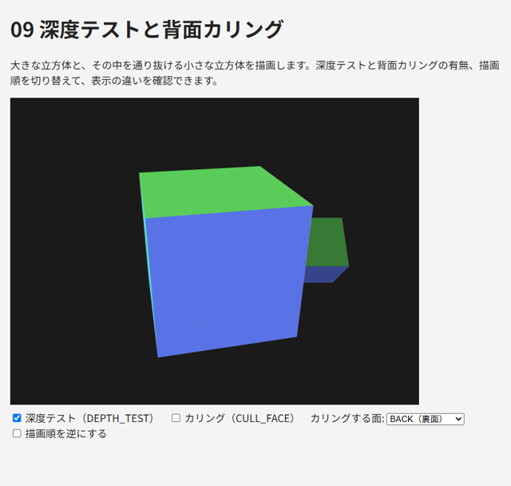

.. _chap-depth:

深度とカリング
==============

この章では、3 次元の物体を正しい前後関係で描画するための深度テストと、見えない面の描画を省く背面カリングを説明します。

描画順の問題
------------

WebGL は、描画関数が呼ばれた順に三角形をフレームバッファーに書き込みます。何も設定しなければ、後から描いた三角形が、先に描いた三角形を上書きします。そのため、立方体の奥の面を手前の面より後に描くと、奥の面が手前に表示されてしまいます。

物体を奥から順に並べ替えて描く方法（画家のアルゴリズム）もありますが、物体どうしが交差している場合や、1 つの物体の中で面が重なっている場合には正しく描けません。また、並べ替えの処理も必要になります。

深度バッファーと深度テスト
--------------------------

この問題を解決するのが\ :term:`深度バッファー`\ （Z バッファー）です。深度バッファーは、フレームバッファーのピクセルごとに、そこに描かれている物の奥行き（深度）を記録します。

:term:`深度テスト`\ を有効にすると、GPU はフラグメントを書き込む前に、そのフラグメントの深度と深度バッファーに記録された深度を比較します。比較に合格した（既定では、記録されている深度より手前にある）場合だけ色を書き込み、深度バッファーも更新します。これにより、描画の順序にかかわらず、各ピクセルには最も手前にある物の色が残ります。

.. code-block:: javascript
   :linenos:

   gl.enable(gl.DEPTH_TEST);  // 深度テストを有効にする（初期化時に 1 回）

   // 毎フレームの描画の最初に、カラーバッファーと深度バッファーをクリアする
   gl.clearDepth(1.0);  // 深度のクリア値（既定値は 1.0 = 最も奥）
   gl.clear(gl.COLOR_BUFFER_BIT | gl.DEPTH_BUFFER_BIT);

深度の値は、正規化デバイス座標の z（-1 ～ 1）を 0 ～ 1 の範囲に変換したものです。深度バッファーをクリアし忘れると、前のフレームの深度が残っているため、新しいフレームの物体が描画されなくなります。

深度テストに関する主な関数を\ :numref:`table-depth-functions` に示します。

.. _table-depth-functions:

.. list-table:: 深度テストに関する主な関数
   :header-rows: 1
   :widths: 35 65

   * - 関数
     - 内容
   * - ``gl.enable(gl.DEPTH_TEST)``
     - 深度テストを有効にします（既定では無効）
   * - ``gl.depthFunc(func)``
     - 比較の方法。既定値は ``gl.LESS``\ （記録されている値より小さければ合格）。他に ``gl.LEQUAL``\ 、\ ``gl.GREATER``\ 、\ ``gl.ALWAYS`` などがあります
   * - ``gl.depthMask(flag)``
     - ``false`` にすると、深度テストは行うが深度バッファーへの書き込みは行いません（\ :numref:`chap-advanced`\ の半透明の描画で使う）
   * - ``gl.clearDepth(depth)``
     - ``gl.clear`` で深度バッファーをクリアするときの値

なお、深度バッファーがあるのは、コンテキスト属性 ``depth`` が ``true``\ （既定値）の場合です。

深度の精度
~~~~~~~~~~

深度バッファーの値は 24 ビット程度の精度しかありません。さらに、透視投影では深度の値が距離に比例せず、手前ほど細かく、奥ほど粗くなります。そのため、奥にある 2 つの面がほぼ同じ深度にあると、ピクセルごとに前後の判定が入れ替わり、縞模様のようにちらつくことがあります。これを :term:`Z ファイティング`\ と呼びます。

Z ファイティングを防ぐには、次のような方法があります。

* 投影行列の near をなるべく大きく、far をなるべく小さくします（特に near の影響が大きいです）。
* 同じ位置に面を重ねて配置しません。

背面カリング
------------

立方体のような閉じた物体では、カメラから見て裏を向いている面（背面）は、手前の面に隠れて必ず見えません。背面を描画しないようにすれば、深度テストの結果は変わらずに、描画する三角形の数をおよそ半分に減らせます。これを\ :term:`背面カリング`\ と呼びます。

三角形の表と裏は、画面上での頂点の並び順で判定します。既定では、画面上で反時計回り（CCW: counter-clockwise）に並んだ三角形が表です。\ :numref:`chap-buffer`\ の ``gen_vertices.py`` が三角形の頂点を表側から見て反時計回りに並べているのはこのためです。

.. code-block:: javascript
   :linenos:

   gl.enable(gl.CULL_FACE);  // カリングを有効にする（既定では無効）
   gl.cullFace(gl.BACK);     // 裏面を描画しない（既定値）
   gl.frontFace(gl.CCW);     // 反時計回りを表とする（既定値）

``gl.cullFace`` に ``gl.FRONT`` を指定すると、表面を描画せずに裏面だけを描画します。立方体の内側から見たような表示になります。

背面カリングは、閉じていない形状（1 枚の板など）や、裏側も見せたい形状には使えません。そのような物体を描くときは、\ ``gl.disable(gl.CULL_FACE)`` でカリングを無効にします。

サンプル
--------

``09_depth_test.html`` は、大きな立方体と、その中を通り抜ける小さな立方体を描画します。チェックボックスで深度テスト、カリング、描画順を切り替えて、次の違いを確認してください。

* 深度テストを無効にすると、後から描いた面が手前に表示され、立方体が正しく描画されません。描画順を逆にすると表示が変わります。
* 深度テストを無効にしたまま背面カリングを有効にすると、1 つの立方体の中では正しく表示されるが、2 つの立方体の前後関係は描画順で決まります。
* 深度テストを有効にすると、描画順にかかわらず正しく表示されます。
* カリングする面を FRONT にすると、立方体の内側の面だけが表示されます。

   09_depth_test.html の実行結果

* `09_depth_test.html をブラウザーで開く <examples/09_depth_test.html>`__
* :download:`09_depth_test.html をダウンロード <../examples/09_depth_test.html>`

描画処理を次に示します。

.. literalinclude:: ../examples/09_depth_test.html
   :language: javascript
   :start-at: // チェックボックスの状態に合わせて
   :end-before: requestAnimationFrame(render);
   :lineno-match:
