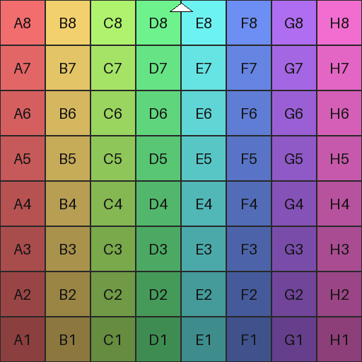
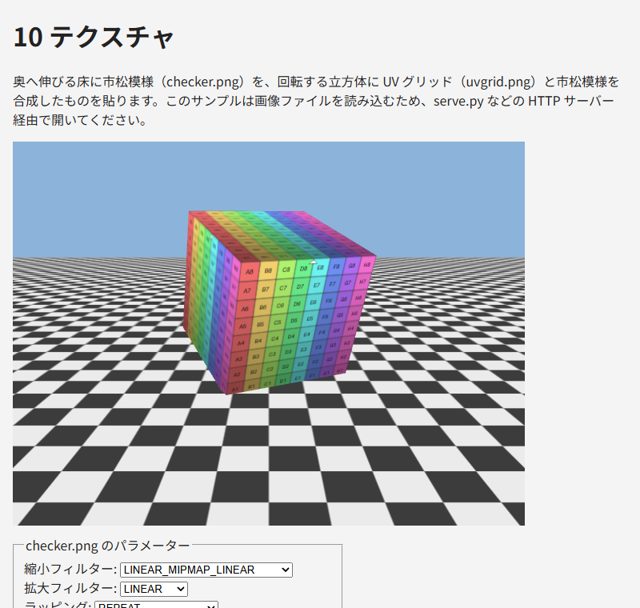

.. _chap-texture:

テクスチャ
==========

この章では、物体の表面に画像を貼り付ける\ :term:`テクスチャ`\ の使い方を説明します。

テクスチャ座標
--------------

テクスチャを貼るには、各頂点に「画像のどの位置を対応させるか」を指定します。これを\ :term:`テクスチャ座標`\ （UV 座標）と呼びます。テクスチャ座標は画像の大きさによらず、横方向 u と縦方向 v のどちらも 0 ～ 1 の範囲で表します。WebGL では、\ **左下**\ が (0, 0)、右上が (1, 1) です。

テクスチャ座標は頂点属性として頂点シェーダーに渡し、\ ``out`` でフラグメントシェーダーに渡します。ラスタライズで補間されたテクスチャ座標を使い、フラグメントシェーダーの ``texture`` 関数でテクスチャから色を読み出します。

.. code-block:: glsl
   :linenos:

   // フラグメントシェーダー
   uniform sampler2D u_texture;  // テクスチャを参照するサンプラー
   in vec2 v_uv;                 // 補間されたテクスチャ座標
   out vec4 outColor;

   void main() {
     outColor = texture(u_texture, v_uv);
   }

テクスチャ上の 1 つのピクセルを\ :term:`テクセル`\ と呼び、画面上のピクセルと区別します。

画像を読み込む
--------------

テクスチャに使う画像は、HTML の ``Image`` オブジェクトで読み込みます。画像の読み込みは非同期に行われるので、読み込みが完了してから WebGL に転送します。本書のサンプルでは、読み込みを ``Promise`` で包んだ関数を使い、\ ``await`` で完了を待ちます。

.. code-block:: javascript
   :linenos:

   function loadImage(url) {
     return new Promise((resolve, reject) => {
       const image = new Image();
       image.onload = () => resolve(image);
       image.onerror = () => reject(new Error(`画像 ${url} を読み込めませんでした。`));
       image.src = url;
     });
   }

   const image = await loadImage("assets/checker.png");

画像のオリジンと CORS
~~~~~~~~~~~~~~~~~~~~~

WebGL に転送できる画像には、セキュリティー上の制限があります。WebGL は ``gl.readPixels`` などで描画結果を読み出せるため、他のサイトの画像を自由に使えると、本来は読めないはずの画像の内容を盗み出せてしまいます。そのため、ページと異なる\ :term:`オリジン`\ （スキーム、ホスト、ポートの組）から読み込んだ画像は、原則として WebGL に転送できず、\ ``gl.texImage2D`` が ``SecurityError`` の例外を発生させます。

異なるオリジンの画像を使うには、画像を配信するサーバーが :term:`CORS`\ （Cross-Origin Resource Sharing）に対応しており、かつ読み込む前に ``image.crossOrigin = "anonymous"`` を設定する必要があります。

また、\ ``file://`` で開いたページでは、同じフォルダーにある画像も異なるオリジンとして扱われます。テクスチャを使うサンプルを手元で動かす場合は、\ :numref:`chap-setup`\ で説明したローカルサーバー経由で開いてください。

テクスチャを作る
----------------

読み込んだ画像からテクスチャを作る手順は次のとおりです。

.. literalinclude:: ../examples/10_texture.html
   :language: javascript
   :start-at: // 画像からテクスチャを作り、ミップマップを生成する
   :end-before: // ---- ベクトルと行列
   :lineno-match:

``gl.createTexture`` でテクスチャオブジェクトを作り、\ ``gl.bindTexture`` で ``gl.TEXTURE_2D`` にバインドします。バッファーと同様に、以降のテクスチャの操作はバインドされているテクスチャに対して行われます。

``gl.texImage2D`` は画像のデータを GPU に転送します。引数は順に、ターゲット、ミップマップのレベル（元の画像は 0）、GPU 上での形式、元データの形式、元データの型、元データです。

上下の反転
~~~~~~~~~~

画像のデータは上の行から順に並んでいますが、WebGL のテクスチャ座標は v = 0 が下端です。そのまま転送すると、画像の上端が v = 0 に対応し、上下が逆に表示されます。\ ``gl.pixelStorei(gl.UNPACK_FLIP_Y_WEBGL, true)`` を設定してから転送すると、画像の上下を反転して転送するので、画像の下端が v = 0 に対応します。

``gl.pixelStorei`` の設定はステートとして残り、以降のすべての転送に影響します。上の関数では、転送が終わったら ``false`` に戻しています。

.. note::

   上下を反転する代わりに、頂点データのテクスチャ座標の v を ``1 - v`` にする方法もあります。どちらの方法を使うかをプロジェクト内で統一することが大切です。

テクスチャユニットとサンプラー
------------------------------

シェーダーからテクスチャを参照するには、\ :term:`テクスチャユニット`\ という仕組みを使います。テクスチャユニットは、テクスチャを差し込む番号付きの差し込み口で、WebGL 2.0 では少なくとも 16 個（フラグメントシェーダーから）使えます。

1. ``gl.activeTexture(gl.TEXTURE0 + n)`` で、操作するテクスチャユニットを選びます。
2. ``gl.bindTexture`` で、選んだテクスチャユニットにテクスチャをバインドします。
3. シェーダーの ``sampler2D`` 型の uniform 変数に、テクスチャユニットの番号 ``n`` を ``gl.uniform1i`` で設定します。

.. code-block:: javascript
   :linenos:

   // テクスチャユニット 0 に texture をバインドし、u_texture がユニット 0 を参照するようにする
   gl.activeTexture(gl.TEXTURE0);
   gl.bindTexture(gl.TEXTURE_2D, texture);
   gl.useProgram(program);
   gl.uniform1i(textureLocation, 0);

サンプラーに設定するのはテクスチャオブジェクトではなく、テクスチャユニットの番号であることに注意してください。サンプラーの値は通常変更しないので初期化時に設定し、描画のたびにテクスチャユニットへバインドするテクスチャを切り替えます。\ ``gl.activeTexture`` は ``gl.bindTexture`` の対象となるユニットを変えるので、複数のユニットを使う場合は、どのユニットが選ばれているかに注意します。

フィルタリング
--------------

テクスチャを貼った面が画面上で拡大・縮小されると、画面のピクセルとテクセルが 1 対 1 に対応しなくなります。このとき、どのテクセルからどのように色を求めるかを\ :term:`フィルタリング`\ と呼び、拡大時と縮小時のそれぞれで指定します（\ :numref:`table-texture-filters`\ ）。

.. _table-texture-filters:

.. list-table:: 主なフィルターの設定
   :header-rows: 1
   :widths: 40 60

   * - 値
     - 内容
   * - ``gl.NEAREST``
     - 最も近い 1 つのテクセルの色を使います。拡大するとドットが目立ちます
   * - ``gl.LINEAR``
     - 周囲の 4 つのテクセルの色を、距離に応じて混ぜます（バイリニア補間）。拡大しても滑らかです
   * - ``gl.NEAREST_MIPMAP_NEAREST``
     - （縮小時のみ）最も近い大きさのミップマップを選び、そこから ``NEAREST`` で色を求めます
   * - ``gl.LINEAR_MIPMAP_LINEAR``
     - （縮小時のみ）近い大きさの 2 つのミップマップからそれぞれ ``LINEAR`` で色を求め、さらに混ぜます（トライリニア補間）

フィルターは ``gl.texParameteri`` で設定します。

.. code-block:: javascript
   :linenos:

   gl.texParameteri(gl.TEXTURE_2D, gl.TEXTURE_MAG_FILTER, gl.LINEAR);               // 拡大時
   gl.texParameteri(gl.TEXTURE_2D, gl.TEXTURE_MIN_FILTER, gl.LINEAR_MIPMAP_LINEAR); // 縮小時

ミップマップ
~~~~~~~~~~~~

遠くにある面のようにテクスチャが大きく縮小される場合、\ ``NEAREST`` や ``LINEAR`` では 1 つのピクセルに多数のテクセルが対応するのに、そのうちの数個しか参照しません。そのため、模様がちらついたり、本来ない縞模様（モアレ）が現れたりします。

これを防ぐのが\ :term:`ミップマップ`\ です。ミップマップは、元の画像を縦横 1/2、1/4、1/8、……と順に縮小した画像の組です。縮小時のフィルターに ``*_MIPMAP_*`` を指定すると、GPU は表示される大きさに近いミップマップから色を求めます。ミップマップは、画像を転送した後に ``gl.generateMipmap(gl.TEXTURE_2D)`` を呼ぶと自動的に生成されます。

縮小時のフィルターの既定値は ``gl.NEAREST_MIPMAP_LINEAR`` です。ミップマップを生成せずにこの既定値のまま使うと、テクスチャは不完全なものとして扱われ、黒く表示されます。ミップマップを使わない場合は、縮小時のフィルターを ``gl.LINEAR`` などに設定してください。

ラッピング
----------

テクスチャ座標が 0 ～ 1 の範囲の外にあるときにどの色を使うかを、\ :term:`ラッピング`\ と呼びます。u 方向（\ ``gl.TEXTURE_WRAP_S``\ ）と v 方向（\ ``gl.TEXTURE_WRAP_T``\ ）を別々に指定できます（\ :numref:`table-texture-wrap`\ ）。

.. _table-texture-wrap:

.. list-table:: ラッピングの設定
   :header-rows: 1
   :widths: 35 65

   * - 値
     - 内容
   * - ``gl.REPEAT``
     - 画像を繰り返します（既定値）。床や壁に模様を敷き詰める場合に使います
   * - ``gl.MIRRORED_REPEAT``
     - 画像を 1 回ごとに反転しながら繰り返します
   * - ``gl.CLAMP_TO_EDGE``
     - 範囲外では端のテクセルの色を使います

WebGL 1.0 では、縦横の大きさが 2 のべき乗（256、512 など）でない画像には、ミップマップと ``REPEAT`` が使えないという制限がありました。WebGL 2.0 ではこの制限はなく、どのような大きさの画像でも同じように扱えます。ただし、2 のべき乗の大きさのほうが効率の良い GPU もあるため、可能であれば 2 のべき乗にしておくと安心です。

複数のテクスチャ
----------------

1 つのシェーダーで複数のテクスチャを使うには、テクスチャごとに別のテクスチャユニットを使い、それぞれのサンプラーに別の番号を設定します。サンプル ``10_texture.html`` では、立方体を描くときにユニット 0 に ``uvgrid.png``\ 、ユニット 1 に ``checker.png`` をバインドし、フラグメントシェーダーの ``mix`` 関数で 2 つの色を混ぜています。

.. literalinclude:: ../examples/10_texture.html
   :language: javascript
   :start-at: const FRAGMENT_SHADER_SOURCE = `
   :end-at: `;
   :lineno-match:

.. literalinclude:: ../examples/10_texture.html
   :language: javascript
   :start-at: // 立方体: ユニット 0 に uvgrid.png、ユニット 1 に checker.png
   :end-before: const model =
   :lineno-match:

テクスチャ画像を生成する
------------------------

本書のサンプルで使うテクスチャ画像は、Python のスクリプト ``gen_texture.py`` で生成しています。画像の生成には Pillow（PIL）を使います。

.. code-block:: console
   :linenos:

   > python gen_texture.py
   ...\examples\assets\checker.png を出力しました。
   ...\examples\assets\uvgrid.png を出力しました。

生成される画像を\ :numref:`table-texture-images` に示します。

.. _table-texture-images:

.. list-table:: サンプルで使うテクスチャ画像
   :header-rows: 1
   :widths: 25 75

   * - ファイル
     - 内容
   * - ``checker.png``
     - 256 × 256 ピクセル、8 × 8 マスの市松模様。フィルタリングやラッピングの違いを確認しやすいです
   * - ``uvgrid.png``
     - 512 × 512 ピクセルの格子。各マスに列（A ～ H）と行（1 ～ 8）のラベルを描いています。左下のマスが A1、右上のマスが H8 なので、テクスチャ座標の向きや上下の反転を確認できます

   uvgrid.png

.. literalinclude:: ../examples/gen_texture.py
   :language: python
   :linenos:

* :download:`gen_texture.py をダウンロード <../examples/gen_texture.py>`

サンプル
--------

``10_texture.html`` は、奥へ伸びる床に ``checker.png`` を、回転する立方体に ``uvgrid.png`` と ``checker.png`` を合成したものを貼ります。画面下のコントロールで、次の違いを確認してください。

* 縮小フィルターを ``NEAREST`` や ``LINEAR`` にすると、床の奥のほうで模様がちらつき、モアレが現れます。\ ``LINEAR_MIPMAP_LINEAR`` にすると滑らかになります。
* 拡大フィルターを ``NEAREST`` にして立方体の市松模様の混合率を上げると、手前の模様の境界がくっきりします。
* ラッピングを ``CLAMP_TO_EDGE`` にすると、床のテクスチャ座標が 1 を超える部分が端の色で引き伸ばされます。
* 「上下反転して転送する」をオフにすると、立方体のラベルの上下が逆になります。

   10_texture.html の実行結果

* `10_texture.html をブラウザーで開く <examples/10_texture.html>`__
* :download:`10_texture.html をダウンロード <../examples/10_texture.html>`
* :download:`checker.png をダウンロード <../examples/assets/checker.png>`
* :download:`uvgrid.png をダウンロード <../examples/assets/uvgrid.png>`

ダウンロードしたサンプルを動かすには、HTML ファイルと同じフォルダーに ``assets`` フォルダーを作り、そこに 2 つの画像を置いてください。
