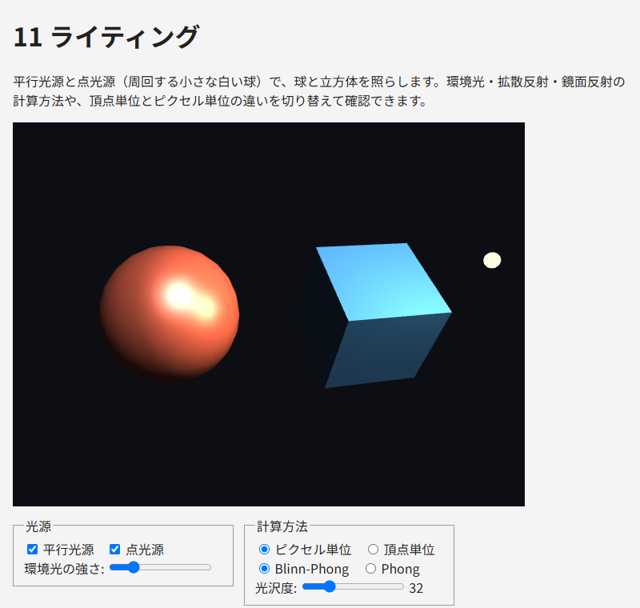

.. _chap-lighting:

ライティング
============

ここまでのサンプルでは、面ごとに決まった色を塗っていました。この章では、光源からの光が物体の表面でどのように反射するかを計算し、立体感のある表示を行う\ :term:`ライティング`\ を説明します。

法線
----

光の反射を計算するには、表面がどちらを向いているかを知る必要があります。表面に垂直な単位ベクトルを\ :term:`法線`\ （法線ベクトル）と呼びます。法線は頂点属性として、頂点ごとに与えます。

立方体のように平らな面からなる物体では、面の法線をその面の頂点すべてに与えます。角の頂点は面ごとに法線が異なるため、\ :numref:`chap-buffer`\ で説明したように、面ごとに別の頂点として持ちます。一方、球のような曲面では、各頂点に「その位置での曲面の法線」を与えます。半径 :math:`r` で中心が原点の球では、頂点の位置を :math:`r` で割ったものが法線になります。

法線行列
~~~~~~~~

物体をモデル行列で回転させると、法線も一緒に回転させる必要があります。回転と一様スケールだけであれば、モデル行列の左上 3 × 3 の部分を法線に掛ければ済みます（一様スケールで変わった長さは、シェーダーで正規化して戻します）。しかし、非一様スケールが含まれると、この方法では法線が面に垂直でなくなります。

例えば、球を y 方向に縮めて平たい楕円体にすると、表面は上下方向にゆるやかになり、法線はより上下を向くはずです。ところが、法線にも同じように y 方向に縮める変換を掛けると、法線は逆に水平方向へ傾いてしまいます。

正しい法線を得るには、モデル行列の左上 3 × 3 の部分 :math:`M_3` の逆行列の転置を掛けます。これを\ :term:`法線行列`\ と呼びます。

.. math::

   N = (M_3^{-1})^{\mathsf{T}}

この式は、表面に沿ったベクトル :math:`\mathbf{t}` を :math:`M_3` で変換したとき、変換後の法線 :math:`N\mathbf{n}` が変換後の :math:`M_3\mathbf{t}` と直交する（内積が 0 になる）という条件から導かれます。

.. math::

   (N\mathbf{n}) \cdot (M_3\mathbf{t}) = \mathbf{n}^{\mathsf{T}} N^{\mathsf{T}} M_3 \mathbf{t} = \mathbf{n}^{\mathsf{T}} M_3^{-1} M_3 \mathbf{t} = \mathbf{n} \cdot \mathbf{t} = 0

:numref:`chap-math`\ で作成した ``mat4.normalMatrix`` は、余因子を使って法線行列を計算し、長さ 9 の ``Float32Array``\ （列優先の 3 × 3 行列）を返します。シェーダーには ``mat3`` 型の uniform 変数として ``gl.uniformMatrix3fv`` で渡します。

反射のモデル
------------

実際の光の反射は複雑ですが、リアルタイムの描画では、反射を次の 3 つの成分に分けて近似する方法が古くから使われています。

環境光
~~~~~~

:term:`環境光`\ は、周囲の物体に何度も反射して、あらゆる方向から届く光を近似したものです。光源の方向に関係なく、物体の色に一定の強さ :math:`k_a` を掛けた値とします。環境光がないと、光の当たらない部分が真っ黒になります。

.. math::

   I_{\mathrm{ambient}} = k_a \, C_{\mathrm{base}}

拡散反射
~~~~~~~~

:term:`拡散反射`\ は、光が表面であらゆる方向に均等に散らばる反射です。紙や布のようにつやのない表面の見え方を表します。どの方向から見ても明るさは同じで、明るさは光が表面に当たる角度だけで決まります。光が表面に垂直に当たるほど明るく、斜めに当たるほど暗くなります。

表面の法線を :math:`\mathbf{N}`\ 、表面から光源へ向かう単位ベクトルを :math:`\mathbf{L}` とすると、拡散反射の強さは 2 つのベクトルのなす角の余弦、つまり内積で求められます（ランバートの余弦則）。光が裏側から当たる場合（内積が負の場合）は 0 とします。

.. math::

   I_{\mathrm{diffuse}} = \max(\mathbf{N} \cdot \mathbf{L},\ 0) \; C_{\mathrm{light}} \, C_{\mathrm{base}}

鏡面反射
~~~~~~~~

:term:`鏡面反射`\ は、光が鏡のように特定の方向へ強く反射する成分です。プラスチックや金属の表面に見える明るいハイライトを表します。拡散反射と異なり、見る方向によって明るさが変わります。

**Phong の反射モデル**\ では、光が表面で反射する方向 :math:`\mathbf{R}` と、表面から視点へ向かう単位ベクトル :math:`\mathbf{V}` の近さで鏡面反射の強さを決めます。

.. math::

   \mathbf{R} = \mathrm{reflect}(-\mathbf{L}, \mathbf{N}), \qquad
   I_{\mathrm{specular}} = \max(\mathbf{R} \cdot \mathbf{V},\ 0)^{s} \; C_{\mathrm{light}}

指数 :math:`s` は\ :term:`光沢度`\ で、大きいほどハイライトが小さく鋭くなり、つやのある表面に見えます。

**Blinn-Phong の反射モデル**\ では、\ :math:`\mathbf{L}` と :math:`\mathbf{V}` の中間の向きのベクトル（ハーフベクトル）\ :math:`\mathbf{H}` と法線の近さを使います。

.. math::

   \mathbf{H} = \mathrm{normalize}(\mathbf{L} + \mathbf{V}), \qquad
   I_{\mathrm{specular}} = \max(\mathbf{N} \cdot \mathbf{H},\ 0)^{s} \; C_{\mathrm{light}}

Blinn-Phong は、Phong よりも計算が少なく、視線が表面に対して浅い角度のときにハイライトが不自然に途切れる問題も起きにくいため、広く使われています。同じ光沢度では Blinn-Phong のほうがハイライトが広がるので、Phong と同じ見え方にするには光沢度を 2 ～ 4 倍程度にします。

最終的な色は、これらの成分の和です。

.. math::

   C = I_{\mathrm{ambient}} + I_{\mathrm{diffuse}} + I_{\mathrm{specular}}

光源の種類
----------

本書では 2 種類の光源を扱います。

* :term:`平行光源`\ （ディレクショナルライト）: 太陽のように十分遠くにあり、シーンのどこでも同じ方向から届く光源です。\ :math:`\mathbf{L}` は場所によらず一定です。
* :term:`点光源`\ （ポイントライト）: 電球のように 1 点から全方向に光を放つ光源です。\ :math:`\mathbf{L}` は表面の位置から光源の位置へ向かう方向で、場所ごとに異なります。また、光源から離れるほど光は弱くなります（減衰）。本書では、光源までの距離 :math:`d` を使って、次の減衰係数を掛けます。

.. math::

   \mathrm{attenuation} = \frac{1}{1 + k_1 d + k_2 d^2}

物理的には光の強さは距離の 2 乗に反比例しますが、それだけでは光源の近くが極端に明るくなるため、定数項と 1 次の項を加えて調整します。

シェーダーでの実装
------------------

サンプル ``11_lighting.html`` の光の計算を次に示します。座標と法線はすべてワールド座標系で扱います。視点の位置 ``u_cameraPosition`` は、JavaScript でビュー行列を作るときの視点と同じ値を渡します。

.. literalinclude:: ../examples/11_lighting.html
   :language: javascript
   :start-at: const LIGHTING_GLSL = `
   :end-at: `;
   :lineno-match:

ベクトルの向きに注意してください。\ ``u_lightDirection`` は光が進む方向ではなく、表面から光源へ向かう方向です。また、補間された法線は長さが 1 でなくなるので、フラグメントシェーダーで ``normalize`` し直しています。

頂点単位とピクセル単位
~~~~~~~~~~~~~~~~~~~~~~

光の計算は、頂点シェーダーとフラグメントシェーダーのどちらでも行えます。

* **頂点単位**\ （グーローシェーディング）: 頂点シェーダーで頂点ごとに色を計算し、三角形の内部では色を補間します。計算量は少ないですが、ハイライトが三角形の内部にある場合に表現できず、分割の粗い形状ではハイライトが角張って見えます。
* **ピクセル単位**\ （フォンシェーディング）: 頂点シェーダーから位置と法線を渡し、フラグメントシェーダーでフラグメントごとに色を計算します。計算量は多いですが、滑らかなハイライトが得られます。

現在の GPU では、ピクセル単位の計算が一般的です。サンプルでは、光の計算を文字列 ``LIGHTING_GLSL`` として共通化し、頂点シェーダーとフラグメントシェーダーの両方に埋め込んで、2 つの方法を切り替えられるようにしています。

色空間とガンマ
--------------

ここまでの計算では、色の値（0 ～ 1）と光の強さが比例するものとして扱ってきました。しかし、一般的なディスプレイや画像ファイルは :term:`sRGB` という色空間を使っており、値と実際の明るさは比例しません（値 0.5 の明るさは、値 1.0 の明るさの約 21 % です）。光の計算は、明るさに比例する値（リニアな値）で行うのが物理的に正しく、sRGB の値のまま計算すると、陰影の境目が暗くなりすぎるなどの違いが生じます。

正確に扱うには、テクスチャの色を sRGB からリニアに変換してから光の計算を行い、最後に sRGB に戻して出力します（ガンマ補正）。WebGL 2.0 には、sRGB のテクスチャ形式（\ ``gl.SRGB8_ALPHA8``\ ）など、そのための機能もあります。本書では説明を簡単にするため、ガンマ補正を行わずに計算しています。より写実的な表示を目指す場合は、参考文献を参照してください。

サンプル
--------

``11_lighting.html`` は、平行光源と、周回する点光源（小さな白い球）で、球と立方体を照らします。画面下のコントロールで、次の違いを確認してください。

* 光源をそれぞれ無効にすると、平行光源と点光源の当たり方の違いが分かります。
* 計算方法を「頂点単位」にすると、球のハイライトが角張ります。立方体の面では 4 つの頂点で計算した色を補間するだけになるため、面の内側のハイライトが現れなくなります。
* Phong と Blinn-Phong を切り替えると、同じ光沢度でもハイライトの大きさが変わります。
* 「球を y 方向に 0.4 倍する」をオンにしてから「法線行列の代わりにモデル行列を使う」をオンにすると、陰影の付き方が不自然になります。

   11_lighting.html の実行結果

* `11_lighting.html をブラウザーで開く <examples/11_lighting.html>`__
* :download:`11_lighting.html をダウンロード <../examples/11_lighting.html>`
