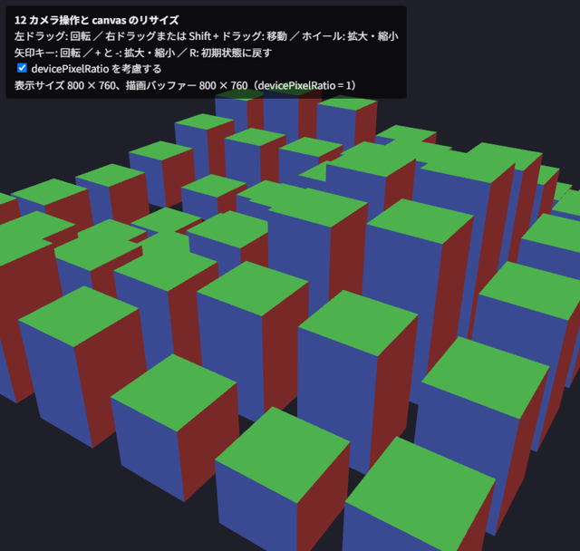

.. _chap-interaction:

インタラクション
================

この章では、マウスやキーボードでカメラを操作する方法と、canvas をウィンドウの大きさに合わせる方法を説明します。また、マウスで指した物体を特定するピッキングの考え方を紹介します。

注視点を回るカメラ
------------------

3D のビューアーでよく使われるのが、注視点のまわりをカメラが回る操作方法です（オービットカメラ）。カメラの状態を、注視点 :math:`\mathbf{t}`\ 、注視点からの距離 :math:`d`\ 、水平方向の角度（方位角）\ :math:`\phi`\ 、垂直方向の角度（仰角）\ :math:`\theta` で表すと、視点の位置 :math:`\mathbf{e}` は次の式で求められます。

.. math::

   \mathbf{e} = \mathbf{t} + d \, (\cos\theta \sin\phi,\ \sin\theta,\ \cos\theta \cos\phi)

マウスのドラッグで :math:`\phi` と :math:`\theta` を、ホイールで :math:`d` を変化させ、求めた視点と注視点から ``mat4.lookAt`` でビュー行列を作ります。

仰角 :math:`\theta` が ±90 度に達すると、視線の方向とカメラの上方向の目安 (0, 1, 0) が平行になり、\ ``lookAt`` でカメラの右方向を求められなくなります（\ :numref:`chap-transform`\ ）。そのため、仰角は ±90 度よりわずかに小さい範囲に制限します。

ポインターイベント
------------------

マウスの操作は、ポインターイベントで受け取ります。ポインターイベントはマウス、タッチ、ペンを同じ方法で扱えます。

.. list-table:: カメラ操作で使うイベント
   :header-rows: 1
   :widths: 30 70

   * - イベント
     - 用途
   * - ``pointerdown``
     - ドラッグの開始。押されたボタン（``event.button``。0 が左、2 が右）と位置を記録します
   * - ``pointermove``
     - ドラッグ中の移動。前回の位置との差に応じてカメラを動かします
   * - ``pointerup``
     - ドラッグの終了
   * - ``wheel``
     - ホイールの回転。\ ``event.deltaY`` に応じて距離を変えます
   * - ``contextmenu``
     - 右クリックのメニュー。右ドラッグを使う場合は ``preventDefault`` で表示しないようにします
   * - ``keydown``
     - キーボードの入力。\ ``event.key`` で押されたキーを判定します

``pointerdown`` で ``canvas.setPointerCapture(event.pointerId)`` を呼ぶと、ドラッグ中にポインターが canvas の外に出てもイベントを受け取り続けられます。また、タッチ操作でページがスクロールしないように、canvas の CSS に ``touch-action: none`` を指定します。

``wheel`` イベントの既定の動作はページのスクロールなので、\ ``preventDefault`` で止めます。このとき、\ ``addEventListener`` の第 3 引数に ``{ passive: false }`` を指定する必要があります。

サンプルで使っているカメラ操作の関数を次に示します。

.. literalinclude:: ../examples/12_camera_control.html
   :language: javascript
   :start-at: // ---- マウスとキーボードによるカメラ操作（第 11 章） ----
   :end-before: // ---- canvas の大きさを表示サイズに合わせる
   :lineno-match:

ドラッグ量からの角度の計算（ピクセルあたり 0.01 ラジアン）や、ホイールによる距離の変化（\ ``Math.exp`` を使い、近いときほど細かく動く）の係数は、操作感を見ながら調整してください。

canvas の大きさを表示に合わせる
-------------------------------

:numref:`chap-first-drawing`\ で説明したように、canvas には描画バッファーの大きさと表示サイズがあります。canvas をウィンドウ全体に広げる場合、CSS で表示サイズを指定し、描画バッファーの大きさを JavaScript で表示サイズに合わせます。

高 DPI ディスプレイへの対応
~~~~~~~~~~~~~~~~~~~~~~~~~~~

高解像度のディスプレイでは、CSS の 1 ピクセルが、物理的な複数のピクセルで表示されます。その倍率は ``window.devicePixelRatio`` で取得できます（例えば 2 なら、CSS の 1 ピクセルが縦横 2 × 2 の物理ピクセルに当たります）。描画バッファーを CSS の表示サイズと同じにすると、表示の際に拡大されてぼやけるため、表示サイズに ``devicePixelRatio`` を掛けた大きさにします。

.. literalinclude:: ../examples/12_camera_control.html
   :language: javascript
   :start-at: // CSS 上の表示サイズ × devicePixelRatio
   :end-before: // ---- メイン処理 ----
   :lineno-match:

この関数を毎フレームの描画の最初に呼び出し、続けて ``gl.viewport`` と投影行列の縦横比も描画バッファーの大きさに合わせます。\ ``resize`` イベントで処理する方法もありますが、毎フレーム確認する方法は、ウィンドウの大きさ以外の理由（CSS のレイアウトの変化など）で表示サイズが変わった場合にも対応できます。

``devicePixelRatio`` が 2 の環境では、描画するピクセル数が 4 倍になります。フラグメントシェーダーの処理が重い場合は、性能とのバランスを考えて倍率に上限を設けることも検討してください（\ :numref:`chap-debug`\ ）。

サンプル
--------

``12_camera_control.html`` は、ウィンドウ全体に広げた canvas に、高さの異なる立方体を 7 × 7 個並べて表示します。マウスとキーボードで、\ :numref:`table-camera-operations` の操作ができます。

.. _table-camera-operations:

.. list-table:: 12_camera_control.html の操作
   :header-rows: 1
   :widths: 40 60

   * - 操作
     - 動作
   * - 左ドラッグ、矢印キー
     - 注視点のまわりを回ります
   * - 右ドラッグ、Shift + 左ドラッグ
     - 注視点を画面と平行に移動します
   * - ホイール、\ ``+`` キーと ``-`` キー
     - 注視点に近づく・遠ざかります
   * - ``R`` キー
     - 初期状態に戻します

左上には、canvas の表示サイズと描画バッファーの大きさを表示します。「devicePixelRatio を考慮する」をオフにすると、高 DPI ディスプレイでは表示がぼやけることを確認できます。

   12_camera_control.html の実行結果

* `12_camera_control.html をブラウザーで開く <examples/12_camera_control.html>`__
* :download:`12_camera_control.html をダウンロード <../examples/12_camera_control.html>`

ピッキング
----------

マウスでクリックした位置にある物体を特定することを\ :term:`ピッキング`\ と呼びます。主な方法は 2 つあります。

* **レイキャスト**: クリックした位置から視線の方向に伸びる半直線（レイ）を求め、各物体との交差を JavaScript で計算します。投影行列とビュー行列の逆行列が必要で、物体の形状ごとに交差判定を実装する必要があります。
* **色による ID 方式**: 物体ごとに固有の色（ID を色に変換したもの）を決めておき、画面に表示しないフレームバッファーに、その色で物体を塗りつぶして描画します。クリックした位置のピクセルの色を ``gl.readPixels`` で読み取れば、その色から物体の ID が分かります。

色による ID 方式は、どのような形状でも GPU の描画結果をそのまま使えるため、実装が簡単です。ID は、例えば次のように RGB の 3 バイトに分けて色にします（ID が 0 の黒は「物体なし」を表します）。

.. literalinclude:: ../examples/17_scene.html
   :language: javascript
   :start-at: function idToColor(id)
   :end-before: // ピッキング用のフレームバッファー
   :lineno-match:

この方法には、画面に表示しないフレームバッファーが必要です。フレームバッファーは次の章で説明し、ピッキングの実装は\ :numref:`chap-scene`\ の総合演習で行います。
