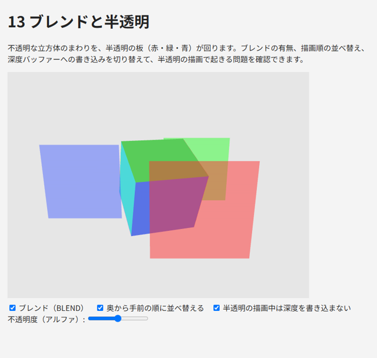
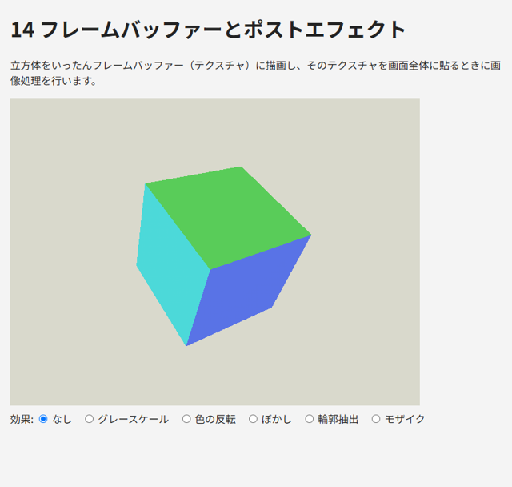
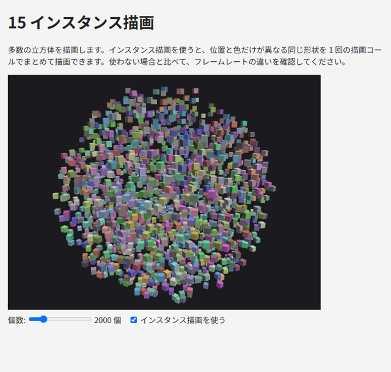
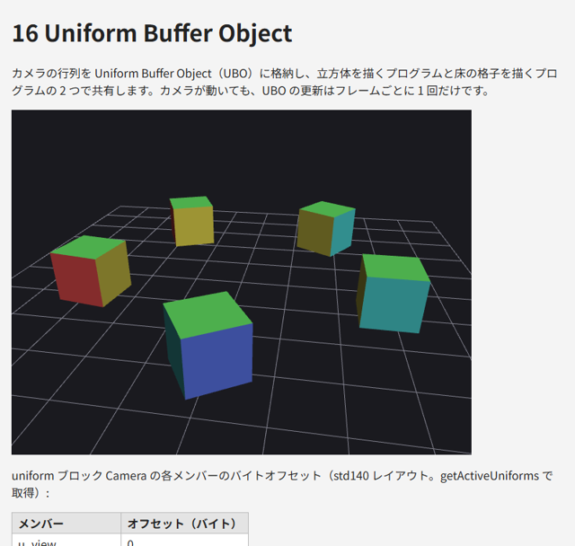

.. _chap-advanced:

応用技法
========

この章では、半透明の描画、画面以外への描画、多数の物体の効率的な描画など、実用的なプログラムでよく使う技法を説明します。また、本書で扱わない WebGL 2.0 の機能と、拡張機能の仕組みを紹介します。

ブレンドと半透明
----------------

ガラスや煙のような半透明の物体を描くには、フラグメントシェーダーが出力した色（ソース）と、フレームバッファーにすでにある色（デスティネーション）を混ぜ合わせます。これを\ :term:`ブレンド`\ と呼びます。

ブレンドを有効にすると、GPU は次の式で新しい色を求めます。

.. math::

   C_{\mathrm{result}} = C_{\mathrm{src}} \times F_{\mathrm{src}} + C_{\mathrm{dst}} \times F_{\mathrm{dst}}

係数 :math:`F_{\mathrm{src}}` と :math:`F_{\mathrm{dst}}` は ``gl.blendFunc`` で指定します。半透明の描画で最もよく使うのは、ソースのアルファ :math:`\alpha` を不透明度として使う組み合わせです。

.. math::

   C_{\mathrm{result}} = C_{\mathrm{src}} \, \alpha + C_{\mathrm{dst}} \, (1 - \alpha)

.. code-block:: javascript
   :linenos:

   gl.enable(gl.BLEND);
   gl.blendFunc(gl.SRC_ALPHA, gl.ONE_MINUS_SRC_ALPHA);

canvas のアルファに注意する
~~~~~~~~~~~~~~~~~~~~~~~~~~~

上の ``gl.blendFunc`` は、色だけでなくアルファにも同じ式を適用します。アルファが 1 の背景に :math:`\alpha = 0.5` で描くと、結果のアルファは :math:`0.5 \times 0.5 + 1 \times 0.5 = 0.75` になります。コンテキスト属性 ``alpha`` が ``true``\ （既定値）の場合、canvas のアルファが 1 未満のピクセルでは背後の Web ページが透けて見えてしまいます。

これを防ぐには、\ ``gl.blendFuncSeparate`` で色とアルファに別々の係数を指定し、アルファが 1 のまま保たれるようにします。または、透けて見える必要がなければ、コンテキストを ``{ alpha: false }`` で作ります。

.. code-block:: javascript
   :linenos:

   // 色: src × α + dst × (1 - α)、アルファ: src × 1 + dst × (1 - α)
   gl.blendFuncSeparate(gl.SRC_ALPHA, gl.ONE_MINUS_SRC_ALPHA, gl.ONE, gl.ONE_MINUS_SRC_ALPHA);

描画順と深度
~~~~~~~~~~~~

ブレンドの結果は描画の順序に依存します。また、深度テストとの組み合わせにも注意が必要です。半透明の物体を正しく描くための一般的な手順は次のとおりです。

1. 不透明な物体をすべて描きます（ブレンドは無効、深度の書き込みは有効）。
2. 半透明の物体を、カメラから遠い順に並べ替えます。
3. ブレンドを有効にし、\ ``gl.depthMask(false)`` で深度の書き込みを無効にして、半透明の物体を遠い順に描きます。

手前の半透明の物体を先に描くと、その深度が深度バッファーに書き込まれ、後から描く奥の物体が深度テストで捨てられてしまいます。遠い順に描けばこの問題は起きませんが、物体どうしが交差している場合などは並べ替えだけでは解決できないため、\ ``gl.depthMask(false)`` を併用して影響を小さくします。それでも完全には正しくならない場合があり、半透明の正確な描画は 3D グラフィックスの難しい問題の 1 つです。

``13_blend.html`` は、不透明な立方体のまわりを半透明の板が回るサンプルです。ブレンド、並べ替え、深度の書き込みを切り替えて、それぞれの効果を確認できます。並べ替えをオフにして深度の書き込みも有効にすると、板が重なったときに奥の板が欠けて見えます。

.. literalinclude:: ../examples/13_blend.html
   :language: javascript
   :start-at: // 1. 不透明な物体を先に描く
   :end-before: gl.bindVertexArray(null);
   :lineno-match:

   13_blend.html の実行結果

* `13_blend.html をブラウザーで開く <examples/13_blend.html>`__
* :download:`13_blend.html をダウンロード <../examples/13_blend.html>`

フレームバッファー
------------------

ここまでは、描画結果をすべて canvas に表示していました。WebGL では、描画先を画面に表示しないバッファーに切り替えることもできます。描画先となる\ :term:`フレームバッファー`\ オブジェクトを作り、そこにテクスチャを取り付けると、描画結果をテクスチャとして後から利用できます。これをオフスクリーンレンダリングと呼びます。

フレームバッファーには、色・深度・ステンシルの書き込み先（アタッチメント）を取り付けます。書き込み先には、テクスチャか\ :term:`レンダーバッファー`\ を使います。後でシェーダーから読む必要がある場合はテクスチャを、読む必要がない場合（深度など）はレンダーバッファーを使います。

.. literalinclude:: ../examples/14_framebuffer.html
   :language: javascript
   :start-at: // カラーテクスチャと深度レンダーバッファーを持つフレームバッファーを作る
   :end-before: // ---- メイン処理 ----
   :lineno-match:

``gl.texStorage2D`` は、WebGL 2.0 で追加された、大きさと形式を固定したテクスチャの領域を確保する関数です。\ ``gl.texImage2D`` にデータとして ``null`` を渡して領域だけを確保する方法もあります。

フレームバッファーの設定に誤りがあると、描画しても何も起きません。\ ``gl.checkFramebufferStatus`` で ``gl.FRAMEBUFFER_COMPLETE`` が返ることを確認してください。

描画先は ``gl.bindFramebuffer`` で切り替えます。\ ``null`` をバインドすると、canvas の描画バッファー（既定のフレームバッファー）に戻ります。描画先の大きさが変わるので、\ ``gl.viewport`` も合わせて設定し直します。

ポストエフェクト
~~~~~~~~~~~~~~~~

フレームバッファーの代表的な用途が、描画結果に画像処理を施す\ :term:`ポストエフェクト`\ です。シーンをいったんテクスチャに描画し、次にそのテクスチャを画面全体に貼る際に、フラグメントシェーダーで色を加工します。

画面全体を覆うには、画面より大きな三角形を 1 つ描くのが簡単です。WebGL 2.0 では、頂点シェーダーの組み込み変数 ``gl_VertexID``\ （頂点の番号）から座標を計算できるので、頂点バッファーも不要です。

.. literalinclude:: ../examples/14_framebuffer.html
   :language: javascript
   :start-at: const POST_VS = `
   :end-at: `;
   :lineno-match:

頂点 0、1、2 の ``uv`` はそれぞれ (0, 0)、(2, 0)、(0, 2) になり、クリップ座標では (-1, -1)、(3, -1)、(-1, 3) の三角形になります。画面（-1 ～ 1 の正方形）の外にはみ出した部分はクリッピングで捨てられます。

フラグメントシェーダーでは、\ ``textureSize`` 関数でテクスチャの大きさを取得し、隣のテクセルを参照するためのオフセットを求めています。

``14_framebuffer.html`` では、グレースケール、色の反転、ぼかし、輪郭抽出（Sobel フィルター）、モザイクの効果を切り替えられます。

   14_framebuffer.html の実行結果

* `14_framebuffer.html をブラウザーで開く <examples/14_framebuffer.html>`__
* :download:`14_framebuffer.html をダウンロード <../examples/14_framebuffer.html>`

インスタンス描画
----------------

草や木、群衆、パーティクルのように、同じ形状を位置や色だけ変えて大量に描きたいことがあります。物体ごとに uniform 変数を設定して描画関数を呼ぶと、描画コール（描画関数の呼び出し）の回数が物体の数だけ増えます。描画コールには CPU 側のオーバーヘッドがあるため、数千回を超えると性能が大きく低下します。

:term:`インスタンス描画`\ を使うと、同じ形状を 1 回の描画コールで多数描けます。描画される各コピーをインスタンスと呼びます。インスタンスごとに異なる値（位置や色など）は、次のどちらかの方法で頂点シェーダーに渡します。

* インスタンスごとに値が進む頂点属性を使います。\ ``gl.vertexAttribDivisor(location, 1)`` を設定すると、その頂点属性は頂点ごとではなく、1 インスタンスごとに次の値へ進みます。
* 組み込み変数 ``gl_InstanceID``\ （インスタンスの番号）を使い、シェーダー内で値を計算します。

.. literalinclude:: ../examples/15_instancing.html
   :language: javascript
   :start-at: // インスタンス描画用の VAO
   :end-at: gl.vertexAttribDivisor(3, 1);
   :lineno-match:

描画には ``gl.drawArraysInstanced`` または ``gl.drawElementsInstanced`` を使い、最後の引数にインスタンスの数を指定します。

.. code-block:: javascript
   :linenos:

   gl.drawElementsInstanced(gl.TRIANGLES, CUBE.indices.length, gl.UNSIGNED_SHORT, 0, count);

``15_instancing.html`` は、最大 10000 個の立方体を描きます。「インスタンス描画を使う」をオフにすると、立方体 1 個ごとに描画コールを発行する方法に切り替わります。個数を増やしたときのフレームレートを比べてみてください。

   15_instancing.html の実行結果

* `15_instancing.html をブラウザーで開く <examples/15_instancing.html>`__
* :download:`15_instancing.html をダウンロード <../examples/15_instancing.html>`

Uniform Buffer Object
---------------------

カメラの行列や光源の情報は、多くのプログラムで共通に使います。通常の uniform 変数はプログラムごとに値を保持するので、プログラムが複数あると、同じ値をプログラムごとに設定する必要があります。

:term:`Uniform Buffer Object`\ （UBO）を使うと、複数の uniform 変数をバッファーにまとめ、複数のプログラムで共有できます。シェーダーでは、共有する変数を uniform ブロックとして宣言します。

.. literalinclude:: ../examples/16_ubo.html
   :language: javascript
   :start-at: const CAMERA_BLOCK = `
   :end-at: `;
   :lineno-match:

JavaScript 側の手順は次のとおりです。

1. 各プログラムの uniform ブロックを、\ ``gl.uniformBlockBinding`` で番号付きの\ :term:`バインディングポイント`\ に結び付けます。
2. バッファーを作り、\ ``gl.bindBufferBase(gl.UNIFORM_BUFFER, 番号, バッファー)`` で同じバインディングポイントに結び付けます。
3. バッファーの内容を ``gl.bufferSubData`` で更新します。更新した値は、そのブロックを使うすべてのプログラムに反映されます。

.. literalinclude:: ../examples/16_ubo.html
   :language: javascript
   :start-at: // 各プログラムの uniform ブロック Camera をバインディングポイント 0 に結び付ける
   :end-at: const cameraData = new Float32Array(blockSize / 4);
   :lineno-match:

std140 レイアウト
~~~~~~~~~~~~~~~~~

バッファーの中で各変数をどの位置（オフセット）に置くかは、レイアウトの規則で決まります。\ ``layout(std140)`` を指定すると、決まった規則で配置されます。主な規則は次のとおりです。

* ``float``\ 、\ ``int`` は 4 バイト境界、\ ``vec2`` は 8 バイト境界に置かれます。
* ``vec3`` と ``vec4`` は 16 バイト境界に置かれます。\ ``vec3`` の直後に 4 バイトの隙間ができることに注意します（隙間には次の ``float`` が入ることもある）。
* ``mat4`` は 16 バイト境界から始まる 4 つの ``vec4``\ （列）として置かれます。
* 配列の各要素は 16 バイト境界に置かれます。\ ``float`` の配列でも 1 要素あたり 16 バイトを使います。

規則を覚えて自分で計算することもできますが、\ ``gl.getActiveUniforms(program, indices, gl.UNIFORM_OFFSET)`` で各変数のオフセットを WebGL に問い合わせれば確実です。サンプルでは、問い合わせた結果をページに表示しています。

なお、uniform ブロックを頂点シェーダーとフラグメントシェーダーの両方で宣言する場合は、精度修飾子を含めて同じ宣言にする必要があります。サンプルでは、ブロックを使うフラグメントシェーダーの既定の精度を ``highp`` にして、頂点シェーダーと一致させています。

``16_ubo.html`` では、カメラの行列を UBO に格納し、立方体を描くプログラムと床の格子を描くプログラムで共有しています。

   16_ubo.html の実行結果

* `16_ubo.html をブラウザーで開く <examples/16_ubo.html>`__
* :download:`16_ubo.html をダウンロード <../examples/16_ubo.html>`

その他の WebGL 2.0 の機能
-------------------------

本書のサンプルでは扱いませんが、WebGL 2.0 には次のような機能もあります。

.. list-table:: 本書で扱わない WebGL 2.0 の主な機能
   :header-rows: 1
   :widths: 30 70

   * - 機能
     - 概要
   * - 複数レンダーターゲット（MRT）
     - フレームバッファーに複数のカラーアタッチメントを取り付け、フラグメントシェーダーの複数の ``out`` 変数から同時に書き込みます。\ ``gl.drawBuffers`` で出力先を指定します。ディファードシェーディングなどで使います
   * - 3D テクスチャ、テクスチャ配列
     - ``gl.TEXTURE_3D`` は 3 次元のテクセルの配列で、ボリュームデータの表示などに使います。\ ``gl.TEXTURE_2D_ARRAY`` は同じ大きさの 2D テクスチャを束ねたもので、1 回の描画で多数の画像を使い分けられます
   * - Transform Feedback
     - 頂点シェーダーの出力をバッファーに書き戻します。GPU 上でパーティクルの位置を更新する場合などに使います
   * - サンプラーオブジェクト
     - フィルタリングやラッピングの設定をテクスチャから切り離して管理します
   * - マルチサンプルのレンダーバッファー
     - ``gl.renderbufferStorageMultisample`` で作り、\ ``gl.blitFramebuffer`` で通常のフレームバッファーに転送します。オフスクリーンレンダリングでアンチエイリアスを行います
   * - クエリーオブジェクト、フェンス
     - 描画したピクセルの数を調べたり（オクルージョンクエリー）、GPU の処理の完了を待ったりします

拡張機能
--------

WebGL の仕様に含まれない機能は、\ :term:`拡張機能`\ として提供されます。拡張機能を使うには、\ ``gl.getExtension`` に拡張機能の名前を渡します。環境が対応していない場合は ``null`` が返るので、必ず確認してから使います。

.. code-block:: javascript
   :linenos:

   const ext = gl.getExtension("EXT_color_buffer_float");
   if (!ext) {
     // 対応していない場合の代替処理
   }

``getExtension`` を呼ぶまで、その拡張機能は有効になりません。利用できる拡張機能の一覧は ``gl.getSupportedExtensions()`` で取得でき、\ :numref:`chap-setup`\ のサンプル ``01_check_support.html`` で確認できます。WebGL 2.0 でよく使われる拡張機能を\ :numref:`table-extensions` に示します。

.. _table-extensions:

.. list-table:: よく使われる拡張機能
   :header-rows: 1
   :widths: 40 60

   * - 名前
     - 内容
   * - ``EXT_color_buffer_float``
     - 浮動小数点数のテクスチャやレンダーバッファーを、フレームバッファーの書き込み先にできます（HDR の描画などに使う）
   * - ``OES_texture_float_linear``
     - 32 ビット浮動小数点数のテクスチャで ``LINEAR`` フィルターを使えます
   * - ``EXT_texture_filter_anisotropic``
     - 異方性フィルタリング。斜めから見た面のテクスチャを、ミップマップよりも鮮明に表示します
   * - ``WEBGL_lose_context``
     - コンテキストロストを意図的に起こす（テスト用。\ :numref:`chap-debug`\ ）
   * - ``EXT_disjoint_timer_query_webgl2``
     - GPU での処理時間を計測します（プライバシー保護のため、無効にしているブラウザーもあります）
