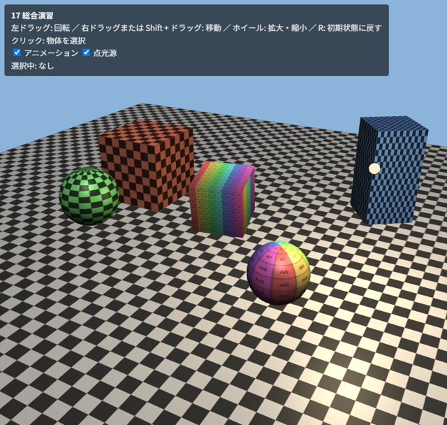

.. _chap-scene:

総合演習
========

この章では、これまでの章で学んだ要素を組み合わせて、マウスで見回せる小さな 3D シーンを作ります。

完成形
------

サンプル ``17_scene.html`` は、次の要素を組み合わせたシーンです。

* 市松模様のテクスチャを敷き詰めた床（\ :numref:`chap-texture`\ ）
* テクスチャを貼った立方体と球（\ :numref:`chap-buffer`\ 、\ :numref:`chap-texture`\ ）
* 平行光源と周回する点光源によるピクセル単位の Blinn-Phong ライティング（\ :numref:`chap-lighting`\ ）
* 回転や弾むアニメーション（\ :numref:`chap-first-drawing`\ 、\ :numref:`chap-transform`\ ）
* マウスによるカメラ操作と、ウィンドウの大きさへの追従（\ :numref:`chap-interaction`\ ）
* クリックによる物体の選択（ピッキング。\ :numref:`chap-interaction`\ 、\ :numref:`chap-advanced`\ ）

   17_scene.html の実行結果

* `17_scene.html をブラウザーで開く <examples/17_scene.html>`__
* :download:`17_scene.html をダウンロード <../examples/17_scene.html>`

このサンプルはテクスチャ画像を使うため、ダウンロードして動かす場合は ``assets`` フォルダーも必要です。\ :doc:`examples_list`\ から zip ファイルで一括ダウンロードすると便利です。

操作方法は ``12_camera_control.html`` と同じです。加えて、物体をクリックすると、その物体が黄色く強調され、左上に名前が表示されます。

全体の構成
----------

プログラムは次の部分からなります。

.. list-table:: 17_scene.html の構成
   :header-rows: 1
   :widths: 35 65

   * - 部分
     - 内容
   * - シェーダー
     - 通常の描画用（\ ``SCENE_VS`` / ``SCENE_FS``\ ）と、ピッキング用（\ ``PICK_VS`` / ``PICK_FS``\ ）の 2 組
   * - 頂点データ
     - ``gen_vertices.py`` で生成した立方体、\ ``createSphere`` で生成した球、\ ``createPlane`` で生成した床
   * - 補助関数
     - これまでの章のサンプルと共通の関数（シェーダーの作成、VAO の作成、画像の読み込み、テクスチャの作成、行列の計算、カメラ操作）
   * - 物体の一覧
     - 各物体の名前、形状、テクスチャ、色、モデル行列を返す関数を、配列 ``objects`` にまとめます
   * - 描画ループ
     - canvas のリサイズ、行列の計算、全物体の描画を毎フレーム行います
   * - ピッキング
     - クリックされたときだけ、ID の色でフレームバッファーに描画し、クリック位置のピクセルを読み取ります

シーンの記述
------------

シーンに置く物体は、データとして配列にまとめています。物体を追加・変更するときは、この配列を編集するだけで済みます。モデル行列は時刻を引数とする関数で表し、アニメーションする物体は時刻に応じた行列を返します。

.. literalinclude:: ../examples/17_scene.html
   :language: javascript
   :start-at: // シーンに置く物体。
   :end-before: gl.enable(gl.DEPTH_TEST);
   :lineno-match:

シェーダー
----------

通常の描画用のフラグメントシェーダーでは、テクスチャから読んだ色に物体ごとの色 ``u_tint`` を掛けたものを物体の色とし、\ :numref:`chap-lighting`\ と同じ方法でライティングを行います。選択中の物体は、最終的な色を黄色に近づけて強調します。

.. literalinclude:: ../examples/17_scene.html
   :language: javascript
   :start-at: const SCENE_FS = `
   :end-at: `;
   :lineno-match:

描画ループ
----------

描画ループでは、毎フレーム次の処理を行います。

1. canvas の描画バッファーの大きさを表示サイズに合わせます。大きさが変わった場合は、ピッキング用のフレームバッファーも作り直します。
2. カメラの状態からビュー行列を、描画バッファーの縦横比から投影行列を作ります。
3. 各物体のモデル行列を計算します（ピッキングでも同じ行列を使うため、変数に保存しておきます）。
4. すべての物体に共通の uniform 変数（行列、視点、光源）を設定します。
5. 物体ごとにモデル行列、法線行列、テクスチャなどを設定して描画します。

.. literalinclude:: ../examples/17_scene.html
   :language: javascript
   :start-at: function render(time) {
   :end-before: main().catch
   :lineno-match:

ピッキングの実装
----------------

ピッキング用のフレームバッファーは、色と深度の両方をレンダーバッファーで作ります（読み取りは ``gl.readPixels`` で行い、シェーダーからは読まないため）。canvas と同じ大きさにすることで、クリック位置のピクセルの座標をそのまま使えます。

クリックされたら、ピッキング用のフレームバッファーに、各物体を ID の色で塗りつぶして描画し、クリック位置の 1 ピクセルを読み取ります。

.. literalinclude:: ../examples/17_scene.html
   :language: javascript
   :start-at: // ---- クリックで物体を選択する ----
   :end-before: function render(time) {
   :lineno-match:

実装上の注意点は次のとおりです。

* マウスのイベントの座標（CSS ピクセル、左上が原点）を、描画バッファーのピクセル座標（左下が原点）に変換します。\ ``devicePixelRatio`` による倍率と、y 軸の向きの違いに注意します。
* ドラッグによるカメラ操作の終わりをクリックと誤認しないように、ボタンを押してから離すまでの移動量が小さい場合だけクリックとみなします。
* ID の色が正確に読み取れるように、ピッキング用の描画ではライティングやブレンドを行いません。また、アンチエイリアスがかかると物体の境界で色が混ざるため、マルチサンプルでないフレームバッファーを使います。
* ``gl.readPixels`` は GPU の処理の完了を待つため、毎フレーム呼ぶと性能が低下します。このサンプルのように、必要なときだけ呼びます。

発展課題
--------

このサンプルをもとに、次のような改良に挑戦してみてください。

* 物体の一覧に、別の形状（円柱や円錐など）を追加します。頂点データの生成関数を自作します。
* 選択した物体をドラッグで移動できるようにします。
* :numref:`chap-advanced`\ の UBO を使い、カメラと光源の情報を共有します。
* :numref:`chap-advanced`\ のポストエフェクトを組み合わせます。
* 複数の点光源に対応します（uniform 変数を配列にします）。
